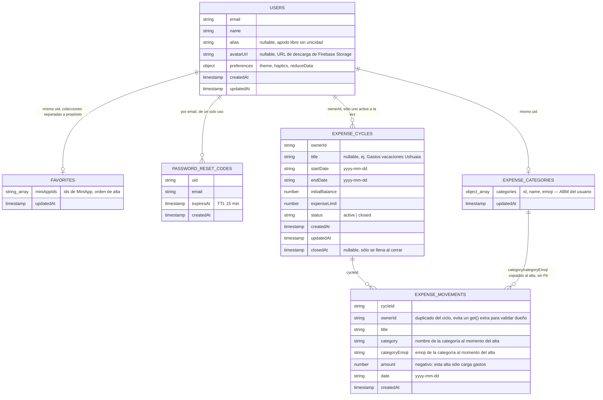
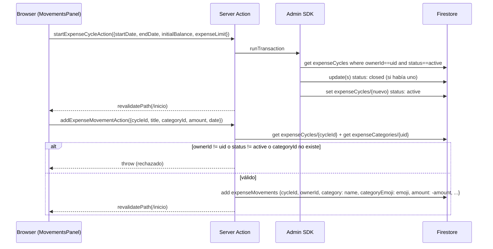
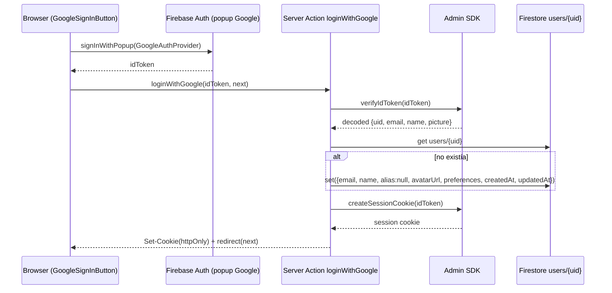

# Arquitectura de datos — Firestore

Registro vivo del diseño de colecciones de Firestore: qué documentos existen,
su forma, quién los lee/escribe, y las reglas de seguridad que necesitan.

**Regla del repo**: cada vez que se cree o modifique una colección, se cambie
la forma de un documento, o se toque la arquitectura de auth/datos, hay que
agregar una entrada al [Changelog](#changelog) de este archivo — qué cambió,
por qué, un diagrama si ayuda a entenderlo, y el bloque de reglas de
`firestore.rules` que haya que agregar o actualizar (el bloque en sí, no sólo
una descripción). Ver también la nota en `AGENTS.md`.

## Colecciones actuales

| Colección | Doc id | Definido en |
|---|---|---|
| `users` | `uid` de Firebase Auth | `src/lib/firebase/collections.ts` → `UserDoc` |
| `favorites` | `uid` de Firebase Auth | `src/lib/firebase/collections.ts` → `FavoritesDoc` |
| `passwordResetCodes` | `sha256(email:código)` | `src/lib/firebase/collections.ts` → `PasswordResetCodeDoc` |
| `expenseCycles` | autogenerado | `src/lib/firebase/collections.ts` → `ExpenseCycleDoc` |
| `expenseMovements` | autogenerado | `src/lib/firebase/collections.ts` → `ExpenseMovementDoc` |
| `expenseCategories` | `uid` de Firebase Auth | `src/lib/firebase/collections.ts` → `ExpenseCategoriesDoc` |



`users` y `favorites` **se mantienen separadas** aunque ambas cuelgan del
mismo `uid`: los favoritos se leen/escriben con una transacción propia
(`toggleFavorite`, ver más abajo) y mezclarlos en un solo documento
obligaría a que cualquier cambio de perfil pase por esa misma transacción.

### `users/{uid}`

Perfil de cuenta. La identidad (email, password, uid) vive en **Firebase
Auth**; este documento es todo lo que Auth no sabe.

| Campo | Tipo | Se escribe en | Notas |
|---|---|---|---|
| `email` | `string` | alta | normalizado (`trim().toLowerCase()`) |
| `name` | `string` | alta, `updateProfileAction` | del form de alta, o del claim `name` de Google |
| `alias` | `string \| null` | alta (`null`), `updateProfileAction` | apodo libre, **sin unicidad** |
| `avatarUrl` | `string \| null` | alta (`null` o claim `picture` de Google), `updateProfileAction` | URL de descarga de Firebase Storage (`avatars/{uid}/avatar.jpg`, ver `uploadAvatar`) |
| `preferences` | `UserPreferences` | alta (defaults), `updatePreferencesAction` | ver tabla abajo |
| `createdAt` / `updatedAt` | `Timestamp` | siempre | `now()` = `serverTimestamp()`, nunca el reloj del cliente |

`UserPreferences`:

| Campo | Tipo | Default | Hoy vive también en |
|---|---|---|---|
| `theme` | `"light" \| "dark" \| "system"` | `"system"` | `localStorage["maguita:theme"]` |
| `haptics` | `boolean` | `true` | `localStorage["maguita:haptics"]` |
| `reduceData` | `boolean` | `false` | `localStorage["maguita:reduce-data"]` |

> Los defaults del server están alineados a propósito con los de
> `localStorage` para que, cuando se conecte la UI, un usuario nuevo vea lo
> mismo en ambos lados. **La UI todavía no lee/escribe estos campos** — hoy
> sigue funcionando 100% con `localStorage` (`ThemeProvider`,
> `SettingsPanel`). Los accesores están listos para cuando se conecte.

Accesores: `getProfile` (`src/lib/data/profile.ts`, sólo Server Components),
`updateProfileAction` / `updatePreferencesAction`
(`src/lib/data/profile-actions.ts`, Server Actions — re-verifican la sesión).
`updateProfileAction` sigue el patrón `useActionState` (recibe
`prevState, FormData`, ver `EditProfileForm`) y, si el form manda una foto,
la sube con `uploadAvatar` (`src/lib/firebase/storage.ts`) antes de escribir
`avatarUrl`. Alta: `createAccount` / `findOrCreateGoogleAccount`
(`src/lib/auth/users.ts`).

### `favorites/{uid}`

| Campo | Tipo | Notas |
|---|---|---|
| `miniAppIds` | `string[]` | ids de `MiniApp` (`src/lib/data/mini-apps.ts`), en orden de alta |
| `updatedAt` | `Timestamp` | — |

Un solo documento por cuenta con el array entero: pocos favoritos, así que
una lectura gana contra N lecturas de una subcolección. `toggleFavorite`
(`src/lib/data/favorites.ts`) usa una transacción porque es
read-modify-write — sin ella, dos toques casi simultáneos (celular + compu)
pisarían el cambio del otro.

### `expenseCycles/{cycleId}` y `expenseMovements/{movementId}`

Gestor de gastos por período: hoy vive sólo en la tab **Movimientos** de
Inicio, pero las dos colecciones están pensadas para que una mini-app de
gastos aparte, más adelante, las lea/escriba igual — por eso son colecciones
propias en vez de un array adentro de `users/{uid}`.

`expenseCycles/{cycleId}` (id autogenerado):

| Campo | Tipo | Notas |
|---|---|---|
| `ownerId` | `string` | uid del dueño |
| `title` | `string \| null` | libre, ej. "Gastos vacaciones Ushuaia". `null` = la UI muestra el lapso de fechas (`expenseCycleTitle`, `src/lib/home-model.ts`) |
| `startDate` / `endDate` | `string` | día del período, `yyyy-mm-dd` |
| `initialBalance` | `number` | saldo inicial, pesos enteros |
| `expenseLimit` | `number` | tope de gastos, pesos enteros |
| `status` | `"active" \| "closed"` | sólo un `active` por usuario a la vez |
| `createdAt` / `updatedAt` | `Timestamp` | — |
| `closedAt` | `Timestamp \| null` | `null` mientras está `active` |

`expenseMovements/{movementId}` (id autogenerado):

| Campo | Tipo | Notas |
|---|---|---|
| `cycleId` | `string` | referencia a `expenseCycles/{cycleId}` |
| `ownerId` | `string` | duplicado del `ownerId` del ciclo (ver abajo) |
| `title` | `string` | concepto |
| `category` / `categoryEmoji` | `string` | nombre y emoji de la categoría **copiados al momento del alta** desde `expenseCategories/{uid}` (ver esa sección abajo) — no es una referencia viva. Los ingresos usan la categoría fija `"Ingreso"` / `💰`, sin pasar por el ABM |
| `amount` | `number` | negativo = gasto (`addExpenseMovementAction`), positivo = ingreso (`addExpenseIncomeAction`) |
| `date` | `string` | día del movimiento, `yyyy-mm-dd` |
| `createdAt` | `Timestamp` | — |

Accesores: `getActiveExpenseCycle` / `getExpenseMovements`
(`src/lib/data/expenses.ts`, sólo Server Components); `startExpenseCycleAction`
(alta/reinicio), `updateExpenseCycleAction` (edita tope y fechas de un ciclo
en curso, sin cerrarlo), `addExpenseMovementAction` (gasto),
`addExpenseIncomeAction` (ingreso) — todas en `src/lib/data/expenses-actions.ts`.

Decisiones de diseño:

- **Un solo `active` por usuario, garantizado por transacción.**
  `startExpenseCycleAction` cierra (`status: "closed"`) el ciclo activo del
  usuario y crea el nuevo dentro de la misma `runTransaction`: así nunca hay
  una ventana en la que un doble tap cree dos ciclos activos. El ciclo cerrado
  no se borra — queda como historial, tal cual pidió el dueño del producto
  ("cuando finalice se podrá reiniciar, dejando el anterior como historial").
  Verlo todavía no tiene UI (fuera de alcance de esta entrada).
- **`ownerId` duplicado en `expenseMovements`.** Sin él, para saber si un
  movimiento es de la cuenta que lo pide habría que ir a buscar su ciclo
  (`get()` extra) tanto en las reglas de Firestore como en
  `addExpenseMovementAction`. Con el campo repetido, las reglas leen
  `resource.data.ownerId` directo y la Server Action valida dueño y
  `status === "active"` con el mismo documento que ya trae (`cycleRef.get()`),
  sin una consulta aparte — importa porque el Admin SDK saltea las reglas, así
  que esa validación en la Server Action es la única barrera real contra que
  una sesión válida le cargue gastos al ciclo de otra cuenta pasando su
  `cycleId`.
- **Sin `orderBy` en las consultas.** `getExpenseMovements` filtra sólo por
  `cycleId` (`==`) y ordena en memoria con `byDayDesc` (`src/lib/home-model.ts`,
  ya usado por notas y hábitos). Sumar un `orderBy` en un campo distinto al
  filtro le pediría a Firestore un índice compuesto que hoy no hace falta —
  los movimientos de un período son pocos.



### `expenseCategories/{uid}`

ABM de categorías del gestor de gastos (nombre + emoji). Un solo documento
por cuenta con el array entero, igual que `favorites/{uid}`: son pocas
categorías, así que una lectura gana contra N de una subcolección.

| Campo | Tipo | Notas |
|---|---|---|
| `categories` | `{ id, name, emoji }[]` | orden de alta; `id` es un `randomUUID()` del server |
| `updatedAt` | `Timestamp` | — |

Accesores: `getExpenseCategories` (`src/lib/data/expense-categories.ts`, sólo
Server Components), `upsertExpenseCategoryAction` / `deleteExpenseCategoryAction`
(`src/lib/data/expense-categories-actions.ts`, Server Actions — devuelven el
array completo ya actualizado, no sólo el item tocado).

Decisiones de diseño:

- **Sin documento todavía = `DEFAULT_EXPENSE_CATEGORIES`.** Un usuario nuevo
  no tiene `expenseCategories/{uid}` hasta su primer alta/edición/borrado; en
  ese hueco, `getExpenseCategories` devuelve un set fijo en código (7
  categorías con emoji) para que el selector del alta de gastos no arranque
  vacío. En cuanto el usuario toca el ABM por primera vez, ese set pasa a ser
  la base sobre la que se aplica el cambio (mismo patrón que
  `DEFAULT_PREFERENCES` en `users/{uid}`).
- **`category`/`categoryEmoji` se copian al movimiento, no se referencian.**
  Si el usuario renombra o borra una categoría después, los gastos ya
  cargados con ella siguen mostrando el nombre/emoji que tenían al momento
  del alta — evita que borrar una categoría deje movimientos "rotos" o que
  editarla reescriba silenciosamente el historial. `addExpenseMovementAction`
  resuelve `category`/`categoryEmoji` del lado del server a partir del
  `categoryId` recibido (nunca confía en un nombre/emoji que mande el
  cliente).
- **Las Server Actions devuelven el array completo.** El sheet del ABM
  (`ExpenseCategoriesSheet`) guarda las categorías en estado local para
  poder editar sin depender de que el sheet — que no se vuelve a montar
  solo mientras está abierto — reciba props nuevas; devolver el array ya
  actualizado evita un segundo viaje a Firestore sólo para refrescar la
  lista en pantalla.

### `passwordResetCodes/{hash}`

| Campo | Tipo | Notas |
|---|---|---|
| `uid` | `string` | cuenta dueña del código |
| `email` | `string` | — |
| `expiresAt` | `Timestamp` | TTL de 15 min |
| `createdAt` | `Timestamp` | — |

El id del documento es `sha256(email:código)`, nunca el código en claro —
alguien con acceso de lectura ve que hay un pedido pendiente, pero no puede
usarlo. Se borra al canjearse, exista o no (un intento fallido no deja el
código vivo para seguir probando).

## Reglas de Firestore

**Estado actual del proyecto real (Firebase Console), pegado por el
usuario el 2026-08-01 — deniega todo:**

```
rules_version = '2';

service cloud.firestore {
  match /databases/{database}/documents {
    match /{document=**} {
      allow read, write: if false;
    }
  }
}
```

**Reglas objetivo, ya escritas en `firestore.rules` en el repo, pendientes
de publicar** (`firebase deploy --only firestore:rules --project maguita-7832c`):

```
rules_version = '2';

service cloud.firestore {
  match /databases/{database}/documents {

    function isOwner(uid) {
      return request.auth != null && request.auth.uid == uid;
    }

    match /users/{uid} {
      allow read: if isOwner(uid);
      allow write: if false;
    }

    match /favorites/{uid} {
      allow read: if isOwner(uid);
      allow write: if false;
    }

    match /passwordResetCodes/{code} {
      allow read, write: if false;
    }

    match /expenseCycles/{cycleId} {
      allow read: if request.auth != null && resource.data.ownerId == request.auth.uid;
      allow write: if false;
    }

    match /expenseMovements/{movementId} {
      allow read: if request.auth != null && resource.data.ownerId == request.auth.uid;
      allow write: if false;
    }

    match /expenseCategories/{uid} {
      allow read: if isOwner(uid);
      allow write: if false;
    }

    match /{document=**} {
      allow read, write: if false;
    }
  }
}
```

⚠️ **Acción pendiente**: publicar estas reglas contra el proyecto real —
todavía no están activas ahí, sólo en el repo. Sin esto, el cliente no puede
leer ni `users/{uid}` ni `favorites/{uid}` (aunque las escrituras del server
con el Admin SDK funcionan igual, porque ese SDK saltea las reglas).

**Ningún cambio de reglas hizo falta** para agregar `alias`, `avatarUrl` y
`preferences` a `users/{uid}`: la colección ya tenía `allow write: if false`
(todo pasa por el Admin SDK) y `allow read: if isOwner(uid)` cubre el
documento entero, campos nuevos incluidos — Firestore no tiene reglas a
nivel de campo para lectura.

## Changelog

### 2026-08-01 — Fix: "Nuevo gasto" del FAB no cerraba el sheet ni avisaba al guardar

- Sin cambios de datos. Dos fixes en el flujo de alta de un gasto:
  1. `NewExpenseMovementSheet`/`NewExpenseIncomeSheet`
     (`src/components/organisms/home/`) no tenían try/catch alrededor de la
     Server Action: si `addExpenseMovementAction`/`addExpenseIncomeAction`
     rechazaba (categoría borrada entre que se abrió el sheet y se guardó,
     período recién finalizado, etc.), el rechazo se perdía en silencio —
     ni el snack de éxito ni `onSaved()`/`closeSheet()` corrían, y tampoco
     había un snack de error. Ahora atrapan el error y muestran un snack
     `variant="error"` con el mensaje de la excepción; el sheet queda
     abierto para reintentar.
  2. El FAB de Inicio (`HomeBoard.tsx`) dejó de usar `FabActionSheets` de
     `lib-kit-components` — monta sus tres `BottomSheet` propios sin
     exponer ninguna forma de cerrarlos desde adentro de su `content`, así
     que "Nuevo gasto" desde el FAB **nunca** podía cerrarse solo (a
     diferencia de abrirlo desde Movimientos, que sí usa el sheet propio de
     la app). Ahora las tres acciones del FAB (`quickActions`) usan
     `FloatingButton` directo + `useAppSheet()` — el mismo sheet global que
     ya usan Movimientos y Notas —, así que "Nuevo gasto" le pasa
     `onSaved={closeSheet}` a `NewExpenseMovementSheet` igual que desde
     Movimientos, y se cierra solo al guardar sin importar desde dónde se
     abrió.
- **Fuera de alcance a propósito**: "Nueva nota" y "Compartir" del FAB
  siguen sin cerrarse solos (no se les pasó `onSaved`/`closeSheet`) — no
  era el bug reportado, y una nota no tiene la misma necesidad de
  confirmación visual inmediata que cargar un gasto.

### 2026-08-01 — Ítems de movimientos con elevación

- Sin cambios de datos. Nuevo `MovementsList`
  (`src/components/organisms/home/MovementsList.tsx`), que reemplaza a
  `TransactionList` de `lib-kit-components` en las tres pantallas donde se
  listan movimientos (`MovementsPanel`, `SummaryPanel`, `PeriodDetailScreen`):
  agrupa por día igual que antes, pero cada movimiento es su propia `Card
  variant="elevated"` (borde + `shadow-lg`) en vez de una fila plana dentro
  de una lista con `divide-y`. `TransactionList` no tiene forma de darle
  elevación a sus filas (son `<li>` fijos del componente), así que no había
  manera de pedir esto sin dejar de usarlo.
- De paso se resolvió una fuente de mismatch de hidratación que ya tenía
  `TransactionList`: agrupaba "Hoy"/"Ayer" con `new Date()` real adentro del
  componente, en vez del `today` que ya resuelve una sola vez el server.
  `MovementsList` agrupa con `formatDay` (con `today`) o, si no se lo pasan
  (`PeriodDetailScreen`, un período ya cerrado donde "Hoy"/"Ayer" no
  aplica), con `formatShortDate` — fecha absoluta.
- **Fuera de alcance a propósito**: `TransactionList` traía chips de filtro
  por categoría; `MovementsList` no los tiene. No se pidieron y agregarlos
  hubiera significado reconstruir esa lógica a mano.

### 2026-08-01 — Pantalla de detalle de un período anterior

- Sin colecciones ni campos nuevos: nueva forma de leer `expenseCycles` /
  `expenseMovements` que ya existían.
- Nueva `getExpenseCycleById(userId, cycleId)`
  (`src/lib/data/expenses.ts`): trae un ciclo puntual por id (cualquier
  `status`, no sólo `active`) y devuelve `null` tanto si no existe como si
  es de otra cuenta — la Server Action del Admin SDK saltea las reglas, así
  que esta verificación de dueño es la barrera real. La página nueva trata
  los dos casos igual (`notFound()`), para no delatar cuál de los dos pasó.
- Nueva ruta dinámica `/inicio/periodos/{cycleId}`
  (`src/app/(app)/inicio/periodos/[cycleId]/page.tsx`), a la que se llega
  tocando una card del carrusel de "Períodos anteriores"
  (`PastExpenseCyclesSection`, ahora envuelve cada card en un `Link`). Ya
  cubierta por sesión en dos capas: el prefijo `/inicio` de
  `PROTECTED_ROUTES` matchea por `startsWith` (sin agregar nada al array) y
  `(app)/layout.tsx` llama `requireSession()` en todo lo que cuelga de él.
  `headerFor` (`src/components/shell/nav-config.tsx`) le agrega un `if`
  de prefijo — es la única ruta dinámica hoy, así que no encaja en el mapa
  fijo de `SCREEN_HEADERS`.
- `PeriodDetailScreen`
  (`src/components/organisms/home/PeriodDetailScreen.tsx`): resumen del
  ciclo (saldo inicial/ingresos/saldo final + barra de tope), categorías
  con más gasto y días con más consumo (las dos como barras de un solo
  color — ver nota de diseño abajo), y el listado completo de operaciones
  con `TransactionList`. Nuevas funciones puras en `home-model.ts`:
  `categoryBreakdown` y `dailyBreakdown` (agrupan y suman gastos por
  categoría/día), y `shortDate` pasa a exportarse como `formatShortDate`
  (la necesitan también estas dos gráficas).
- **Nota de diseño (paleta de las gráficas)**: categorías y días son listas
  de "magnitud, ¿cuál es más alto?", no series a diferenciar por identidad
  — así que llevan un solo hue (`primary`) en vez de una paleta categórica.
  Evita además un problema real: las categorías son libres/ilimitadas (el
  ABM del usuario), así que una paleta categórica se quedaría sin colores
  distinguibles por CVD tarde o temprano; la etiqueta + emoji de cada fila
  ya cargan la identidad, el color sólo carga la magnitud. Días con más
  consumo usa el patrón "emphasis": todas las barras en `primary/35`
  (contexto) y el día pico en `accent` (el punto de la historia) — one hue
  + gray, no un color por barra.
- **Sin cambios de reglas**: la lectura va por el Admin SDK (Server
  Component/Action), que ya saltea `firestore.rules`.

### 2026-08-01 — Fix: "Balance del mes" del tab Resumen no coincidía con Movimientos

- Sin cambios de datos. Bug en `SummaryPanel`
  (`src/components/organisms/home/SummaryPanel.tsx`): calculaba el balance
  con la vieja `monthBalance` (`income - expense` de los movimientos cuya
  `date` cae en el mes calendario de `today`), que quedó pisada por el
  gestor de gastos sin actualizarse. Dos problemas: (1) `movements` ya son
  sólo los del ciclo activo (`getHomeData`), y un período no tiene por qué
  coincidir con un mes calendario (ej. "Gastos vacaciones Ushuaia" del
  15/08 al 15/09) — filtrar por mes de nuevo descartaba movimientos del
  ciclo o mezclaba con el mes siguiente; (2) ni sumaba el saldo inicial, así
  que el número no coincidía con "Saldo disponible" de `MovementsPanel`
  para lo que es el mismo período.
- Ahora usa `expenseCycleProgress` (`src/lib/home-model.ts`), la misma
  función que ya usa `MovementsPanel` — mismo cálculo, mismo número. La
  card pasa a llamarse "Saldo disponible" (antes "Balance del mes", que ya
  no describía lo que mostraba) y `SummaryPanel` gana el prop
  `expenseCycle: ExpenseCycle | null`; sin ciclo activo muestra "Sin
  período activo" en vez de calcular sobre una lista vacía.
- `monthBalance`/`MonthBalance` se borraron de `home-model.ts`: sin este
  último uso, quedaban muertos.

### 2026-08-01 — Carrusel de "Períodos anteriores" en Movimientos

- Sin colecciones ni campos nuevos: lee `expenseCycles`/`expenseMovements`
  tal como ya existían, sólo con un filtro (`status: "closed"`) que antes
  nadie usaba — los ciclos cerrados existían desde "Finalizar", pero no
  había ninguna pantalla que los mostrara.
- Nueva `getClosedExpenseCycles` (`src/lib/data/expenses.ts`): trae hasta
  10 ciclos `closed` del usuario (`ownerId` + `status`, sin `orderBy` —
  ordena en memoria, mismo criterio que `getExpenseMovements`) y, en una
  sola consulta aparte con `where("cycleId", "in", [...])` sobre
  `expenseMovements`, el gastado/ingresado de esos mismos ciclos — evita
  N+1 consultas (una por ciclo) a costa de un único `in` con como máximo 10
  valores, bien por debajo del límite de 30 que acepta Firestore.
- Nueva Server Action de sólo lectura `getPastExpenseCyclesAction`
  (`src/lib/data/expenses-actions.ts`): existe porque
  `getClosedExpenseCycles` vive en un módulo `server-only`, y el nuevo
  `PastExpenseCyclesSection` (dropdown + carrusel) la llama bajo demanda
  desde el cliente, no en el fetch inicial de `getHomeData()` — la mayoría
  de las visitas a Movimientos no llegan a abrir el historial, así que no
  tiene sentido pagar esa consulta siempre.
- `PastExpenseCyclesSection`
  (`src/components/organisms/home/PastExpenseCyclesSection.tsx`): un
  dropdown ("Períodos anteriores") que al desplegarse por primera vez pide
  los períodos cerrados y los cachea en estado local (cerrar/reabrir no
  repite la consulta) mientras muestra un skeleton; con datos, una fila de
  cards con scroll horizontal (título o lapso de fechas, barra de progreso
  del tope y gastado/tope/saldo final). Se monta en `MovementsPanel`, con o
  sin ciclo activo — el historial no depende de que haya uno en curso.
- **Sin cambios de reglas**: la lectura va por el Admin SDK (Server
  Action), que ya saltea `firestore.rules`; no se agregó ningún campo a
  documentos existentes.

### 2026-08-01 — Selector de emoji en vez de input de texto libre en categorías

- Sin cambios de datos: `ExpenseCategoryItem.emoji` sigue siendo un
  `string`, sólo cambia cómo se lo carga en la UI.
- Nuevo `EmojiPicker` (`src/components/molecules/EmojiPicker.tsx`): botón
  con el emoji elegido (o un `+` si no hay ninguno) que abre una grilla de
  un set curado de ~32 emojis relevantes para categorías de gasto. Mismo
  patrón de popover + cierre por click afuera que ya usa `DatePicker` de
  `lib-kit-components`.
- `ExpenseCategoriesEditor` (`src/components/organisms/home/ExpenseCategoriesEditor.tsx`)
  reemplaza el `Input` de texto libre del emoji, tanto en el alta como en la
  edición de una categoría, por `EmojiPicker`. El nombre sigue siendo un
  `Input` normal — es el único campo de texto que le queda al editor.

### 2026-08-01 — Título de período y "Finalizar" en vez de "Reiniciar"

- `ExpenseCycleDoc` (`src/lib/firebase/collections.ts`) gana `title: string
  | null`; `ExpenseCycle` (`src/lib/data/expenses.ts`) idem. `null` = el
  usuario no le puso título, y la UI cae al lapso de fechas.
- `startExpenseCycleAction` / `updateExpenseCycleAction`
  (`src/lib/data/expenses-actions.ts`) ganan `title?: string`, opcional;
  vacío o ausente se guarda como `null` (`input.title?.trim() || null`).
- Nuevas funciones puras en `src/lib/home-model.ts`: `formatDateRangeShort`
  (`"01/08 al 31/08"`, recorta el string de la day key directo — no pasa
  por `Date`, así que no hay huso que corra el día) y `expenseCycleTitle`,
  que devuelve `cycle.title` si está o cae a `formatDateRangeShort`. La
  usan `MovementsPanel` (título de la card) y sirve de referencia para lo
  que va a mostrar la futura mini-app.
- `ExpenseCycleForm` (alta) y `ExpenseCycleEditor` (sección "Período" del
  panel de ajustes) ganan un `Input` "Título (opcional)".
- **Renombre de "Reiniciar" a "Finalizar"**: el botón de la card y el modo
  `"reset"` de `ExpenseCycleForm` (ahora `"finish"`) no reiniciaban nada —
  cierran el ciclo actual (que queda como historial) y arrancan uno nuevo
  desde cero, con sus propios título/fechas/saldo/tope. "Reiniciar" sugería
  volver a poner en cero el mismo período; "Finalizar" describe lo que
  realmente pasa. Sin cambio de comportamiento, sólo de texto (label del
  botón, título/descripción del sheet, texto del botón de submit y el
  snack de éxito).
- **Sin cambios de reglas**: `title` es un campo más de un documento que
  `firestore.rules` ya cubre entero (`expenseCycles/{cycleId}`, lectura por
  `ownerId`, escritura sólo por Admin SDK) — Firestore no tiene reglas a
  nivel de campo para lectura, mismo caso que `alias`/`avatarUrl` en
  `users/{uid}` (ver esa entrada más abajo).

### 2026-08-01 — Inputs de monto con separador de miles en vivo

- Sin cambios de datos: es sólo el input de "Saldo inicial" y "Tope de
  gastos" (`ExpenseCycleForm`, `ExpenseCycleEditor`). Antes eran un `Input`
  de texto plano de `lib-kit-components`, con el número crudo tal cual lo
  tipeaba el usuario.
- Nuevo `AmountInput` (`src/components/molecules/AmountInput.tsx`): `type="text"`
  + `inputMode="numeric"` (no `type="number"`, que no acepta un valor con
  puntos de miles) que formatea con `toLocaleString("es-AR")` en cada
  tecleo — escribir "150000" muestra "150.000" a medida que se escribe.
  Guarda/expone el valor como `number`, no como string; los dos forms
  dejaron de parsear con `Number(x.replace(",", "."))`.
  Más grande que el `Input` de la librería (`py-3.5 text-lg` vs. su
  `h-12 text-sm` fijo, que no es overrideable por `className` porque esas
  clases están en el `<input>` interno, no en el wrapper) — a propósito,
  para que el monto se lea más parecido a como se lo ve en
  `NewExpenseMovementSheet`/`NewExpenseIncomeSheet` (que ya mostraban el
  monto grande y formateado, pero con `Keypad` en vez de un input real).

### 2026-08-01 — El FAB de Inicio guarda "Nuevo gasto" en el gestor de gastos

- Sin cambios de datos ni de reglas: `expenseMovements` ya tenía todo lo que
  hace falta. El cambio es de dónde y cómo se dispara el alta.
- El "Nuevo gasto" del FAB de Inicio (`FabActionSheets`, montado en
  `HomeBoard`) dejaba lo cargado en `localStorage` (`useExpenseDrafts`,
  `lib/data/local-drafts.ts`) sin tocar Firestore — un holdover de antes de
  que existiera el gestor de gastos. Ahora abre el mismo
  `NewExpenseMovementSheet` que usa `MovementsPanel`, que guarda contra el
  ciclo activo con `addExpenseMovementAction`. `useExpenseDrafts`,
  `movementFromDraft`, `ExpenseDraft` y la clave `DRAFT_KEYS.expenses` se
  borraron de `local-drafts.ts` (`useNoteDrafts`/notas siguen igual, sin
  backend todavía). `HomeBoard` ya no mezcla ningún borrador de gastos con
  `data.movements` — los movimientos que muestra son sólo los del ciclo
  activo, tal como los devuelve el server.
- `NewExpenseMovementSheet` ahora se monta en dos mecanismos de sheet
  distintos: el propio de `MovementsPanel` (`useAppSheet()`, con
  `closeSheet()` real) y `FabActionSheets`, que **no** expone ninguna forma
  de cerrarse desde adentro de su `content` (son sheets fijos, sólo
  `openIdx`/`onClose` internos de la librería). Por eso el componente dejó
  de llamar a `useAppSheet().closeSheet()` directo y ahora recibe un
  `onSaved?: () => void` opcional: `MovementsPanel` le pasa `closeSheet`,
  `HomeBoard` no le pasa nada (mismo criterio que ya tenían
  `NewNoteSheet`/el viejo `NewExpenseSheet` del FAB: guardan, muestran un
  snack y dejan el sheet abierto para que el usuario lo cierre a mano).
- Sin ciclo activo, "Nuevo gasto" del FAB muestra un aviso
  (`NoActiveExpenseCycleNotice`, en `HomeBoard.tsx`) con un botón a la tab
  Movimientos en vez del formulario — cargar un gasto no tiene sentido sin
  un período contra el cual cargarlo. Por esto mismo `QUICK_ACTIONS` pasó de
  ser una constante de módulo a un `useMemo` adentro de `HomeBoard`: ese
  ítem del FAB depende de `data.expenseCycle`/`data.expenseCategories`, que
  antes ninguna de las tres acciones necesitaba.

### 2026-08-01 — Panel de ajustes único para período y categorías

- Sin cambios de datos ni de reglas: es una reorganización de UI sobre lo de
  las dos entradas de abajo. Antes "Categorías" y "Editar" (tope/fechas)
  eran dos sheets sueltos, cada uno con su propio botón; ahora comparten un
  único sheet "Ajustes" (`ExpenseSettingsSheet`,
  `src/components/organisms/home/ExpenseSettingsSheet.tsx`), con la sección
  de período arriba (sólo si hay ciclo activo) y la de categorías abajo,
  separadas por un borde. `MovementsPanel` pasó de tres botones ghost
  ("Categorías", "Editar", "Reiniciar") a dos: un ícono de ajustes
  (`SettingsIcon`) y "Reiniciar" (que sigue aparte a propósito: cierra el
  ciclo y arranca uno nuevo, no es un simple ajuste).
- Los dos sheets viejos se renombraron a secciones reutilizables:
  `EditExpenseCycleSheet` → `ExpenseCycleEditor`
  (`src/components/organisms/home/ExpenseCycleEditor.tsx`) y
  `ExpenseCategoriesSheet` → `ExpenseCategoriesEditor`
  (`src/components/organisms/home/ExpenseCategoriesEditor.tsx`) — las
  referencias a los nombres/archivos viejos en las entradas de abajo quedan
  como estaban al escribirse, este es el puntero vigente.
- `ExpenseCycleEditor` dejó de cerrar el sheet al guardar (antes lo hacía
  como sheet independiente): ahora vive arriba de la sección de categorías
  dentro del mismo panel, así que cerrarlo de golpe cortaría si el usuario
  todavía quería tocar algo más ahí abajo. Mismo criterio que ya tenía
  `ExpenseCategoriesEditor`, que nunca cerró el sheet solo.

### 2026-08-01 — Ingresos y edición en curso del ciclo de gastos

- **No hay colección nueva**: los ingresos son `expenseMovements` con
  `amount` positivo y la categoría fija `"Ingreso"` / `💰` (no pasan por el
  ABM de categorías de gasto). `expenseCycles` no gana campos — se le puede
  actualizar `startDate`/`endDate`/`expenseLimit` en el lugar.
- Nueva Server Action `addExpenseIncomeAction`
  (`src/lib/data/expenses-actions.ts`): igual chequeo de dueño/`status:
  "active"` que `addExpenseMovementAction`, pero sin categoría y guardando el
  monto en positivo. Nuevo sheet `NewExpenseIncomeSheet`
  (`src/components/organisms/home/NewExpenseIncomeSheet.tsx`, mismo `Keypad`
  embebido que el de gasto), abierto por un botón **"Ingreso"** nuevo en
  `MovementsPanel`, al lado de "Gasto".
- Nueva Server Action `updateExpenseCycleAction`: cambia tope de gastos y/o
  lapso de fechas de un ciclo `active` sin cerrarlo ni tocar sus
  movimientos — a diferencia de `startExpenseCycleAction` ("Reiniciar"), que
  cierra el actual y arranca uno nuevo. El saldo inicial queda afuera a
  propósito: cambiarlo a mitad de período resignificaría los gastos ya
  cargados contra un punto de partida distinto al que tenían al cargarse.
  Nuevo sheet `EditExpenseCycleSheet`
  (`src/components/organisms/home/EditExpenseCycleSheet.tsx`), prefilled con
  los valores del ciclo actual, abierto por un botón **"Editar"** nuevo en
  `MovementsPanel`.
- Ambas acciones nuevas y `addExpenseMovementAction` comparten el chequeo de
  dueño/estado a través de un helper `getOwnedActiveCycle`
  (`src/lib/data/expenses-actions.ts`), antes duplicado en cada función.
- `expenseCycleProgress` (`src/lib/home-model.ts`) suma un campo `income` y
  `remaining` pasa de `initialBalance - spent` a
  `initialBalance + income - spent`: antes los ingresos no existían, así que
  el saldo disponible sólo restaba gastos.
- **Sin cambios de reglas**: `updateExpenseCycleAction` sólo hace `update()`
  sobre un documento que ya cubre la regla existente de `expenseCycles/{cycleId}`
  (lectura por `ownerId`, escritura sólo por Admin SDK); los ingresos son
  documentos de `expenseMovements` con la misma forma y las mismas reglas que
  los gastos.

### 2026-08-01 — ABM de categorías del gestor de gastos

- Nueva colección **`expenseCategories/{uid}`**: un documento por cuenta con
  el array `{ id, name, emoji }[]` (ver sección de arriba para la forma
  completa, los defaults y las decisiones de diseño). Antes las categorías
  eran una lista fija en código (`EXPENSE_CATEGORIES` en `home-model.ts`,
  sin emoji); ese export se eliminó.
- `ExpenseMovementDoc` (`src/lib/firebase/collections.ts`) gana
  `categoryEmoji: string`; `category` deja de ser un valor de una lista fija
  para ser el nombre de una categoría real del ABM, copiado al momento del
  alta (no una referencia). `Movement` (`src/lib/data/home.ts`) gana
  `categoryEmoji?: string` — lo usa `MovementsPanel` para pasarle un `icon`
  (el emoji) a cada fila de `TransactionList`.
- `AddExpenseMovementInput.category` pasa a ser `categoryId`:
  `addExpenseMovementAction` (`src/lib/data/expenses-actions.ts`) resuelve
  nombre/emoji del lado del server contra `expenseCategories/{uid}` (nunca
  confía en un nombre/emoji que mande el cliente) y rechaza el alta si el id
  no existe en la lista del usuario.
- Nuevas Server Actions `upsertExpenseCategoryAction` /
  `deleteExpenseCategoryAction`
  (`src/lib/data/expense-categories-actions.ts`), mismo patrón
  read-modify-write en transacción que `toggleFavorite`: devuelven el array
  completo ya actualizado, no sólo el item tocado.
- Nuevo sheet `ExpenseCategoriesSheet`
  (`src/components/organisms/home/ExpenseCategoriesSheet.tsx`): lista con
  editar/borrar por fila y alta al pie (emoji + nombre). Se abre con un
  botón "Categorías" nuevo en `MovementsPanel`, visible tanto con ciclo
  activo como en el alta inicial.
- `NewExpenseMovementSheet` recibe `categories` como prop (resuelta por
  `getHomeData` → `HomeData.expenseCategories`) y arma los chips del
  `ChipCarousel` con emoji + nombre; si el usuario borró todas sus
  categorías, muestra un aviso en vez del carrusel vacío.
- **El `Keypad` reemplaza a `AmountPad`** en `NewExpenseMovementSheet`: el
  monto se carga con un teclado numérico embebido directo en el sheet
  (`Keypad` de `lib-kit-components`, acumulando dígitos a mano) en vez de
  abrir `AmountPad`, que es un overlay a pantalla completa aparte — los
  pesos acá son siempre enteros, así que no hace falta su tecla de coma ni
  su UI de pantalla completa.
- **Fix**: `AppSheetProvider` (`src/components/shell/app-sheet.tsx`) guardaba
  sólo `open: boolean`; si se abría un sheet (ej. "Nuevo gasto") y se
  navegaba a otra pantalla sin cerrarlo a mano (ej. tocando otro tab del
  BottomNav), quedaba flotando sobre una pantalla que no tenía nada que ver,
  con datos (`cycleId`) de un contexto que ya no aplicaba. Ahora guarda
  `{ path, open }` y deriva `open` comparando contra la ruta actual — mismo
  patrón que ya usaba `AppShell` para la tab activa y el buscador — así se
  cierra solo en cada cambio de ruta, sin un efecto aparte. De paso corrige
  el mismo riesgo latente en el sheet de `MiniAppsGrid`, que comparte la
  misma infraestructura.
- **Nuevo bloque de reglas en `firestore.rules`** (pegado también en la
  sección de arriba, "Reglas objetivo"):
  ```
  match /expenseCategories/{uid} {
    allow read: if isOwner(uid);
    allow write: if false;
  }
  ```
  Mismo criterio que `users`/`favorites`: el id del documento es el `uid`,
  así que alcanza con `isOwner(uid)` en vez del patrón por campo `ownerId`
  que usan `expenseCycles`/`expenseMovements` (que tienen id autogenerado).
  Pendiente de publicar contra el proyecto real, igual que el resto de
  `firestore.rules` (ver ⚠️ arriba).
- **Fuera de alcance a propósito**: no hay reordenamiento manual de
  categorías (quedan en orden de alta); no hay picker de emoji nativo, se
  escribe con el teclado de emoji del dispositivo/SO; borrar una categoría
  no ofrece "reasignar" los movimientos que ya la usaban (igual no hace
  falta: quedan con el nombre/emoji copiado al momento del alta).

### 2026-08-01 — Gestor de gastos en la tab Movimientos

- Nuevas colecciones **`expenseCycles`** y **`expenseMovements`** (ver
  sección de arriba para la forma completa de cada documento y las
  decisiones de diseño). Simplificación de lo que va a ser una mini-app de
  gastos compartidos más adelante: misma colección, hoy sólo consumida desde
  la tab Movimientos de Inicio.
- `HomeData` (`src/lib/data/home.ts`) gana `expenseCycle: ExpenseCycle |
  null`; sus `movements` pasan de estar siempre vacíos a ser los del ciclo
  `active` del usuario (`[]` si todavía no armó ninguno).
- `MovementsPanel` (`src/components/organisms/home/MovementsPanel.tsx`) deja
  de ser un placeholder: sin ciclo activo muestra el alta
  (`ExpenseCycleForm`, `DatePicker` en modo rango + saldo inicial + tope);
  con uno, una card con el saldo disponible y una `ProgressBar` del % del
  tope gastado, más la lista de movimientos del período
  (`TransactionList`). El botón "Nuevo gasto" de esta tab abre
  `NewExpenseMovementSheet`, que carga el movimiento contra el ciclo activo
  vía `addExpenseMovementAction` — a diferencia del "Nuevo gasto" del FAB
  global (`quick-actions.tsx`), que se deja sin tocar y sigue guardando en
  `localStorage` (borrador rápido desde cualquier pantalla, sin período
  asociado); unificar los dos quedó fuera de alcance a propósito, ver nota
  más abajo.
- **Nuevo bloque de reglas en `firestore.rules`** (pegado también en la
  sección de arriba, "Reglas objetivo"):
  ```
  match /expenseCycles/{cycleId} {
    allow read: if request.auth != null && resource.data.ownerId == request.auth.uid;
    allow write: if false;
  }

  match /expenseMovements/{movementId} {
    allow read: if request.auth != null && resource.data.ownerId == request.auth.uid;
    allow write: if false;
  }
  ```
  Mismo criterio que el resto del archivo: todas las escrituras van por
  Server Actions con el Admin SDK, que saltea las reglas — la lectura del
  cliente se limita a lo propio, validado por `ownerId` en vez de por id de
  documento porque acá el id es autogenerado (no el `uid`, como en
  `users`/`favorites`). Pendiente de publicar contra el proyecto real, igual
  que el resto de `firestore.rules` (ver ⚠️ arriba).
- **Fuera de alcance a propósito**: no hay UI para ver el historial de
  ciclos cerrados (quedan en Firestore con `status: "closed"`, sin pantalla
  que los liste); el FAB global "Nuevo gasto" sigue siendo un borrador local
  sin conectar al gestor de gastos, porque `FabActionSheets` monta sus tres
  sheets de una y no pueden depender de datos que hoy sólo resuelve el
  Server Component de Inicio (ver comentario en
  `src/components/organisms/quick-actions.tsx`); y `category` de
  `expenseMovements` queda fija en `"Gastos"` — no hay selector de categoría
  en el alta.

### 2026-08-01 — Pantalla de editar perfil: subida real de avatar a Firebase Storage

- Cierra el pendiente `IMAGE_STORAGE_PROVIDER` (ver entrada de abajo): `avatarUrl`
  pasa de ser "sólo texto" a una URL de descarga real de **Firebase Storage**,
  subida por `uploadAvatar` (`src/lib/firebase/storage.ts`, Admin SDK) a una
  ruta fija por usuario (`avatars/{uid}/avatar.jpg` — cada subida nueva
  sobreescribe la anterior, sin archivos huérfanos).
- `updateProfileAction` (`src/lib/data/profile-actions.ts`) cambia de firma:
  de argumentos tipados (`{name?, alias?}`) a `(prevState, formData)`, patrón
  `useActionState`, para poder recibir el archivo de la foto junto con
  `name`/`alias` en un solo submit. Nueva pantalla `/ajustes/perfil`
  (`src/app/(app)/ajustes/perfil/page.tsx` + `EditProfileForm`), con un
  `AvatarPicker` propio (`src/components/molecules/AvatarPicker.tsx`) que
  comprime la imagen en el cliente (canvas, recorte cuadrado, máx. 512px)
  antes de mandarla.
- `UserAvatar` (`src/components/molecules/UserAvatar.tsx`) gana un prop `src`
  opcional para mostrar la foto real en vez de sólo iniciales; se conecta en
  el account card de `SettingsPanel`/`ajustes`.
- **Nuevo archivo `storage.rules`** (el proyecto no tenía reglas de Storage
  hasta ahora) + `firebase.json` referenciándolo:
  ```
  rules_version = '2';
  service firebase.storage {
    match /b/{bucket}/o {
      match /avatars/{uid}/{fileName} {
        allow read: if true;
        allow write: if false;
      }
      match /{allPaths=**} {
        allow read, write: if false;
      }
    }
  }
  ```
  Mismo criterio que Firestore: todas las subidas van por el Admin SDK
  (`uploadAvatar`), que saltea las rules; el cliente nunca escribe. La
  lectura de `avatars/{uid}/*` es pública a propósito, así se puede mostrar
  con un `` normal sin manejar tokens de descarga ni signed URLs.
  Pendiente de publicar contra el proyecto real, igual que `firestore.rules`
  (ver sección de arriba): `firebase deploy --only storage:rules`.
- **`firestore.rules` no necesita ningún cambio**: `avatarUrl` sigue siendo
  un `string | null` como cualquier otro campo de `users/{uid}`, que ya
  tenía `allow write: if false` (todo por Admin SDK) y `allow read: if
  isOwner(uid)` cubriendo el documento entero. El bloque vigente (idéntico
  al de la sección de reglas de arriba) queda igual:
  ```
  match /users/{uid} {
    allow read: if isOwner(uid);
    allow write: if false;
  }
  ```
- `next.config.ts`: `experimental.serverActions.bodySizeLimit` sube a
  `"4mb"` (el default es 1MB) porque el form de editar perfil manda la foto
  como `multipart/form-data`.
- **Fuera de alcance a propósito**: el saludo del header (`AppShell`) sigue
  mostrando sólo iniciales — depende de la session cookie (`CurrentUser`),
  no de una lectura de Firestore, y conectarlo ahí es un cambio más grande
  que no se pidió. Cambiar el email tampoco está implementado (requiere
  reautenticación en Firebase Auth).

### 2026-08-01 — Perfil extendido: alias, avatar, preferencias

- `UserDoc` (`src/lib/firebase/collections.ts`) gana `alias`, `avatarUrl` y
  `preferences` (nuevo tipo `UserPreferences` + `DEFAULT_PREFERENCES`).
- `createAccount` y `findOrCreateGoogleAccount` (`src/lib/auth/users.ts`)
  escriben el documento completo con estos campos desde el alta;
  `findOrCreateGoogleAccount` además toma `avatarUrl` del claim `picture`
  de Google, que antes se descartaba sin usar.
- Nuevos accesores `src/lib/data/profile.ts` (`getProfile`) y
  `src/lib/data/profile-actions.ts` (`updateProfileAction`,
  `updatePreferencesAction`), siguiendo el mismo patrón que
  `favorites.ts` / `favorites-actions.ts`.
- Sin cambios de reglas (ver sección de arriba).
- **Fuera de alcance a propósito**: no se conectó `SettingsPanel` ni
  `ThemeProvider` — siguen en `localStorage`. Falta subir avatar
  (depende de `IMAGE_STORAGE_PROVIDER`, todavía sin implementar).

### 2026-08-01 — Ingreso y alta automática con Google

- Nueva Server Action `loginWithGoogle` (`src/lib/auth/actions.ts`) y
  `findOrCreateGoogleAccount` (`src/lib/auth/users.ts`): reutiliza el mismo
  canje de ID token por session cookie que el login por contraseña
  (`createSession`, `src/lib/auth/session.ts`).
- La cuenta de **Firebase Auth** la crea Firebase solo en el primer login
  federado (eso es lo "automático" del alta); lo único que faltaba era el
  documento de perfil en Firestore, que ahora crea
  `findOrCreateGoogleAccount` sólo si no existía (nunca pisa un perfil ya
  creado).
- Nuevo componente cliente `GoogleSignInButton`
  (`src/components/organisms/auth/GoogleSignInButton.tsx`), con
  `signInWithPopup` del SDK de Firebase (ya lazy-cargado vía
  `src/lib/firebase/client.ts`), agregado a `LoginForm` y `SignupForm`.



- Sin cambios de reglas: la escritura del perfil sigue yendo por el Admin
  SDK, igual que el alta por contraseña.
- **Pendiente en Firebase Console** (fuera del repo, no es código): habilitar
  el proveedor **Google** en Authentication → Sign-in method — hoy sólo está
  habilitado Email/contraseña.
