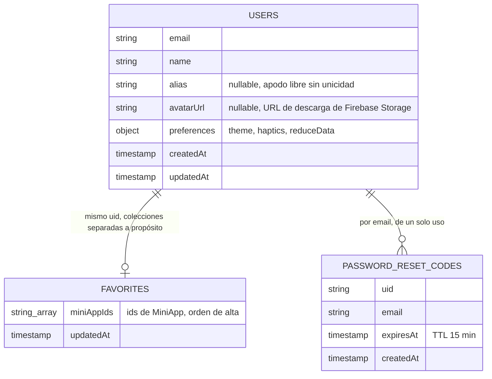
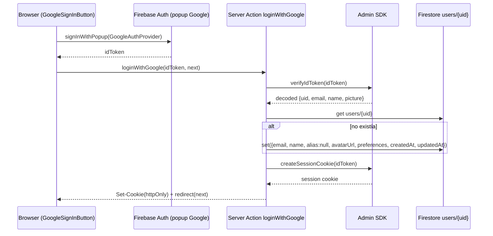

# Arquitectura de datos — Firestore

Registro vivo del diseño de colecciones de Firestore: qué documentos existen,
su forma, quién los lee/escribe, y las reglas de seguridad que necesitan.

**Regla del repo**: cada vez que se cree o modifique una colección, se cambie
la forma de un documento, o se toque la arquitectura de auth/datos, hay que
agregar una entrada al [Changelog](#changelog) de este archivo — qué cambió,
por qué, un diagrama si ayuda a entenderlo, y el bloque de reglas de
`firestore.rules` que haya que agregar o actualizar (el bloque en sí, no sólo
una descripción). Ver también la nota en `AGENTS.md`.

## Colecciones actuales

| Colección | Doc id | Definido en |
|---|---|---|
| `users` | `uid` de Firebase Auth | `src/lib/firebase/collections.ts` → `UserDoc` |
| `favorites` | `uid` de Firebase Auth | `src/lib/firebase/collections.ts` → `FavoritesDoc` |
| `passwordResetCodes` | `sha256(email:código)` | `src/lib/firebase/collections.ts` → `PasswordResetCodeDoc` |



`users` y `favorites` **se mantienen separadas** aunque ambas cuelgan del
mismo `uid`: los favoritos se leen/escriben con una transacción propia
(`toggleFavorite`, ver más abajo) y mezclarlos en un solo documento
obligaría a que cualquier cambio de perfil pase por esa misma transacción.

### `users/{uid}`

Perfil de cuenta. La identidad (email, password, uid) vive en **Firebase
Auth**; este documento es todo lo que Auth no sabe.

| Campo | Tipo | Se escribe en | Notas |
|---|---|---|---|
| `email` | `string` | alta | normalizado (`trim().toLowerCase()`) |
| `name` | `string` | alta, `updateProfileAction` | del form de alta, o del claim `name` de Google |
| `alias` | `string \| null` | alta (`null`), `updateProfileAction` | apodo libre, **sin unicidad** |
| `avatarUrl` | `string \| null` | alta (`null` o claim `picture` de Google), `updateProfileAction` | URL de descarga de Firebase Storage (`avatars/{uid}/avatar.jpg`, ver `uploadAvatar`) |
| `preferences` | `UserPreferences` | alta (defaults), `updatePreferencesAction` | ver tabla abajo |
| `createdAt` / `updatedAt` | `Timestamp` | siempre | `now()` = `serverTimestamp()`, nunca el reloj del cliente |

`UserPreferences`:

| Campo | Tipo | Default | Hoy vive también en |
|---|---|---|---|
| `theme` | `"light" \| "dark" \| "system"` | `"system"` | `localStorage["maguita:theme"]` |
| `haptics` | `boolean` | `true` | `localStorage["maguita:haptics"]` |
| `reduceData` | `boolean` | `false` | `localStorage["maguita:reduce-data"]` |

> Los defaults del server están alineados a propósito con los de
> `localStorage` para que, cuando se conecte la UI, un usuario nuevo vea lo
> mismo en ambos lados. **La UI todavía no lee/escribe estos campos** — hoy
> sigue funcionando 100% con `localStorage` (`ThemeProvider`,
> `SettingsPanel`). Los accesores están listos para cuando se conecte.

Accesores: `getProfile` (`src/lib/data/profile.ts`, sólo Server Components),
`updateProfileAction` / `updatePreferencesAction`
(`src/lib/data/profile-actions.ts`, Server Actions — re-verifican la sesión).
`updateProfileAction` sigue el patrón `useActionState` (recibe
`prevState, FormData`, ver `EditProfileForm`) y, si el form manda una foto,
la sube con `uploadAvatar` (`src/lib/firebase/storage.ts`) antes de escribir
`avatarUrl`. Alta: `createAccount` / `findOrCreateGoogleAccount`
(`src/lib/auth/users.ts`).

### `favorites/{uid}`

| Campo | Tipo | Notas |
|---|---|---|
| `miniAppIds` | `string[]` | ids de `MiniApp` (`src/lib/data/mini-apps.ts`), en orden de alta |
| `updatedAt` | `Timestamp` | — |

Un solo documento por cuenta con el array entero: pocos favoritos, así que
una lectura gana contra N lecturas de una subcolección. `toggleFavorite`
(`src/lib/data/favorites.ts`) usa una transacción porque es
read-modify-write — sin ella, dos toques casi simultáneos (celular + compu)
pisarían el cambio del otro.

### `passwordResetCodes/{hash}`

| Campo | Tipo | Notas |
|---|---|---|
| `uid` | `string` | cuenta dueña del código |
| `email` | `string` | — |
| `expiresAt` | `Timestamp` | TTL de 15 min |
| `createdAt` | `Timestamp` | — |

El id del documento es `sha256(email:código)`, nunca el código en claro —
alguien con acceso de lectura ve que hay un pedido pendiente, pero no puede
usarlo. Se borra al canjearse, exista o no (un intento fallido no deja el
código vivo para seguir probando).

## Reglas de Firestore

**Estado actual del proyecto real (Firebase Console), pegado por el
usuario el 2026-08-01 — deniega todo:**

```
rules_version = '2';

service cloud.firestore {
  match /databases/{database}/documents {
    match /{document=**} {
      allow read, write: if false;
    }
  }
}
```

**Reglas objetivo, ya escritas en `firestore.rules` en el repo, pendientes
de publicar** (`firebase deploy --only firestore:rules --project maguita-7832c`):

```
rules_version = '2';

service cloud.firestore {
  match /databases/{database}/documents {

    function isOwner(uid) {
      return request.auth != null && request.auth.uid == uid;
    }

    match /users/{uid} {
      allow read: if isOwner(uid);
      allow write: if false;
    }

    match /favorites/{uid} {
      allow read: if isOwner(uid);
      allow write: if false;
    }

    match /passwordResetCodes/{code} {
      allow read, write: if false;
    }

    match /{document=**} {
      allow read, write: if false;
    }
  }
}
```

⚠️ **Acción pendiente**: publicar estas reglas contra el proyecto real —
todavía no están activas ahí, sólo en el repo. Sin esto, el cliente no puede
leer ni `users/{uid}` ni `favorites/{uid}` (aunque las escrituras del server
con el Admin SDK funcionan igual, porque ese SDK saltea las reglas).

**Ningún cambio de reglas hizo falta** para agregar `alias`, `avatarUrl` y
`preferences` a `users/{uid}`: la colección ya tenía `allow write: if false`
(todo pasa por el Admin SDK) y `allow read: if isOwner(uid)` cubre el
documento entero, campos nuevos incluidos — Firestore no tiene reglas a
nivel de campo para lectura.

## Changelog

### 2026-08-01 — Pantalla de editar perfil: subida real de avatar a Firebase Storage

- Cierra el pendiente `IMAGE_STORAGE_PROVIDER` (ver entrada de abajo): `avatarUrl`
  pasa de ser "sólo texto" a una URL de descarga real de **Firebase Storage**,
  subida por `uploadAvatar` (`src/lib/firebase/storage.ts`, Admin SDK) a una
  ruta fija por usuario (`avatars/{uid}/avatar.jpg` — cada subida nueva
  sobreescribe la anterior, sin archivos huérfanos).
- `updateProfileAction` (`src/lib/data/profile-actions.ts`) cambia de firma:
  de argumentos tipados (`{name?, alias?}`) a `(prevState, formData)`, patrón
  `useActionState`, para poder recibir el archivo de la foto junto con
  `name`/`alias` en un solo submit. Nueva pantalla `/ajustes/perfil`
  (`src/app/(app)/ajustes/perfil/page.tsx` + `EditProfileForm`), con un
  `AvatarPicker` propio (`src/components/molecules/AvatarPicker.tsx`) que
  comprime la imagen en el cliente (canvas, recorte cuadrado, máx. 512px)
  antes de mandarla.
- `UserAvatar` (`src/components/molecules/UserAvatar.tsx`) gana un prop `src`
  opcional para mostrar la foto real en vez de sólo iniciales; se conecta en
  el account card de `SettingsPanel`/`ajustes`.
- **Nuevo archivo `storage.rules`** (el proyecto no tenía reglas de Storage
  hasta ahora) + `firebase.json` referenciándolo:
  ```
  rules_version = '2';
  service firebase.storage {
    match /b/{bucket}/o {
      match /avatars/{uid}/{fileName} {
        allow read: if true;
        allow write: if false;
      }
      match /{allPaths=**} {
        allow read, write: if false;
      }
    }
  }
  ```
  Mismo criterio que Firestore: todas las subidas van por el Admin SDK
  (`uploadAvatar`), que saltea las rules; el cliente nunca escribe. La
  lectura de `avatars/{uid}/*` es pública a propósito, así se puede mostrar
  con un `` normal sin manejar tokens de descarga ni signed URLs.
  Pendiente de publicar contra el proyecto real, igual que `firestore.rules`
  (ver sección de arriba): `firebase deploy --only storage:rules`.
- **`firestore.rules` no necesita ningún cambio**: `avatarUrl` sigue siendo
  un `string | null` como cualquier otro campo de `users/{uid}`, que ya
  tenía `allow write: if false` (todo por Admin SDK) y `allow read: if
  isOwner(uid)` cubriendo el documento entero. El bloque vigente (idéntico
  al de la sección de reglas de arriba) queda igual:
  ```
  match /users/{uid} {
    allow read: if isOwner(uid);
    allow write: if false;
  }
  ```
- `next.config.ts`: `experimental.serverActions.bodySizeLimit` sube a
  `"4mb"` (el default es 1MB) porque el form de editar perfil manda la foto
  como `multipart/form-data`.
- **Fuera de alcance a propósito**: el saludo del header (`AppShell`) sigue
  mostrando sólo iniciales — depende de la session cookie (`CurrentUser`),
  no de una lectura de Firestore, y conectarlo ahí es un cambio más grande
  que no se pidió. Cambiar el email tampoco está implementado (requiere
  reautenticación en Firebase Auth).

### 2026-08-01 — Perfil extendido: alias, avatar, preferencias

- `UserDoc` (`src/lib/firebase/collections.ts`) gana `alias`, `avatarUrl` y
  `preferences` (nuevo tipo `UserPreferences` + `DEFAULT_PREFERENCES`).
- `createAccount` y `findOrCreateGoogleAccount` (`src/lib/auth/users.ts`)
  escriben el documento completo con estos campos desde el alta;
  `findOrCreateGoogleAccount` además toma `avatarUrl` del claim `picture`
  de Google, que antes se descartaba sin usar.
- Nuevos accesores `src/lib/data/profile.ts` (`getProfile`) y
  `src/lib/data/profile-actions.ts` (`updateProfileAction`,
  `updatePreferencesAction`), siguiendo el mismo patrón que
  `favorites.ts` / `favorites-actions.ts`.
- Sin cambios de reglas (ver sección de arriba).
- **Fuera de alcance a propósito**: no se conectó `SettingsPanel` ni
  `ThemeProvider` — siguen en `localStorage`. Falta subir avatar
  (depende de `IMAGE_STORAGE_PROVIDER`, todavía sin implementar).

### 2026-08-01 — Ingreso y alta automática con Google

- Nueva Server Action `loginWithGoogle` (`src/lib/auth/actions.ts`) y
  `findOrCreateGoogleAccount` (`src/lib/auth/users.ts`): reutiliza el mismo
  canje de ID token por session cookie que el login por contraseña
  (`createSession`, `src/lib/auth/session.ts`).
- La cuenta de **Firebase Auth** la crea Firebase solo en el primer login
  federado (eso es lo "automático" del alta); lo único que faltaba era el
  documento de perfil en Firestore, que ahora crea
  `findOrCreateGoogleAccount` sólo si no existía (nunca pisa un perfil ya
  creado).
- Nuevo componente cliente `GoogleSignInButton`
  (`src/components/organisms/auth/GoogleSignInButton.tsx`), con
  `signInWithPopup` del SDK de Firebase (ya lazy-cargado vía
  `src/lib/firebase/client.ts`), agregado a `LoginForm` y `SignupForm`.



- Sin cambios de reglas: la escritura del perfil sigue yendo por el Admin
  SDK, igual que el alta por contraseña.
- **Pendiente en Firebase Console** (fuera del repo, no es código): habilitar
  el proveedor **Google** en Authentication → Sign-in method — hoy sólo está
  habilitado Email/contraseña.
