# Arquitectura de datos — Firestore

Registro vivo del diseño de colecciones de Firestore: qué documentos existen,
su forma, quién los lee/escribe, y las reglas de seguridad que necesitan.

**Regla del repo**: cada vez que se cree o modifique una colección, se cambie
la forma de un documento, o se toque la arquitectura de auth/datos, hay que
agregar una entrada al [Changelog](#changelog) de este archivo — qué cambió,
por qué, un diagrama si ayuda a entenderlo, y el bloque de reglas de
`firestore.rules` que haya que agregar o actualizar (el bloque en sí, no sólo
una descripción). Ver también la nota en `AGENTS.md`.

## Colecciones actuales

| Colección | Doc id | Definido en |
|---|---|---|
| `users` | `uid` de Firebase Auth | `src/lib/firebase/collections.ts` → `UserDoc` |
| `favorites` | `uid` de Firebase Auth | `src/lib/firebase/collections.ts` → `FavoritesDoc` |
| `passwordResetCodes` | `sha256(email:código)` | `src/lib/firebase/collections.ts` → `PasswordResetCodeDoc` |
| `expenseCycles` | autogenerado | `src/lib/firebase/collections.ts` → `ExpenseCycleDoc` |
| `expenseMovements` | autogenerado | `src/lib/firebase/collections.ts` → `ExpenseMovementDoc` |
| `expenseCategories` | `uid` de Firebase Auth | `src/lib/firebase/collections.ts` → `ExpenseCategoriesDoc` |
| `wallets` | autogenerado | `src/lib/firebase/collections.ts` → `WalletDoc` |
| `walletMovements` | autogenerado | `src/lib/firebase/collections.ts` → `WalletMovementDoc` |
| `walletTrades` | autogenerado | `src/lib/firebase/collections.ts` → `WalletTradeDoc` |
| `notes` | autogenerado | `src/lib/firebase/collections.ts` → `NoteDoc` |
| `links` | autogenerado | `src/lib/firebase/collections.ts` → `LinkDoc` |
| `habits` | autogenerado | `src/lib/firebase/collections.ts` → `HabitDoc` |
| `workoutRoutines` | autogenerado | `src/lib/firebase/collections.ts` → `WorkoutRoutineDoc` |
| `workoutSessions` | `{uid}_{yyyy-mm-dd}` | `src/lib/firebase/collections.ts` → `WorkoutSessionDoc` |
| `customExercises` | autogenerado | `src/lib/firebase/collections.ts` → `CustomExerciseDoc` |
| `notifications` | autogenerado, o `sha256(uid:topic:dedupeKey)` | `src/lib/firebase/collections.ts` → `NotificationDoc` |
| `pushSubscriptions` | `sha256(endpoint)` | `src/lib/firebase/collections.ts` → `PushSubscriptionDoc` |
| `notificationPreferences` | `uid` de Firebase Auth | `src/lib/firebase/collections.ts` → `NotificationPreferencesDoc` |

```mermaid
erDiagram
    USERS {
        string email
        string name
        string alias "nullable, apodo libre sin unicidad"
        string avatarUrl "nullable, URL de descarga de Firebase Storage"
        object preferences "theme, haptics, reduceData, pinHash, lockedModules"
        timestamp createdAt
        timestamp updatedAt
    }
    FAVORITES {
        string_array miniAppIds "ids de MiniApp, orden de alta"
        timestamp updatedAt
    }
    PASSWORD_RESET_CODES {
        string uid
        string email
        timestamp expiresAt "TTL 15 min"
        timestamp createdAt
    }
    EXPENSE_CYCLES {
        string ownerId
        string title "nullable, ej. Gastos vacaciones Ushuaia"
        string startDate "yyyy-mm-dd"
        string endDate "yyyy-mm-dd"
        number initialBalance
        number expenseLimit
        string status "active | closed"
        timestamp createdAt
        timestamp updatedAt
        timestamp closedAt "nullable, sólo se llena al cerrar"
    }
    EXPENSE_MOVEMENTS {
        string cycleId
        string ownerId "duplicado del ciclo, evita un get() extra para validar dueño"
        string title
        string category "nombre de la categoría al momento del alta"
        string categoryEmoji "emoji de la categoría al momento del alta"
        number amount "negativo: esta alta sólo carga gastos"
        string date "yyyy-mm-dd"
        timestamp createdAt
    }
    EXPENSE_CATEGORIES {
        object_array categories "id, name, emoji — ABM del usuario"
        timestamp updatedAt
    }
    WALLETS {
        string ownerId
        string name "ej. Ahorro auto"
        string emoji "de una paleta fija, no input libre"
        string color "primary | accent | success | danger | muted"
        string kind "gastos | ahorro | credito | inversion — fijo desde el alta"
        string currency "ARS | USD | EUR | BRL | USDT — fija desde el alta"
        string purpose "nullable, de qué se encarga esta billetera"
        number initialBalance "saldo con el que arranca, 0 en inversión"
        number targetAmount "nullable, meta de ahorro"
        number creditLimit "nullable, sólo kind credito"
        map quotes "símbolo -> precio + fecha, sólo kind inversion"
        boolean pinnedToHome "acceso directo en el carrusel de Inicio"
        timestamp createdAt
        timestamp updatedAt
    }
    WALLET_TRADES {
        string walletId
        string ownerId "duplicado de la billetera"
        string kind "deposito | retiro | compra | venta | dividendo | comision"
        string date "yyyy-mm-dd"
        string assetSymbol "nullable — AAPL, BTC; clave de la API de cotizaciones"
        string assetName "nullable"
        string assetType "nullable"
        number quantity "nullable, admite decimales"
        number unitPrice "nullable, precio de esta operación"
        number cashAmount "con signo: + entra al efectivo, − sale"
        string note "nullable"
        timestamp createdAt
    }
    WALLET_MOVEMENTS {
        string walletId
        string ownerId "duplicado de la billetera, evita un get() extra"
        string title
        string category "copiado del ABM al momento del alta"
        string categoryEmoji
        number amount "negativo: gasto — positivo: ingreso"
        string date "yyyy-mm-dd"
        timestamp createdAt
    }
    NOTES {
        string ownerId
        string text
        string date "yyyy-mm-dd, día de creación — no editable"
        string priority "low | medium | high"
        boolean hasAlert
        string alertDate "yyyy-mm-dd, nullable — sólo si hasAlert"
        string alertTime "HH:mm, nullable — sólo si hasAlert"
        timestamp createdAt
        timestamp updatedAt
    }
    LINKS {
        string ownerId
        string url "URL completa, ya normalizada con protocolo"
        string title "nullable, og:title o <title> del sitio"
        string description "nullable, og:description o meta description"
        string image "nullable, URL absoluta de og:image/twitter:image"
        string siteName "nullable, og:site_name"
        string domain "host sin www., ej. github.com"
        string note "nullable, descripción propia del usuario"
        string category "nullable, categoría libre del usuario"
        timestamp createdAt
        timestamp updatedAt
    }
    HABITS {
        string ownerId
        string name "ej. Leer 20 minutos"
        string subtitle "nullable, bajada libre y corta"
        string emoji "de una paleta fija, no input libre"
        number_array scheduledWeekdays "Date.getDay(), 0-6, 1 a 7 valores"
        boolean alertEnabled
        string alertTime "HH:mm local, nullable si alertEnabled es false"
        number score "sube al cumplir, baja al perder un día programado"
        number order "posición manual, drag & drop"
        string lastPenalizedDay "yyyy-mm-dd, nullable"
        string_array doneDates "yyyy-mm-dd — derivado de actions cuando actions no está vacío"
        HabitActionDoc_array actions "[] = hábito simple, no vacío = grupo con timeline"
        map actionDoneDates "actionId -> yyyy-mm-dd[], historial por paso"
        timestamp createdAt
        timestamp updatedAt
    }
    WORKOUT_ROUTINES {
        string ownerId
        string name "ej. Full body 3 días"
        string type "gimnasio | crossfit | aire-libre | casa | funcional | otro"
        string description "nullable, bajada libre y corta"
        WorkoutDayDoc_array days "weekday (0-6, único), title y exercises (name 60, detail 200, exerciseId)"
        boolean active "sólo una por cuenta, garantizado por transacción"
        timestamp createdAt
        timestamp updatedAt
    }
    WORKOUT_SESSIONS {
        string ownerId
        string date "yyyy-mm-dd, duplica lo que ya dice el id del documento"
        string routineId "nullable, entrenamiento suelto si no hay rutina activa"
        string routineName "nullable, copiado al registrar — no es una referencia viva"
        string type "copiado de la rutina al registrar"
        string title "qué se entrenó ese día"
        string note "nullable, nota libre del día"
        timestamp createdAt
        timestamp updatedAt
    }
    CUSTOM_EXERCISES {
        string ownerId
        string name "ej. Remo invertido en anillas"
        string group "MuscleGroup del catálogo estático"
        string equipment "ExerciseEquipment del catálogo estático"
        string description "nullable"
        string_array tips "consejos de ejecución, hasta 8"
        timestamp createdAt
        timestamp updatedAt
    }
    USERS ||--o| FAVORITES : "mismo uid, colecciones separadas a propósito"
    USERS ||--o{ PASSWORD_RESET_CODES : "por email, de un solo uso"
    USERS ||--o{ EXPENSE_CYCLES : "ownerId, sólo uno active a la vez"
    USERS ||--o| EXPENSE_CATEGORIES : "mismo uid"
    EXPENSE_CYCLES ||--o{ EXPENSE_MOVEMENTS : "cycleId"
    EXPENSE_CATEGORIES ||--o{ EXPENSE_MOVEMENTS : "category/categoryEmoji copiados al alta, sin FK"
    USERS ||--o{ WALLETS : "ownerId, hasta 12, todas activas a la vez"
    WALLETS ||--o{ WALLET_MOVEMENTS : "walletId, en gastos/ahorro/credito"
    WALLETS ||--o{ WALLET_TRADES : "walletId, sólo en kind inversion"
    EXPENSE_CATEGORIES ||--o{ WALLET_MOVEMENTS : "mismo ABM que los gastos del ciclo, copiado al alta"
    NOTIFICATIONS {
        string ownerId
        string topic "id del registro de topics"
        string title
        string description "nullable"
        string tone "info | success | warning | danger | neutral"
        string href "nullable, ruta interna"
        boolean read
        timestamp readAt "nullable"
        timestamp createdAt
        timestamp expiresAt "TTL, 30 días por defecto"
    }
    PUSH_SUBSCRIPTIONS {
        string ownerId
        string endpoint "URL del push service"
        string p256dh "clave de cifrado de la suscripción"
        string auth "secreto de autenticación"
        string userAgent "nullable, recortado a 200"
        string timeZone "nullable, IANA"
        timestamp createdAt
        timestamp updatedAt
        timestamp lastSuccessAt "nullable"
        number failureCount "a los 3 seguidos se borra la fila"
    }
    NOTIFICATION_PREFERENCES {
        boolean pushEnabled "interruptor maestro"
        object topics "override de push por topic"
        object quietHours "enabled, from, to"
        string timeZone "nullable, IANA"
        timestamp updatedAt
    }
    USERS ||--o{ NOTES : "ownerId"
    USERS ||--o{ LINKS : "ownerId"
    USERS ||--o{ HABITS : "ownerId"
    USERS ||--o{ WORKOUT_ROUTINES : "ownerId, sólo una active a la vez"
    USERS ||--o{ WORKOUT_SESSIONS : "ownerId, a lo sumo una por día"
    WORKOUT_ROUTINES ||--o{ WORKOUT_SESSIONS : "routineId; name/type copiados al registrar, sin FK"
    USERS ||--o{ CUSTOM_EXERCISES : "ownerId, ABM de la biblioteca"
    CUSTOM_EXERCISES ||--o{ WORKOUT_ROUTINES : "days[].exercises[].exerciseId; name copiado, sin FK"
    USERS ||--o{ NOTIFICATIONS : "ownerId"
    USERS ||--o{ PUSH_SUBSCRIPTIONS : "ownerId, una por navegador"
    USERS ||--o| NOTIFICATION_PREFERENCES : "mismo uid"
    NOTES ||--o{ NOTIFICATIONS : "alertDate/alertTime, vía el cron de dispatch"
    HABITS ||--o{ NOTIFICATIONS : "hitos de racha"
    EXPENSE_CYCLES ||--o{ NOTIFICATIONS : "umbrales del tope"
```

`users` y `favorites` **se mantienen separadas** aunque ambas cuelgan del
mismo `uid`: los favoritos se leen/escriben con una transacción propia
(`toggleFavorite`, ver más abajo) y mezclarlos en un solo documento
obligaría a que cualquier cambio de perfil pase por esa misma transacción.

### `users/{uid}`

Perfil de cuenta. La identidad (email, password, uid) vive en **Firebase
Auth**; este documento es todo lo que Auth no sabe.

| Campo | Tipo | Se escribe en | Notas |
|---|---|---|---|
| `email` | `string` | alta | normalizado (`trim().toLowerCase()`) |
| `name` | `string` | alta, `updateProfileAction` | del form de alta, o del claim `name` de Google |
| `alias` | `string \| null` | alta (`null`), `updateProfileAction` | apodo libre, **sin unicidad** |
| `avatarUrl` | `string \| null` | alta (`null` o claim `picture` de Google), `updateProfileAction` | URL de descarga de Firebase Storage (`avatars/{uid}/avatar.jpg`, ver `uploadAvatar`) |
| `preferences` | `UserPreferences` | alta (defaults), `updatePreferencesAction` | ver tabla abajo |
| `createdAt` / `updatedAt` | `Timestamp` | siempre | `now()` = `serverTimestamp()`, nunca el reloj del cliente |

`UserPreferences`:

| Campo | Tipo | Default | Hoy vive también en |
|---|---|---|---|
| `theme` | `"light" \| "dark" \| "system"` | `"system"` | `localStorage["maguita:theme"]` |
| `haptics` | `boolean` | `true` | `localStorage["maguita:haptics"]` |
| `reduceData` | `boolean` | `false` | `localStorage["maguita:reduce-data"]` |
| `pinHash` | `string \| null` | `null` | — (sólo Firestore, ver el [Changelog](#changelog)) |
| `lockedModules` | `string[]` | `[]` | — (sólo Firestore, ídem) |

> Los defaults de `theme`/`haptics`/`reduceData` están alineados a propósito
> con los de `localStorage` para que, cuando se conecte la UI, un usuario
> nuevo vea lo mismo en ambos lados. **La UI todavía no lee/escribe esos tres
> campos** — hoy siguen funcionando 100% con `localStorage`
> (`ThemeProvider`, `SettingsPanel`). Los accesores están listos para cuando
> se conecten. `pinHash`/`lockedModules` son la excepción: esos sí están
> conectados de punta a punta desde que se agregaron (ver el changelog).

Accesores: `getProfile` (`src/lib/data/profile.ts`, sólo Server Components),
`updateProfileAction` / `updatePreferencesAction`
(`src/lib/data/profile-actions.ts`, Server Actions — re-verifican la sesión).
`updateProfileAction` sigue el patrón `useActionState` (recibe
`prevState, FormData`, ver `EditProfileForm`) y, si el form manda una foto,
la sube con `uploadAvatar` (`src/lib/firebase/storage.ts`) antes de escribir
`avatarUrl`. Alta: `createAccount` / `findOrCreateGoogleAccount`
(`src/lib/auth/users.ts`). `pinHash`/`lockedModules` tienen sus propias
Server Actions (`setPinAction`, `setModuleLockAction`) y una de verificación
(`verifyPinAction`) — ver el changelog para el detalle.

### `favorites/{uid}`

| Campo | Tipo | Notas |
|---|---|---|
| `miniAppIds` | `string[]` | ids de `MiniApp` (`src/lib/data/mini-apps.ts`), en orden de alta |
| `updatedAt` | `Timestamp` | — |

Un solo documento por cuenta con el array entero: pocos favoritos, así que
una lectura gana contra N lecturas de una subcolección. `toggleFavorite`
(`src/lib/data/favorites.ts`) usa una transacción porque es
read-modify-write — sin ella, dos toques casi simultáneos (celular + compu)
pisarían el cambio del otro.

### `expenseCycles/{cycleId}` y `expenseMovements/{movementId}`

Gestor de gastos por período: hoy vive sólo en la tab **Movimientos** de
Inicio, pero las dos colecciones están pensadas para que una mini-app de
gastos aparte, más adelante, las lea/escriba igual — por eso son colecciones
propias en vez de un array adentro de `users/{uid}`.

`expenseCycles/{cycleId}` (id autogenerado):

| Campo | Tipo | Notas |
|---|---|---|
| `ownerId` | `string` | uid del dueño |
| `title` | `string \| null` | libre, ej. "Gastos vacaciones Ushuaia". `null` = la UI muestra el lapso de fechas (`expenseCycleTitle`, `src/lib/home-model.ts`) |
| `startDate` / `endDate` | `string` | día del período, `yyyy-mm-dd` |
| `initialBalance` | `number` | saldo inicial, pesos enteros |
| `expenseLimit` | `number` | tope de gastos, pesos enteros |
| `status` | `"active" \| "closed"` | sólo un `active` por usuario a la vez |
| `createdAt` / `updatedAt` | `Timestamp` | — |
| `closedAt` | `Timestamp \| null` | `null` mientras está `active` |

`expenseMovements/{movementId}` (id autogenerado):

| Campo | Tipo | Notas |
|---|---|---|
| `cycleId` | `string` | referencia a `expenseCycles/{cycleId}` |
| `ownerId` | `string` | duplicado del `ownerId` del ciclo (ver abajo) |
| `title` | `string` | concepto |
| `category` / `categoryEmoji` | `string` | nombre y emoji de la categoría **copiados al momento del alta** desde `expenseCategories/{uid}` (ver esa sección abajo) — no es una referencia viva. Los ingresos usan la categoría fija `"Ingreso"` / `💰`, sin pasar por el ABM |
| `amount` | `number` | negativo = gasto (`addExpenseMovementAction`), positivo = ingreso (`addExpenseIncomeAction`) |
| `date` | `string` | día del movimiento, `yyyy-mm-dd` |
| `createdAt` | `Timestamp` | — |

Accesores: `getActiveExpenseCycle` / `getExpenseMovements`
(`src/lib/data/expenses.ts`, sólo Server Components); `startExpenseCycleAction`
(alta/reinicio), `updateExpenseCycleAction` (edita tope y fechas de un ciclo
en curso, sin cerrarlo), `addExpenseMovementAction` (gasto),
`addExpenseIncomeAction` (ingreso) — todas en `src/lib/data/expenses-actions.ts`.

Decisiones de diseño:

- **Un solo `active` por usuario, garantizado por transacción.**
  `startExpenseCycleAction` cierra (`status: "closed"`) el ciclo activo del
  usuario y crea el nuevo dentro de la misma `runTransaction`: así nunca hay
  una ventana en la que un doble tap cree dos ciclos activos. El ciclo cerrado
  no se borra — queda como historial, tal cual pidió el dueño del producto
  ("cuando finalice se podrá reiniciar, dejando el anterior como historial").
  Verlo todavía no tiene UI (fuera de alcance de esta entrada).
- **`ownerId` duplicado en `expenseMovements`.** Sin él, para saber si un
  movimiento es de la cuenta que lo pide habría que ir a buscar su ciclo
  (`get()` extra) tanto en las reglas de Firestore como en
  `addExpenseMovementAction`. Con el campo repetido, las reglas leen
  `resource.data.ownerId` directo y la Server Action valida dueño y
  `status === "active"` con el mismo documento que ya trae (`cycleRef.get()`),
  sin una consulta aparte — importa porque el Admin SDK saltea las reglas, así
  que esa validación en la Server Action es la única barrera real contra que
  una sesión válida le cargue gastos al ciclo de otra cuenta pasando su
  `cycleId`.
- **Sin `orderBy` en las consultas.** `getExpenseMovements` filtra sólo por
  `cycleId` (`==`) y ordena en memoria con `byDayDesc` (`src/lib/home-model.ts`,
  ya usado por notas y hábitos). Sumar un `orderBy` en un campo distinto al
  filtro le pediría a Firestore un índice compuesto que hoy no hace falta —
  los movimientos de un período son pocos.

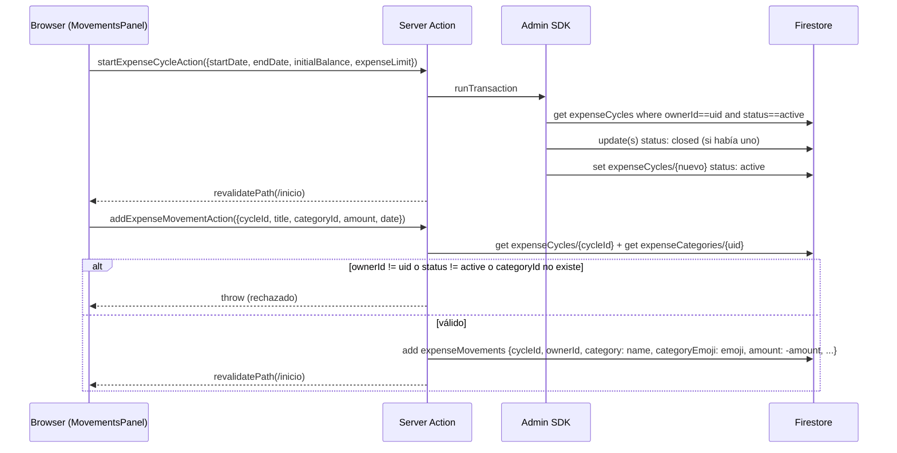

### `expenseCategories/{uid}`

ABM de categorías del gestor de gastos (nombre + emoji). Un solo documento
por cuenta con el array entero, igual que `favorites/{uid}`: son pocas
categorías, así que una lectura gana contra N de una subcolección.

| Campo | Tipo | Notas |
|---|---|---|
| `categories` | `{ id, name, emoji }[]` | orden de alta; `id` es un `randomUUID()` del server |
| `updatedAt` | `Timestamp` | — |

Accesores: `getExpenseCategories` (`src/lib/data/expense-categories.ts`, sólo
Server Components), `upsertExpenseCategoryAction` / `deleteExpenseCategoryAction`
(`src/lib/data/expense-categories-actions.ts`, Server Actions — devuelven el
array completo ya actualizado, no sólo el item tocado).

Decisiones de diseño:

- **Sin documento todavía = `DEFAULT_EXPENSE_CATEGORIES`.** Un usuario nuevo
  no tiene `expenseCategories/{uid}` hasta su primer alta/edición/borrado; en
  ese hueco, `getExpenseCategories` devuelve un set fijo en código (7
  categorías con emoji) para que el selector del alta de gastos no arranque
  vacío. En cuanto el usuario toca el ABM por primera vez, ese set pasa a ser
  la base sobre la que se aplica el cambio (mismo patrón que
  `DEFAULT_PREFERENCES` en `users/{uid}`).
- **`category`/`categoryEmoji` se copian al movimiento, no se referencian.**
  Si el usuario renombra o borra una categoría después, los gastos ya
  cargados con ella siguen mostrando el nombre/emoji que tenían al momento
  del alta — evita que borrar una categoría deje movimientos "rotos" o que
  editarla reescriba silenciosamente el historial. `addExpenseMovementAction`
  resuelve `category`/`categoryEmoji` del lado del server a partir del
  `categoryId` recibido (nunca confía en un nombre/emoji que mande el
  cliente).
- **Las Server Actions devuelven el array completo.** El sheet del ABM
  (`ExpenseCategoriesSheet`) guarda las categorías en estado local para
  poder editar sin depender de que el sheet — que no se vuelve a montar
  solo mientras está abierto — reciba props nuevas; devolver el array ya
  actualizado evita un segundo viaje a Firestore sólo para refrescar la
  lista en pantalla.

### `wallets/{walletId}` y `walletMovements/{movementId}`

Mini-app privada **Billetera** (`/mini-apps/billetera`): varias bolsas de plata
en paralelo, cada una para un fin distinto ("Ahorro auto", "Casa", "Viaje"),
con su saldo y sus movimientos.

Es la **extensión** del gestor de gastos a varias cuentas, no su reemplazo: la
tab "Principal" de la mini-app es literalmente el `MovementsPanel` de la tab
Movimientos de Inicio y sigue leyendo `expenseCycles`/`expenseMovements` sin
ningún cambio. Estas dos colecciones son sólo las billeteras extra.

`wallets/{walletId}` (id autogenerado, dueño por campo como `notes`/`habits`):

| Campo | Tipo | Notas |
|---|---|---|
| `ownerId` | `string` | uid del dueño |
| `name` | `string` | nombre libre, ej. "Ahorro auto". Máx. 40 caracteres |
| `emoji` | `string` | de la paleta fija de `wallet-model.ts`, no un input libre |
| `color` | `WalletColor` | `primary`/`accent`/`success`/`danger`/`muted`. Lista cerrada, y **sólo con tokens que existen en el tema** (`globals.css` de `lib-kit-components` no define `warning`) |
| `kind` | `WalletKind` | `gastos`/`ahorro`/`credito`/`inversion`. **Fijo desde el alta** (ver abajo) |
| `currency` | `CurrencyCode` | `ARS`/`USD`/`EUR`/`BRL`/`USDT`. **Fija desde el alta** |
| `creditLimit` | `number \| null` | límite de la tarjeta/préstamo. Sólo en `kind: "credito"`, `null` en el resto |
| `purpose` | `string \| null` | de qué se encarga la billetera, ej. "Cuota y seguro". Máx. 80. `null` = sin bajada |
| `initialBalance` | `number` | plata con la que arranca, pesos enteros |
| `targetAmount` | `number \| null` | meta de ahorro. `null` = sin meta, la card no dibuja la barra |
| `pinnedToHome` | `boolean` | si aparece como acceso directo en el carrusel del Resumen de Inicio. Ausente en billeteras creadas antes del campo: se lee con `?? false` |
| `createdAt` / `updatedAt` | `Timestamp` | `createdAt` es lo que ordena la grilla y el carrusel |

`walletMovements/{movementId}` (id autogenerado):

| Campo | Tipo | Notas |
|---|---|---|
| `walletId` | `string` | referencia a `wallets/{walletId}` |
| `ownerId` | `string` | duplicado del `ownerId` de la billetera, mismo motivo que en `expenseMovements` |
| `title` | `string` | concepto. Vacío = se completa con el nombre de la categoría |
| `category` / `categoryEmoji` | `string` | **copiados al alta** desde `expenseCategories/{uid}` — el mismo ABM que usan los gastos del ciclo, no uno propio. Los ingresos usan la categoría fija `"Ingreso"` / `💰` |
| `amount` | `number` | negativo = gasto, positivo = ingreso |
| `date` | `string` | `yyyy-mm-dd` |
| `createdAt` | `Timestamp` | — |

`walletTrades/{tradeId}` (id autogenerado) — el **libro de operaciones**, sólo
de las billeteras con `kind: "inversion"`:

| Campo | Tipo | Notas |
|---|---|---|
| `walletId` | `string` | referencia a `wallets/{walletId}` |
| `ownerId` | `string` | duplicado, mismo motivo que en `walletMovements` |
| `kind` | `TradeKind` | `deposito`/`retiro`/`compra`/`venta`/`dividendo`/`comision` |
| `date` | `string` | `yyyy-mm-dd`. Es lo que ordena el libro |
| `assetSymbol` | `string \| null` | mayúsculas, sin puntos ("AAPL", "BTC"). `null` en depósito/retiro/comisión. Clave de agrupación de tenencias y de la futura API de cotizaciones |
| `assetName` / `assetType` | `string \| null` / `AssetType \| null` | copiados en cada asiento del activo |
| `quantity` | `number \| null` | unidades operadas, positivo. **Admite decimales**. `null` fuera de compra/venta |
| `unitPrice` | `number \| null` | precio por unidad de *esta* operación. `null` fuera de compra/venta |
| `cashAmount` | `number` | **con signo**: `+` entra al efectivo (depósito, venta, dividendo), `−` sale (retiro, compra, comisión) |
| `note` | `string \| null` | nota libre. Máx. 140 |
| `createdAt` | `Timestamp` | desempata dos asientos del mismo día |

**No existe ningún documento de "tenencia" ni de "saldo de la cartera".** Las
unidades de cada activo, su costo promedio, el resultado realizado y el
efectivo sin invertir salen todos de recorrer este libro en orden
(`portfolio()`, `wallet-model.ts`).

Accesores: `getWallets` / `getWalletMovements` / `getWalletTrades` /
`getWalletsWithContents` / `getWalletShortcuts` (`src/lib/data/wallets.ts`,
sólo Server Components); `addWalletAction`, `updateWalletAction`,
`deleteWalletAction`, `toggleWalletHomePinAction`, `addWalletMovementAction`,
`deleteWalletMovementAction`, `recordTradeAction`, `deleteTradeAction`,
`setQuoteAction` (`src/lib/data/wallets-actions.ts`, Server Actions — todas
re-verifican la sesión y el dueño del documento). Los cálculos de saldo,
cartera y formato por moneda son puros y viven en `src/lib/wallet-model.ts`,
compartidos entre la validación del server y la pantalla.

Decisiones de diseño:

- **Colección propia (`walletMovements`) en vez de sumarle un `walletId` a
  `expenseMovements`.** Reusar la colección del gestor de gastos habría
  obligado a volver `cycleId` nullable —y con eso a re-auditar cada consulta
  que hoy asume que todo movimiento cuelga de un ciclo— y, sobre todo, habría
  mezclado los dos módulos en el borrado por módulo de Ajustes:
  `resetModuleDataAction` borra por `ownerId`, así que "restablecer
  Movimientos" se habría llevado puestas también las billeteras. Con dos
  colecciones, cada módulo de `RESETTABLE_MODULES` borra lo suyo y nada más.
  El precio es duplicar unas pocas líneas de lectura/escritura; lo que sí se
  comparte es todo lo que importa: la forma del movimiento (`Movement`), el
  ABM de categorías, `MovementsList` y `formatMoney`.
- **El saldo se deriva, no se guarda.** `walletTotals` lo calcula en cada
  lectura a partir de `initialBalance` y los movimientos, igual que
  `expenseCycleProgress` con el ciclo. Un campo acumulado habría que
  mantenerlo sincronizado en cada alta y en cada baja, y se desincroniza en el
  primer error a mitad de camino.
- **Una sola consulta de movimientos por usuario, agrupada en memoria.**
  `getWalletMovements` filtra por `ownerId` (no por `walletId`) y
  `getWalletsWithMovements` los agrupa en un `Map`. Una consulta por billetera
  —o un `in` sobre sus ids— serían N lecturas o un índice compuesto para traer
  exactamente los mismos documentos: la grilla muestra el saldo de todas y el
  detalle de cualquiera al tocarla, así que igual las necesita todas. Mismo
  criterio que `getWorkoutSessions`.
- **Sin `orderBy` en ninguna de las dos consultas.** Las dos filtran sólo por
  `ownerId` (`==`) y ordenan en memoria (`createdAt` para las billeteras,
  `byDayDesc` para los movimientos) — mismo criterio que
  `getNotes`/`getLinks`/`getExpenseMovements`, evita un índice compuesto.
- **`emoji` y `color` se estrechan del lado del server.** El cliente los elige
  de grillas fijas, así que `normalizeWalletFields` los valida contra los
  mismos registros de `wallet-model.ts` y cae al default en vez de guardar lo
  que llegue; `getWallets` vuelve a validar `color` **al leer** para que un
  documento viejo con un color que ya no está en el registro no rompa la
  grilla (mismo criterio que `group`/`equipment` en `getCustomExercises`).
- **Borrar una billetera borra sus movimientos.** A diferencia de un
  `expenseCycle` cerrado —que queda como historial— una billetera borrada no
  se puede volver a ver desde ninguna pantalla, así que dejar sus movimientos
  huérfanos sólo sumaría documentos invisibles que igual se leen en cada carga
  (`getWalletMovements` consulta por `ownerId`, no por billetera). Va en tandas
  de 500 (el tope de un `WriteBatch`) repitiendo hasta vaciar, igual que
  `deleteOwnedDocs` en `module-reset-actions.ts`.
- **`initialBalance` sí es editable**, a diferencia del saldo inicial de un
  `expenseCycle`. Allá cambiarlo a mitad de período resignificaría los gastos
  ya cargados contra un punto de partida distinto al que tenían; una billetera
  no es un período contra el que se mida nada, es una bolsa viva cuyo punto de
  partida el usuario puede haber cargado mal.
- **Un solo alta para gasto e ingreso** (`addWalletMovementAction`, con un
  `kind`), a diferencia del gestor de gastos que tiene
  `addExpenseMovementAction` y `addExpenseIncomeAction` por separado: acá los
  dos escriben exactamente el mismo documento —no hay ciclo activo que validar
  ni umbral de tope que avisar—, así que la única diferencia es el signo y de
  dónde sale la categoría.
- **Tope de 12 billeteras por cuenta.** La grilla las muestra todas juntas sin
  paginar y cada carga baja también sus movimientos; mismo tipo de resguardo
  que el tope de 50 hábitos. Se chequea con un `count()`, que devuelve el
  número sin traerse los documentos.
- **El tipo (`kind`) es lo que define qué lleva adentro la billetera.** Es un
  campo y no cuatro colecciones distintas porque todo lo que las rodea es
  idéntico: nombre, ícono, color, moneda, el candado, el carrusel de Inicio, el
  borrado en cascada. Lo único que cambia es qué se carga y cómo se lee el
  número principal, y eso se resuelve con un registro
  (`WALLET_KINDS`, `wallet-model.ts`) que expone dos banderas —`usesPositions`
  e `isDebt`— en vez de un `switch` repetido en cada pantalla.
  `walletHeadline`/`walletProgress` son las que traducen ese registro a "qué
  número muestro y con qué nombre", así que la grilla, el detalle y el carrusel
  de Inicio dicen exactamente lo mismo sin coordinarse.
- **`credito` invierte el signo al mostrar, no al guardar.** Un consumo se
  guarda como movimiento negativo igual que un gasto (misma colección, misma
  forma), y es `walletHeadline` la que muestra "Deuda: $5.000" en vez de
  "−$5.000". Guardarlo con el signo cambiado habría hecho que `walletTotals`
  —que es la misma función para los cuatro tipos— necesitara saber el tipo.
- **Una cartera es un libro de operaciones, y todo lo demás se deriva.** No hay
  ningún documento que diga "tengo 6 AAPL" ni "me quedan $820 sin invertir":
  las dos cosas salen de recorrer `walletTrades` en orden. Es lo que hace la
  cartera trazable de punta a punta —cada unidad y cada peso se puede seguir
  hasta el asiento que lo puso ahí— y lo que **hace imposible** que un total y
  su detalle se desincronicen, porque el total *es* el detalle sumado. Borrar
  una operación no necesita recalcular nada: el fold vuelve a correr sobre lo
  que quedó.

  La contracara es que cada lectura recalcula. Con un tope de 500 asientos por
  cartera es un `for` sobre unos cientos de objetos en memoria, muy por debajo
  de lo que costaría mantener contadores sincronizados y de los bugs que eso
  arrastra.

  El invariante que tiene que cerrar siempre es
  **`aportado + resultado total = valor de la cartera`** (depósitos − retiros,
  más lo ganado realizado y sin realizar, igual a efectivo + valor de mercado).
- **Costo promedio ponderado, no FIFO.** Cada compra promedia su precio con lo
  que ya había; cada venta saca unidades a ese promedio y la diferencia contra
  lo que entró de efectivo es el resultado realizado. Es el criterio estándar y
  el único que no obliga a guardar de qué compra puntual salió cada unidad
  vendida — FIFO exigiría un modelo de lotes que este libro deliberadamente no
  tiene.
- **El orden del recorrido es parte del cálculo, no cosmética.** `byTradeOrder`
  ordena por día, después por `createdAt` y después por id: el costo promedio y
  el resultado de cada venta dependen de qué se compró antes, así que recorrer
  el mismo libro en otro orden da otros números. Vive en `wallet-model.ts` (no
  en la consulta) para que el server y el cliente usen exactamente el mismo.
- **Los asientos no se editan, sólo se borran.** Un asiento editable dejaría de
  ser el registro de lo que pasó. Borrar puede dejar el libro incompleto (una
  venta cuya compra se borró): en vez de bloquearlo, el fold clampea la
  cantidad en cero y marca la tenencia como `inconsistent` para que la pantalla
  lo avise — atar al usuario a un asiento mal cargado sería peor.
- **La plata de una venta no se "acredita" en ningún lado.** Queda como
  efectivo sin invertir por construcción: el efectivo *es* la suma de la
  columna `cashAmount`, así que asentar la venta ya lo deja disponible para
  otra compra o para retirar. Sin un saldo que actualizar, no hay forma de que
  una venta se registre y el efectivo no se entere.
- **El efectivo puede quedar negativo y no se bloquea.** Cargar una compra sin
  el depósito previo es normal cuando se está cargando historial fuera de
  orden; el composer avisa y la cartera lo muestra en rojo. Trabar la carga
  obligaría a inventar un depósito para poder seguir.
- **`cashAmount` se guarda aunque en compra/venta sea derivable.** Es la
  columna que hace que el efectivo se lea como un extracto, y deja lugar a que
  una operación mueva un importe distinto al teórico (comisión del broker
  incluida, redondeo) — que es justamente lo que el campo "importe total"
  opcional del composer permite cargar.
- **Las cotizaciones van en un mapa dentro de la billetera
  (`wallets.quotes`), no en una colección.** Firestore soporta rutas de campo
  por clave, así que actualizar un símbolo es una escritura atómica de un solo
  campo (`quotes.AAPL`) sin leer ni reescribir el resto — misma mecánica que
  `HabitDoc.actionDoneDates`, y por eso el símbolo **no puede tener puntos**
  (`quotes.BRK.B` escribiría en `quotes → BRK → B`). Y va por billetera y no
  global porque el precio está expresado en la moneda de *esa* billetera.

  Cotizar **no es una operación**: no mueve efectivo ni tenencia, sólo cambia a
  cuánto se valúa lo que ya está. Por eso no entra al libro.
- **`kind` y `currency` no se pueden editar.** Cambiar el tipo dejaría
  movimientos en una billetera que pasó a llevar un libro (o al revés) y
  resignificaría su saldo; cambiar la moneda reinterpretaría en otra unidad
  montos cargados en la vieja, que sin una cotización es inventar números.
  `updateWalletAction` los ignora del lado del server —no sólo los esconde la
  UI— y valida el resto de los campos contra el `kind` **guardado**, no contra
  el que mande el cliente.
- **Nunca se suman dos monedas.** No hay un total de todas las billeteras en
  ningún lado, ni en la grilla ni en el carrusel de Inicio: cada una muestra su
  propio número en su propia moneda. Sumar pesos con dólares exigiría una
  cotización que la app todavía no tiene, y un total mal sumado es peor que no
  mostrar ninguno.
- **`wallets.quotes` es el enganche de la API de cotizaciones.** Hoy lo escribe
  el usuario a mano (`setQuoteAction`), que existe como acción chica y separada
  del libro justamente porque es **la misma escritura** que va a hacer la
  integración cuando exista: buscar por `assetSymbol`, escribir precio y fecha.
  El día que se enchufe no hay que rediseñar nada — `portfolio()` ya calcula el
  rendimiento a partir de ese mapa, sin importar quién lo llenó. Y sin precio
  **no se inventa un valor**: la tenencia vale lo que costó, se marca
  `priced: false` y la UI dice "sin cotización" en vez de un 0% que se leería
  como "ni ganó ni perdió".
- **El libro es la única forma del repo con decimales.** El resto de los
  montos son pesos enteros (ver `Movement.amount`), pero media acción o 0.0031
  BTC son cantidades reales y un precio unitario redondeado destruiría el
  cálculo. Por eso su composer usa un `Input` numérico común y no
  `AmountInput`, que formatea con separador de miles y redondea a entero. Las
  comparaciones de cantidades llevan un epsilon (`1e-9`): sin él, vender "todo"
  lo que la pantalla muestra podría rebotar por el resto de punto flotante que
  deja multiplicar decimales.
- **`formatAmount` no usa `Intl.NumberFormat(style: "currency")`.** Mismo
  criterio y mismo motivo que `formatMoney` en `home-model.ts`: el símbolo y el
  espaciado que mete cada runtime varían entre Node y el browser, y esa
  diferencia es un mismatch de hidratación. Se arma a mano con el prefijo del
  registro de monedas.
- **`pinnedToHome` es un campo de la billetera, no un array tipo
  `favorites/{uid}`.** Los accesos directos de Inicio se prenden y apagan de a
  uno (`toggleWalletHomePinAction`), así que un array con la selección entera
  obligaría a un read-modify-write: fijar una billetera desde el celular y otra
  desde la compu se pisarían. Es la diferencia con `favorites.miniAppIds`, que
  sí es un array pero **guarda el orden** de alta (y por eso paga una
  transacción propia en `toggleFavorite`); acá el orden del carrusel es el
  mismo `createdAt` que el de la grilla, así que no hay nada que ordenar.

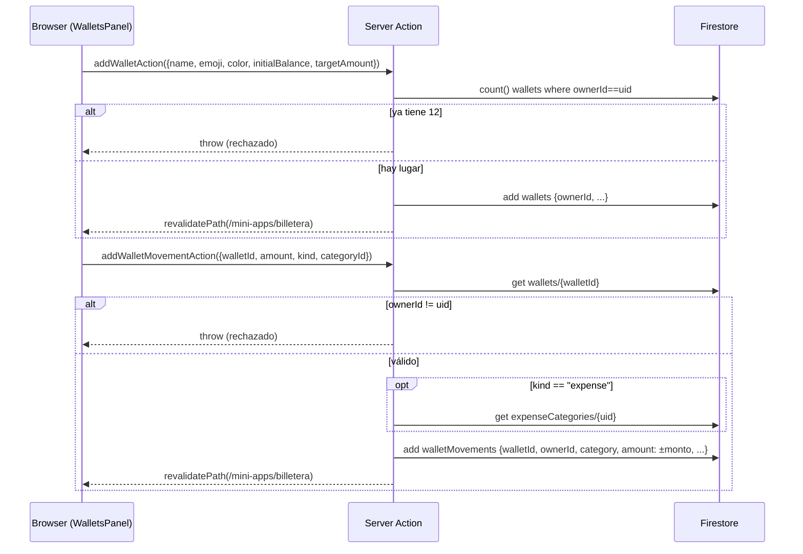

### `notes/{noteId}`

Notas de la tab **Notas** de Inicio: alta libre con prioridad y, opcionalmente,
una alerta con fecha/hora propias (distinta de `date`, que es el día al que
corresponde la nota). Id autogenerado, mismo criterio de dueño por campo que
`expenseCycles`/`expenseMovements` — muchas notas por usuario, no un array
único como `favorites`/`expenseCategories`.

| Campo | Tipo | Notas |
|---|---|---|
| `ownerId` | `string` | uid del dueño |
| `text` | `string` | cuerpo de la nota |
| `date` | `string` | `yyyy-mm-dd`, el día en que se creó — sin selector en el composer ni en la edición |
| `priority` | `"low" \| "medium" \| "high"` | ordena el filtro de la grilla de notas |
| `hasAlert` | `boolean` | si además de nota es un recordatorio |
| `alertDate` / `alertTime` | `string \| null` | `yyyy-mm-dd` / `HH:mm`, ambos `null` si `hasAlert` es `false`. Es lo que **muestra** la UI |
| `alertAt` | `Timestamp \| null` | el mismo momento, absoluto: los dos campos de arriba resueltos en el huso del dispositivo que cargó la nota (`alertInstant`). Es por lo que **consulta** el cron de recordatorios |
| `createdAt` / `updatedAt` | `Timestamp` | — |

Accesores: `getNotes` (`src/lib/data/notes.ts`, sólo Server Components);
`addNoteAction`, `updateNoteAction`, `deleteNoteAction`
(`src/lib/data/notes-actions.ts`, Server Actions — re-verifican la sesión).
`updateNoteAction`/`deleteNoteAction` comparten `getOwnedNoteRef` (trae la
nota y valida `ownerId`) y `assertValidNoteFields` (mismas validaciones que
`addNoteAction`), igual criterio que `getOwnedActiveCycle` en
`expenses-actions.ts`.

Decisiones de diseño:

- **`date` no es un campo del formulario.** El composer no tiene selector de
  fecha (se sacó a pedido: sólo prioridad y alerta) — `addNoteAction` recibe
  el `today` que ya resuelve el server y lo guarda tal cual. `updateNoteAction`
  tampoco lo deja editar: reenvía el `note.date` original sin tocarlo. Sigue
  siendo su propio campo (no `createdAt` recortado a día) porque `createdAt`
  es un `Timestamp` de bookkeeping — sirve para auditoría, no para agrupar
  "Hoy"/"Ayer" en la UI sin parsear un Timestamp en cada render.
- **La alerta se guarda dos veces: legible y absoluta.** `alertDate`/`alertTime`
  son la hora *local de quien cargó la nota*, y sin su huso no se pueden
  comparar contra ningún reloj — un server en UTC leyendo `"09:00"` dispara el
  recordatorio a las 06:00 de Argentina. Por eso el cliente calcula además
  `alertAt` (`alertInstant`, `src/lib/home-model.ts`), que es ese mismo momento
  como instante absoluto: el navegador es el único que conoce su huso y su
  horario de verano para esa fecha. Los strings quedan porque son lo que la UI
  muestra sin parsear un `Timestamp` en cada render, y `alertAt` es lo único
  por lo que consulta `dispatchNoteAlerts`. Se recalcula en cada guardado, así
  que mover la alerta la reprograma.
- **`hasAlert` + `alertDate`/`alertTime` en vez de un solo campo de
  fecha-hora.** Guardar dos strings planos (mismo criterio que `date` en
  todo el resto del archivo: nunca un `Date`/`Timestamp` para lo que el
  cliente sólo necesita mostrar o comparar como texto) evita tener que
  parsear un ISO combinado en la UI sólo para separar el `DatePicker` de la
  hora. `hasAlert` queda de todos modos como campo propio (no "alertDate no
  nulo") porque es más barato de leer en la UI (`note.hasAlert` directo, sin
  inferir un booleano de dos nullables) y dominios futuros (ej. desactivar
  una alerta sin borrar la fecha) no obligan a tocar el resto de la forma.
- **Sin `orderBy` en la consulta.** `getNotes` filtra sólo por `ownerId`
  (`==`) y ordena en memoria con `byDayDesc` — mismo criterio que
  `getExpenseMovements`, evita un índice compuesto que hoy no hace falta. El
  orden y los filtros de la tab (campo + dirección asc/desc, prioridad, con o
  sin alerta) son sólo de UI: `sortNotes` (`src/lib/home-model.ts`) y un
  `filter` se aplican sobre la lista ya traída, sin volver a pedirle nada a
  Firestore. La colección entera del usuario ya viaja en `data.notes`, así que
  filtrar del lado del server no ahorraría ninguna lectura.
- **Editar y borrar no piden campos nuevos.** `updateNoteAction` reemplaza
  todos los campos editables a la vez (no hay `PATCH` parcial) y no toca
  `createdAt`; `deleteNoteAction` borra el documento entero, sin soft-delete
  — no hay pantalla de "notas borradas" que lo necesite.
- **El borrado masivo saltea lo ajeno en vez de cortar.** `deleteNotesAction`
  valida dueño documento por documento y descarta en silencio lo que no sea
  del usuario: los ids los manda el cliente, y fallar distinto según "no
  existe" o "no es tuyo" delataría qué ids existen. Si al final no quedó
  ninguna propia sí tira error, para que un borrado que no borró nada no se
  vea como exitoso. Va en un `WriteBatch` (atómico) con un tope de 500, que
  es el límite de Firestore — por UI es imposible llegar, pero el largo del
  array lo decide el cliente.

### `links/{linkId}`

Links guardados de la mini-app privada **Links guardados**
(`/mini-apps/links`): alta libre por URL, con preview (título, descripción,
imagen) resuelto una sola vez al guardar. Id autogenerado, mismo criterio de
dueño por campo que `notes`/`expenseCycles` — muchos links por usuario.

| Campo | Tipo | Notas |
|---|---|---|
| `ownerId` | `string` | uid del dueño |
| `url` | `string` | URL completa, ya normalizada (siempre con protocolo — `addLinkAction` le agrega `https://` si el usuario no lo tipeó) |
| `title` | `string \| null` | `og:title` o, si no hay, el `<title>` del sitio. `null` si el fetch falló o el sitio no tiene ninguno |
| `description` | `string \| null` | `og:description` o `meta[name=description]` |
| `image` | `string \| null` | URL absoluta de `og:image`/`twitter:image` (resuelta contra la URL final tras redirects) |
| `siteName` | `string \| null` | `og:site_name` |
| `domain` | `string` | host de `url` sin `www.` — evita parsear la URL en el cliente sólo para mostrarlo |
| `note` | `string \| null` | Descripción propia del usuario, distinta de `description` (la de los metatags). `null` = no puso ninguna |
| `category` | `string \| null` | Categoría libre del usuario (ej. "Trabajo", "Recetas"). `null` = sin categorizar |
| `createdAt` / `updatedAt` | `Timestamp` | — |

Accesores: `getLinks` (`src/lib/data/links.ts`, sólo Server Components),
`addLinkAction` / `updateLinkAction` / `deleteLinkAction`
(`src/lib/data/links-actions.ts`, Server Actions — re-verifican la sesión y,
en la edición/el borrado, el dueño del documento).

Decisiones de diseño:

- **El preview se resuelve una sola vez, en el alta, no en cada lectura.**
  `addLinkAction` llama a `fetchLinkMetadata`
  (`src/lib/data/link-metadata.ts`) y guarda `title`/`description`/`image`/
  `siteName` ya resueltos en el documento — `getLinks` sólo lee Firestore, no
  vuelve a pedirle nada al sitio de terceros. Evita repetir un fetch externo
  (lento, y puede fallar) cada vez que el usuario abre la mini-app; el
  costo es que si el sitio cambia su preview después, el link guardado no se
  actualiza solo (no hay refresco automático, ver "Fuera de alcance" abajo).
- **Sin librería de parsing HTML.** `fetchLinkMetadata` recorta `<head>` del
  HTML descargado y extrae metatags con regex en vez de sumar una dependencia
  (`cheerio` u similar) — alcanza porque sólo le interesan metatags Open
  Graph, que siempre vienen bien formados por los sitios que los publican; no
  necesita un parser DOM completo.
- **Protecciones porque la URL la manda el usuario y el fetch corre en el
  server (riesgo de SSRF).** Antes de pedir cada URL (la original y cada
  redirect, hasta 3), `fetchLinkMetadata` resuelve el hostname y descarta
  cualquier IP privada/loopback/link-local/CGNAT (rangos `10.0.0.0/8`,
  `127.0.0.0/8`, `169.254.0.0/16`, `172.16.0.0/12`, `192.168.0.0/16`,
  `100.64.0.0/10`, sus equivalentes IPv6, y hostnames `localhost`/`*.local`)
  — sin esto, la mini-app se podría usar para sondear la red interna del
  servidor pasándole una URL que apunte para adentro. Los redirects se siguen
  a mano (`redirect: "manual"` + loop propio) en vez de dejar que `fetch` los
  siga solo, precisamente para poder validar cada salto — si no, un sitio
  público podría redirigir a una IP interna y saltearse el chequeo del primer
  hop. Además: sólo `http`/`https`, timeout de 6s, sólo `content-type:
  text/html`, y tope de 500KB leídos del body (alcanza para `<head>`, evita
  bajar una página entera). Cualquier fallo en cualquiera de estos pasos
  devuelve metadata vacía — no rechaza el alta, el link se guarda igual sólo
  que sin preview.
- **`domain` se calcula y guarda en el alta, no se deriva de `url` en la
  UI.** Mismo criterio que `category`/`categoryEmoji` en `expenseMovements`:
  un campo denormalizado barato de leer en la card en vez de parsear la URL
  con `new URL()` en cada render del cliente.
- **Sin edición.** Sólo alta + listado + borrado — no hay forma de corregir a
  mano un preview que salió mal (ej. un sitio sin metatags), sólo borrar y
  volver a guardar.

### `habits/{habitId}`

Hábitos de la tab **Hábitos** de Inicio: el check del día, la racha de cada
uno y la grilla de constancia. Id autogenerado, mismo criterio de dueño por
campo que `notes`/`links` — muchos hábitos por usuario, con un tope de 50
(ver abajo).

| Campo | Tipo | Notas |
|---|---|---|
| `ownerId` | `string` | uid del dueño |
| `name` | `string` | nombre libre, ej. "Leer 20 minutos". Máx. 60 caracteres |
| `subtitle` | `string \| null` | bajada libre y corta, máx. 80 caracteres. `null` = sin subtítulo |
| `emoji` | `string` | de la paleta fija de `habit-options.ts`, no un input libre |
| `scheduledWeekdays` | `number[]` | días de la semana en que aplica, `Date.getDay()` (0=domingo…6=sábado). 1 a 7 valores únicos. Reemplazó a `goalPerWeek`: la meta semanal es `scheduledWeekdays.length` |
| `alertEnabled` | `boolean` | si hay que avisar a una hora fija los días programados |
| `alertTime` | `string \| null` | `HH:mm` local del dueño. `null` si `alertEnabled` es `false` |
| `score` | `number` | puntaje acumulado. Sube al marcar un día programado, baja al desmarcarlo o cuando se pierde uno (job diario). Puede ser negativo |
| `order` | `number` | posición manual en la lista (drag & drop). Menor = más arriba |
| `lastPenalizedDay` | `string \| null` | último día (`yyyy-mm-dd`, local del dueño) ya penalizado — evita que el job de penalización reste dos veces por el mismo día |
| `doneDates` | `string[]` | días cumplidos, `yyyy-mm-dd`. Sólo se escribe con `arrayUnion`/`arrayRemove`: sin duplicados, pero **sin orden garantizado**. Con `actions` no vacío, es **derivado**: sólo se prende un día cuando todas las acciones de ese día están cumplidas |
| `actions` | `HabitActionDoc[]` | pasos del hábito, `{ id, name }`, en el orden en que se muestran. `[]` = hábito simple (comportamiento de siempre). No vacío = hábito de grupo, se muestra como timeline. Tope de 20 |
| `actionDoneDates` | `Record<string, string[]>` | días cumplidos por acción, clave = `HabitActionDoc.id`. Se actualiza con `arrayUnion`/`arrayRemove` sobre una ruta de campo (`actionDoneDates.${actionId}`), no sobre `doneDates` directo |
| `createdAt` / `updatedAt` | `Timestamp` | — |

Accesores: `getHabits` (`src/lib/data/habits.ts`, sólo Server Components),
`addHabitAction` / `toggleHabitDayAction` / `toggleHabitActionAction` /
`updateHabitAction` / `reorderHabitsAction` / `deleteHabitAction`
(`src/lib/data/habits-actions.ts`, Server Actions — todas re-verifican la
sesión y el dueño del documento), más los emisores programados
`dispatchHabitReminders` / `dispatchHabitPenalties`
(`src/lib/notifications/dispatch-habit-*.ts`).

Decisiones de diseño:

- **El historial va en un array adentro del hábito, no en una colección
  aparte.** `doneDates` es un `string[]` en el mismo documento, igual que
  `favorites.miniAppIds` y `expenseCategories.categories`. La alternativa
  (una colección `habitLogs` con un documento por día cumplido) obligaría a
  una query por hábito —o a un índice compuesto— cada vez que se abre Inicio,
  para pintar una grilla de constancia que necesita *todos* los días juntos
  de una. Con el array, leer un hábito ya trae su historial completo. El
  costo es el límite de 1MB por documento, que en la práctica no se toca: a
  ~11 bytes por fecha son décadas de días cumplidos.
- **`arrayUnion`/`arrayRemove` en vez de leer, modificar y reescribir el
  array.** `toggleHabitDayAction` no hace read-modify-write: son operaciones
  atómicas del lado de Firestore, así que dos toques rápidos (o la misma
  cuenta en dos dispositivos) no se pisan. Además `arrayUnion` es
  idempotente, que es justo lo que necesita la UI optimista de `HabitsPanel`
  — marcar dos veces el mismo día no lo duplica.
- **El día lo manda el cliente y el server sólo valida su forma.** El día
  cumplido es el día *local del usuario*, y el server no conoce su huso, así
  que no puede verificarlo contra su propio reloj. `assertValidDay` chequea
  que sea una fecha real (`yyyy-mm-dd` que exista en el calendario) para no
  ensuciar `doneDates` con strings que después rompan la grilla; qué día es
  "hoy" queda del lado del cliente. Como el dato es sólo del propio usuario,
  el peor caso es que alguien se infle su propia racha.
- **Orden manual por `order`, con `createdAt` como respaldo.** La lista se
  ordena por `order` (drag & drop en `HabitsPanel`, `reorderHabitsAction`
  reescribe el campo de todos los hábitos afectados en un solo batch). Un
  hábito cargado antes de que `order` existiera cae a su `createdAt` — mismo
  criterio de antigüedad ascendente que regía antes de este campo — y se
  "cura" solo la primera vez que el usuario arrastra la lista, sin script de
  migración.
- **Tope de 50 hábitos por cuenta.** La tab los muestra todos juntos sin
  paginar y el `doneDates` de cada uno viaja entero en cada carga de Inicio
  — que es una pantalla compartida con movimientos y notas, no sólo de
  hábitos.
- **La racha no se guarda, se deriva.** `streakOf`/`longestStreakOf`/
  `scheduledWeekCountOf` (`src/lib/home-model.ts`) la calculan a partir de
  `doneDates` en cada render. Guardarla como campo obligaría a mantenerla
  sincronizada en cada toggle y a recalcularla igual cuando pasa la
  medianoche sin que nadie escriba nada.
- **El puntaje sí se guarda, no se deriva.** A diferencia de la racha,
  `score` necesita sobrevivir a un evento que nadie dispara (el día
  programado que se *deja pasar* sin marcar), así que no hay array del que
  recalcularlo: lo escribe `toggleHabitDayAction` con `FieldValue.increment`
  en cada marcado/desmarcado de un día programado, y lo ajusta
  `dispatchHabitPenalties` cuando detecta uno perdido.
- **La alerta no usa un `alertAt` como las notas.** `NoteDoc.alertAt` es un
  instante único; el aviso de un hábito se repite cada día programado, así
  que guardar un solo `Timestamp` no alcanzaría — en cambio
  `dispatchHabitReminders` evalúa `alertTime` contra la hora local del dueño
  en cada corrida del cron (ver `resolveNotificationPreferences`/
  `localTimeIn`).
- **`lastPenalizedDay` es el único estado nuevo que rompe el patrón "sin
  estado" de `dispatch-note-alerts.ts`.** Ahí no hacía falta porque la
  idempotencia salía de comparar contra el reloj (una alerta vencida vence
  una sola vez); acá "se perdió el día programado de ayer" sigue siendo
  cierto las 24 horas de hoy, así que sin este campo el job restaría puntos
  en cada corrida del cron en vez de una sola vez por día perdido.
- **El historial de cada acción va en un `map` (`actionDoneDates`), no en un
  array anidado dentro de `actions`.** Firestore no permite `arrayUnion`/
  `arrayRemove` apuntado a un campo *dentro* de un elemento de un array — no
  hay forma de direccionar "el elemento con id X" en una escritura, sólo se
  puede reescribir el array entero. Los mapas sí soportan rutas de campo por
  clave (`actionDoneDates.${actionId}`), así que cada acción actualiza su
  propio historial atómicamente, igual mecánica que `doneDates` del hábito.
  `actions` en cambio sí es un array (sólo id + nombre, sin historial): se
  reescribe entero al agregar/quitar/renombrar un paso, operación poco
  frecuente que no necesita esa atomicidad.
- **`doneDates`/`score` de un hábito de grupo son derivados de las
  acciones, no de un toggle directo.** `toggleHabitActionAction` recalcula
  en memoria (sobre lo que ya trajo `getOwnedHabit` más el cambio, mismo
  patrón que `notifyStreakMilestone`) si con este toggle *todas* las
  acciones quedan cumplidas hoy, y sólo ahí — no en cada toggle de un paso
  individual — mueve `doneDates`/`score`/hitos de racha. `toggleHabitDayAction`
  no cambia: sigue sirviendo a los hábitos simples (`actions: []`).

### `workoutRoutines/{routineId}` y `workoutSessions/{uid}_{yyyy-mm-dd}`

Mini-app privada **Entrenamiento** (`/mini-apps/entrenamiento`): las rutinas
del usuario (creadas a mano o importadas desde JSON), qué toca cada día, y el
registro de los días efectivamente entrenados con su nota.

Son dos colecciones y no un array adentro de la rutina —a diferencia de
`habits.doneDates`— porque acá cada día entrenado **tiene contenido propio**
(qué se hizo, la nota del día) y sobrevive a la rutina con la que se registró:
meterlo adentro del documento de la rutina obligaría a mover el historial
cuando el usuario cambia de plan, que es justo cuando no se quiere perder.

`workoutRoutines/{routineId}` (id autogenerado, dueño por campo como
`notes`/`habits`):

| Campo | Tipo | Notas |
|---|---|---|
| `ownerId` | `string` | uid del dueño |
| `name` | `string` | nombre libre, ej. "Full body 3 días". Máx. 60 caracteres |
| `type` | `WorkoutType` | `gimnasio`/`crossfit`/`aire-libre`/`casa`/`funcional`/`otro`. Lista cerrada, registro en `src/lib/workout-model.ts` |
| `description` | `string \| null` | bajada libre, máx. 140 caracteres |
| `days` | `WorkoutDayDoc[]` | días de entrenamiento: `{ weekday, title, exercises }`. `weekday` es `Date.getDay()` (0=domingo…6=sábado) y es **único** dentro de la rutina; los días de descanso simplemente no tienen entrada. Ordenados arrancando el lunes. Máx. 7 |
| `days[].exercises` | `WorkoutExerciseDoc[]` | `{ id, name, detail, exerciseId }`. `name` máx. 60 caracteres. `detail` es texto libre, `null` si no lo cargó: va desde las series ("4x10", "20 min") hasta el bloque completo de un WOD, máx. **200 caracteres** (ver el [Changelog](#changelog)). `exerciseId` apunta a la biblioteca (catálogo estático o `customExercises`) y es `null` si se escribió a mano. Máx. 30 por día |
| `active` | `boolean` | rutina con la que se resuelve "qué toca hoy" y contra la que se mide la racha. **Sólo una `true` por cuenta**, garantizado por transacción |
| `createdAt` / `updatedAt` | `Timestamp` | — |

`workoutSessions/{uid}_{yyyy-mm-dd}`:

| Campo | Tipo | Notas |
|---|---|---|
| `ownerId` | `string` | uid del dueño |
| `date` | `string` | `yyyy-mm-dd` local del usuario. Duplica lo que ya dice el id, para poder filtrar/ordenar por campo |
| `routineId` | `string \| null` | rutina con la que se entrenó. `null` = entrenamiento suelto (no había ninguna activa) |
| `routineName` / `type` | `string \| null` / `WorkoutType` | **copiados** al registrar, no referenciados — igual que `category` en `expenseMovements` |
| `title` | `string` | qué se entrenó. Lo propone el día de la rutina, pero es editable |
| `note` | `string \| null` | nota libre del día ("me costó, bajé el peso"). Máx. 600 caracteres |
| `createdAt` / `updatedAt` | `Timestamp` | `createdAt` no se pisa al editar la nota de un día ya registrado |

Accesores: `getWorkoutRoutines` / `getWorkoutRoutineById` /
`getWorkoutSessions` (`src/lib/data/workouts.ts`, sólo Server Components —
`getWorkoutRoutineById` verifica el dueño y devuelve `null` si la rutina es de
otra cuenta, igual que `getExpenseCycleById`); `addRoutineAction`,
`updateRoutineAction`, `activateRoutineAction`, `deleteRoutineAction`,
`importRoutinesAction`, `addExercisesToRoutineDayAction`, `logWorkoutAction`,
`deleteWorkoutAction` (`src/lib/data/workouts-actions.ts`, Server Actions —
todas re-verifican la sesión y el dueño del documento). Los cálculos de racha
y progreso son puros y viven en `src/lib/workout-model.ts`, compartidos entre
la validación del server y la pantalla.

Decisiones de diseño:

- **El id de la sesión se deriva del día (`{uid}_{yyyy-mm-dd}`), no es
  autogenerado.** Es lo que hace que marcar un día sea idempotente: un
  `set()` pisa el registro anterior en vez de duplicarlo, así que "marcar el
  día" y "editar la nota de un día ya marcado" son literalmente la misma
  escritura y un doble toque no deja dos entradas del mismo día. Mismo
  criterio que `pushSubscriptions/{sha256(endpoint)}`: cuando el documento
  tiene una clave natural, conviene que sea el id.
- **Una sola rutina `active`, garantizada por transacción.**
  `activateRoutineAction` apaga las demás y prende la elegida dentro de la
  misma `runTransaction`, igual que `startExpenseCycleAction` con los ciclos
  de gastos: sin eso, dos toques casi simultáneos podrían dejar la cuenta con
  dos activas y "qué toca hoy" sería ambiguo. La primera rutina que se crea
  (o la primera del lote importado) queda activa sola.
- **Borrar una rutina no borra su historial.** Los días entrenados guardan
  `routineName`/`type` copiados al registrar, así que sobreviven a la baja de
  la rutina y siguen mostrándose bien en el historial — mismo criterio que un
  `expenseCycle` cerrado, que queda como historial. El `routineId` queda
  apuntando a un documento que ya no existe: nadie lo dereferencia, es sólo
  procedencia.
- **La racha se deriva, no se guarda** (igual que en `habits`), pero **no
  cuenta días corridos**: `workoutStreak` saltea los días de descanso de la
  rutina activa, así que cumplir un plan de lunes/miércoles/viernes tres
  semanas seguidas es una racha de 9 aunque no se entrene los sábados. Un día
  entrenado fuera del plan no suma (mide cumplimiento, no actividad), y si hoy
  toca y todavía no se marcó, la racha se cuenta hasta el día de entrenamiento
  anterior — el día no terminó. Sin rutina activa cae a la racha por días
  corridos, que es lo único medible sin un plan.
- **La racha se recalcula contra la rutina *activa de ahora*.** Cambiar de
  plan reinterpreta el historial (los días que antes eran de descanso pueden
  pasar a ser exigidos). Es el precio de no congelar el plan en cada sesión;
  a cambio, corregir un error en la rutina no deja el historial inconsistente.
- **El día lo manda el cliente y el server sólo valida su forma**, misma
  `assertValidDay` que `habits-actions.ts` y por el mismo motivo: el día
  entrenado es el día *local del usuario* y el server no conoce su huso. El
  calendario de "Registrar otro día" no deja elegir fechas futuras, pero eso
  es UI: el peor caso de saltearlo es que alguien se infle su propia racha.
- **`detail` dice qué toca; la nota de la sesión dice cómo fue.** Los dos son
  texto libre, y el tope es lo que los mantiene separados: 200 caracteres en
  `days[].exercises[].detail` y 600 en `workoutSessions.note`. 200 alcanza para
  las series de gimnasio ("4x10") y también para el bloque completo de un WOD
  de CrossFit —que es donde vive el contenido real de un metcon, porque el
  `name` es apenas el título del bloque— pero queda bien por debajo de la nota,
  así el detalle no se convierte en el diario de entrenamiento y el historial
  por día no queda vacío. El plan se lee en la **pantalla de detalle** de la
  rutina (`/mini-apps/entrenamiento/rutinas/{routineId}`), una tab por día: la
  lista de rutinas no da el ancho para un bloque de CrossFit. Ahí un detalle
  largo se abre como lista de movimientos (`splitDetail`, heurística de
  presentación sobre los separadores ` | ` / ` + ` / `, `) y uno corto
  ("4x10") se sigue mostrando en una línea.
- **La importación es todo o nada.** `importRoutinesAction` parsea y valida
  todas las rutinas del JSON antes de escribir, y escribe en un `WriteBatch`:
  importar la mitad de un plan y dejar al usuario adivinando cuáles entraron
  sería peor que rechazarlo entero. El parser es deliberadamente tolerante con
  la *forma* (el día como número o como nombre, los ejercicios como objetos o
  como strings sueltos, `detail`/`reps`/`sets`) pero estricto con lo que
  guarda: todo pasa por la misma `normalizeRoutine` que el alta manual, así
  que un JSON no puede meter un tipo inexistente ni saltearse los topes.
- **Sin `orderBy` en las consultas.** Las dos colecciones filtran sólo por
  `ownerId` (`==`) y ordenan en memoria — mismo criterio que
  `getNotes`/`getLinks`/`getHabits`, evita un índice compuesto. Las day keys
  `yyyy-mm-dd` son lexicográficas, así que ordenarlas como strings ya es
  ordenarlas cronológicamente. El historial se trae completo (no una ventana
  de fechas) porque la grilla de constancia y el récord histórico lo
  necesitan entero; son ~150 documentos por año de entrenamiento, el mismo
  orden de magnitud que las notas.

### `customExercises/{exerciseId}`

Ejercicios propios del usuario: el ABM de la tab **Ejercicios** de la mini-app
de entrenamiento. Id autogenerado, dueño por campo, mismo criterio que el
resto.

**El catálogo base no está acá.** Los ~90 ejercicios con descripción y
consejos viven en `src/lib/exercise-catalog.ts`, un módulo estático. Esta
colección guarda **sólo** lo que el usuario agrega, y las dos listas se
mezclan en memoria con `mergeExercises` al mostrarlas.

| Campo | Tipo | Notas |
|---|---|---|
| `ownerId` | `string` | uid del dueño |
| `name` | `string` | nombre libre, máx. 60 caracteres |
| `group` | `string` | `MuscleGroup` del catálogo (`pecho`, `espalda`, `hombros`, `brazos`, `piernas`, `gluteos`, `core`, `cardio`, `full-body`, `movilidad`) |
| `equipment` | `string` | `ExerciseEquipment` del catálogo (`barra`, `mancuernas`, `maquina`, `polea`, `kettlebell`, `banda`, `peso-corporal`, `otro`) |
| `description` | `string \| null` | qué es y para qué sirve. Máx. 400 caracteres |
| `tips` | `string[]` | consejos de ejecución. Hasta 8, de 200 caracteres cada uno. `[]` = no cargó ninguno |
| `createdAt` / `updatedAt` | `Timestamp` | — |

Accesores: `getCustomExercises` (`src/lib/data/exercises.ts`, sólo Server
Components), `addCustomExerciseAction` / `updateCustomExerciseAction` /
`deleteCustomExerciseAction` (`src/lib/data/exercises-actions.ts`).

Decisiones de diseño:

- **El catálogo base es un módulo estático, no documentos de Firestore.** Es
  el mismo para todas las cuentas y sólo cambia si se edita el archivo, así
  que meterlo en la base costaría ~90 documentos por usuario (o una colección
  global con su propia regla de lectura) y una lectura en cada carga de la
  pantalla, para devolver siempre exactamente lo mismo. Es la misma lógica que
  `DEFAULT_EXPENSE_CATEGORIES`, con una diferencia: allá el set fijo es un
  punto de partida que el ABM después copia y edita; acá el catálogo **no es
  editable** y lo propio del usuario vive aparte, así que las dos listas
  nunca se pisan y actualizar el catálogo en un deploy mejora la app para
  todos sin migrar nada.
- **`group`/`equipment` se guardan como `string`, no como el union de
  TypeScript.** El documento no puede depender de un tipo del código: si
  mañana se saca un grupo del registro, los documentos viejos seguirían
  teniéndolo. `getCustomExercises` valida al leer (`isMuscleGroup`/
  `isEquipment`) y cae al default en vez de romper el filtro de la
  biblioteca.
- **La rutina copia el `name` y guarda el `exerciseId` sólo como
  procedencia.** Igual que `category` en `expenseMovements`: renombrar un
  ejercicio propio no reescribe las rutinas que ya lo usaban, y borrarlo
  tampoco las rompe — quedan con el nombre copiado y un `exerciseId` que ya no
  resuelve, así que dejan de ofrecer la ficha pero el plan sigue completo. La
  descripción y los consejos sí se ven siempre actualizados, porque ésos se
  resuelven por id en cada render en vez de copiarse.
- **`exerciseId` no se valida contra la biblioteca al escribir.**
  `normalizeExercises` lo guarda tal cual llega. Verificarlo costaría una
  lectura por ejercicio en cada guardado de rutina para prevenir un caso cuyo
  peor efecto es que una fila no muestre ficha — el mismo estado en el que
  quedan, legítimamente, las filas escritas a mano.
- **Al importar un JSON, el `exerciseId` se resuelve por nombre.** Un JSON
  externo no trae ids de nuestra biblioteca, así que `matchCatalogByName`
  compara contra el catálogo ignorando mayúsculas y acentos: si el nombre
  coincide, la fila importada queda enganchada a su ficha. Sin match se
  guarda igual con `exerciseId: null` — no rechaza la importación por no
  reconocer un nombre.
- **Tope de 200 ejercicios propios.** La biblioteca los baja todos juntos en
  cada carga (no hay paginado), mismo criterio que el tope de 50 hábitos.

### `notifications/{notificationId}`, `pushSubscriptions/{hash}` y `notificationPreferences/{uid}`

Sistema de notificaciones: la bandeja que alimenta la campana del shell, las
suscripciones Web Push de cada navegador, y qué quiere recibir el usuario.

**El punto de entrada es uno solo.** Ningún módulo escribe estas colecciones a
mano: todo pasa por `notify()` (`src/lib/notifications/notify.ts`), que escribe
la entrada de la bandeja, resuelve las preferencias y manda el push en la misma
llamada. Una mini-app nueva sólo tiene que agregar su topic en
`src/lib/notifications/topics.ts` y llamar a `notify()` — no toca ni el panel,
ni el push, ni la pantalla de preferencias.

```ts
await notify({
  userId,
  topic: "expenses.limit-reached",   // id del registro de topics, tipado
  title: "Te pasaste del tope",
  description: "Llevás $120.000 de un tope de $100.000.",
  href: ROUTES.inicio,
  dedupeKey: `${cycleId}:over`,      // idempotencia: una sola vez por evento
});
```

`notifications/{notificationId}`:

| Campo | Tipo | Notas |
|---|---|---|
| `ownerId` | `string` | uid del destinatario |
| `topic` | `NotificationTopicId` | id del registro de topics |
| `title` | `string` | título de la fila y del aviso del sistema |
| `description` | `string \| null` | cuerpo. En el push se recorta a 160 caracteres |
| `tone` | `NotificationTone` | **copiado** del topic al emitir, no referenciado: si mañana el topic cambia de color, lo ya emitido no se repinta |
| `href` | `string \| null` | ruta interna a la que lleva tocarla. Default: `/inicio` |
| `read` / `readAt` | `boolean` / `Timestamp \| null` | — |
| `createdAt` | `Timestamp` | ordena la bandeja |
| `expiresAt` | `Timestamp \| null` | 30 días por defecto. Lo consume la **TTL policy** de Firestore, no la app |

`pushSubscriptions/{sha256(endpoint)}`:

| Campo | Tipo | Notas |
|---|---|---|
| `ownerId` | `string` | uid del dueño del navegador |
| `endpoint` | `string` | URL del push service que devolvió `PushManager.subscribe` |
| `p256dh` / `auth` | `string` | claves de cifrado de la suscripción. **Son el secreto**: con ellas se le puede mandar un push a ese navegador |
| `userAgent` | `string \| null` | recortado a 200 caracteres, sólo para distinguir dispositivos en Ajustes |
| `timeZone` | `string \| null` | zona IANA del dispositivo al suscribirse |
| `createdAt` / `updatedAt` | `Timestamp` | — |
| `lastSuccessAt` | `Timestamp \| null` | último push entregado |
| `failureCount` | `number` | fallos seguidos; a los 3 se borra la fila |

`notificationPreferences/{uid}`:

| Campo | Tipo | Notas |
|---|---|---|
| `pushEnabled` | `boolean` | interruptor maestro del canal push |
| `topics` | `Record<topicId, { push: boolean }>` | override por topic. Un topic ausente usa el `pushByDefault` del registro |
| `quietHours` | `{ enabled, from, to }` | franja diaria sin push, `HH:mm` en hora local. Puede cruzar la medianoche |
| `timeZone` | `string \| null` | zona IANA con la que se evalúa `quietHours` |
| `updatedAt` | `Timestamp` | — |

Accesores: `getNotifications` / `countUnreadNotifications` /
`getNotificationPreferences` / `getPushDevices` (`src/lib/data/notifications.ts`,
sólo Server Components); `markNotificationReadAction`,
`markAllNotificationsReadAction`, `dismissNotificationAction`,
`clearNotificationsAction`, `savePushSubscriptionAction`,
`deletePushSubscriptionAction`, `deletePushDeviceAction`,
`updateNotificationPreferencesAction`, `resetNotificationPreferencesAction` y
`sendTestNotificationAction` (`src/lib/data/notifications-actions.ts`).
La emisión no es una Server Action: es `notify()` / `notifyQuietly()`
(`src/lib/notifications/notify.ts`), que nunca la llama el cliente.

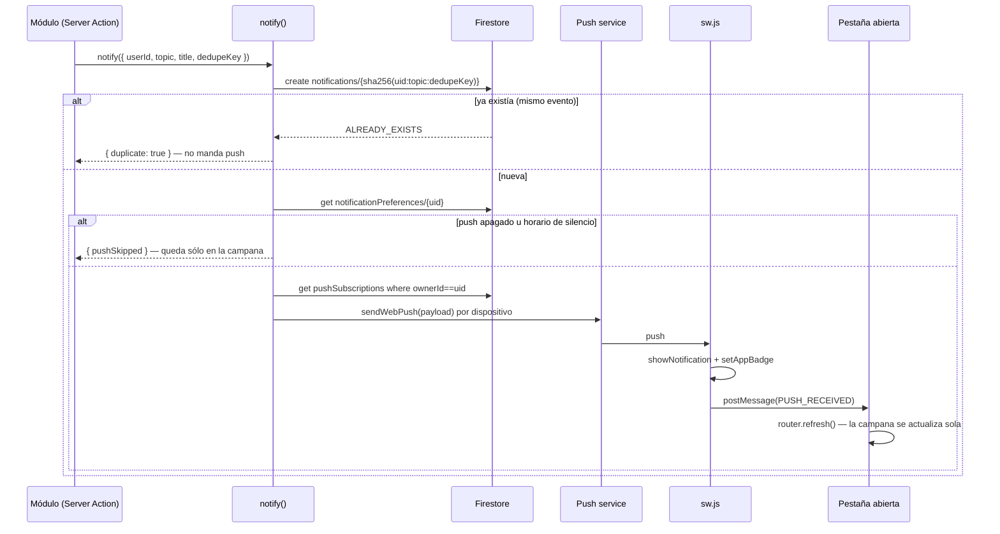

Decisiones de diseño:

- **El panel no se puede silenciar; el push sí.** La preferencia por topic
  gobierna sólo el push, y la entrada de la bandeja se escribe siempre. El
  panel es el registro de lo que pasó: si se pudiera apagar, un evento quedaría
  sin rastro en ningún lado, y el usuario ya puede descartarlo o vaciar la
  bandeja. Además, con una sola dimensión configurable la `dedupeKey` tiene un
  único lugar donde vivir (el propio documento de la bandeja) y no hace falta
  un registro paralelo de "esto ya lo mandé".
- **La idempotencia sale del id del documento, no de un flag.** Con
  `dedupeKey`, el id es `sha256(uid:topic:dedupeKey)` y la emisión usa
  `create()`, que falla si el documento ya existe — sin transacción, sin
  lectura previa y sin campo extra que mantener. Es lo que hace que "llegaste
  al tope" salga una vez por ciclo y no con cada gasto cargado después, y lo
  que permite que el cron de alertas de notas corra cada 5 minutos sin
  duplicar nada ni escribirle nada a la nota.
- **`pushSubscriptions` está cerrada también para lectura**, a diferencia de
  todas las demás colecciones del usuario. `p256dh` y `auth` son justamente lo
  que hace falta para mandarle un push a ese navegador: no son datos del
  usuario, son credenciales. El cliente tampoco las necesita — la suscripción
  de *este* dispositivo se la pide al `pushManager`, no a Firestore — y la
  lista de Ajustes la arma el server, que saltea las reglas.
- **El id de la suscripción se deriva del endpoint.** Con id autogenerado, un
  navegador que se vuelve a suscribir (tras un `unsubscribe`, o porque el push
  service rotó la suscripción) dejaría dos filas apuntando al mismo destino, o
  sea dos avisos idénticos por evento. Con `sha256(endpoint)`, el alta pisa la
  fila anterior.
- **Las suscripciones se limpian solas.** Un 404/410 del push service significa
  que ese navegador ya no existe (PWA desinstalada, datos borrados, permiso
  revocado): se borra en el acto. Los fallos de otro tipo, que pueden ser un
  corte pasajero, se acumulan en `failureCount` y recién a los 3 seguidos
  borran la fila. Sin esto la colección crecería para siempre con endpoints
  muertos que cuestan un intento en cada emisión.
- **El horario de silencio se evalúa con la zona del dispositivo, guardada.**
  El server no conoce el huso del usuario (mismo problema que el `day` de
  `habits`), así que la zona IANA la manda el cliente al guardar preferencias o
  al suscribirse. Sin zona, `isWithinQuietHours` devuelve `false`: preferimos
  avisar de más antes que silenciar en el huso equivocado.
- **`orderBy` en Firestore, al revés que el resto del archivo.** `getNotifications`
  es la única consulta de la app con `where` + `orderBy` sobre otro campo, y por
  eso la única que pide un índice compuesto (`firestore.indexes.json`). Acá el
  orden no es una preferencia de UI sino lo que define qué entra en el recorte
  de 50: ordenar en memoria obligaría a bajar la colección entera justo para
  descartarla.
- **Push directo, sin Firebase Cloud Messaging.** El service worker ya escucha
  el evento `push` crudo y el kit trae `usePushSubscription`, así que FCM sería
  una capa de más. El motivo decisivo es otro: la consola de Firebase entrega
  sólo la clave **pública** del par VAPID, y firmar el JWT desde nuestro server
  necesita la privada. Por eso el par lo generamos nosotros (`yarn vapid`) y
  vive en el `.env`.

### `passwordResetCodes/{hash}`

| Campo | Tipo | Notas |
|---|---|---|
| `uid` | `string` | cuenta dueña del código |
| `email` | `string` | — |
| `expiresAt` | `Timestamp` | TTL de 15 min |
| `createdAt` | `Timestamp` | — |

El id del documento es `sha256(email:código)`, nunca el código en claro —
alguien con acceso de lectura ve que hay un pedido pendiente, pero no puede
usarlo. Se borra al canjearse, exista o no (un intento fallido no deja el
código vivo para seguir probando).

## Reglas de Firestore

**Estado actual del proyecto real (Firebase Console), pegado por el
usuario el 2026-08-01 — deniega todo:**

```
rules_version = '2';

service cloud.firestore {
  match /databases/{database}/documents {
    match /{document=**} {
      allow read, write: if false;
    }
  }
}
```

**Reglas objetivo, ya escritas en `firestore.rules` en el repo, pendientes
de publicar** (`firebase deploy --only firestore:rules --project maguita-7832c`):

```
rules_version = '2';

service cloud.firestore {
  match /databases/{database}/documents {

    function isOwner(uid) {
      return request.auth != null && request.auth.uid == uid;
    }

    match /users/{uid} {
      allow read: if isOwner(uid);
      allow write: if false;
    }

    match /favorites/{uid} {
      allow read: if isOwner(uid);
      allow write: if false;
    }

    match /passwordResetCodes/{code} {
      allow read, write: if false;
    }

    match /expenseCycles/{cycleId} {
      allow read: if request.auth != null && resource.data.ownerId == request.auth.uid;
      allow write: if false;
    }

    match /expenseMovements/{movementId} {
      allow read: if request.auth != null && resource.data.ownerId == request.auth.uid;
      allow write: if false;
    }

    match /expenseCategories/{uid} {
      allow read: if isOwner(uid);
      allow write: if false;
    }

    match /notes/{noteId} {
      allow read: if request.auth != null && resource.data.ownerId == request.auth.uid;
      allow write: if false;
    }

    match /links/{linkId} {
      allow read: if request.auth != null && resource.data.ownerId == request.auth.uid;
      allow write: if false;
    }

    match /habits/{habitId} {
      allow read: if request.auth != null && resource.data.ownerId == request.auth.uid;
      allow write: if false;
    }

    match /workoutRoutines/{routineId} {
      allow read: if request.auth != null && resource.data.ownerId == request.auth.uid;
      allow write: if false;
    }

    match /workoutSessions/{sessionId} {
      allow read: if request.auth != null && resource.data.ownerId == request.auth.uid;
      allow write: if false;
    }

    match /customExercises/{exerciseId} {
      allow read: if request.auth != null && resource.data.ownerId == request.auth.uid;
      allow write: if false;
    }

    match /notifications/{notificationId} {
      allow read: if request.auth != null && resource.data.ownerId == request.auth.uid;
      allow write: if false;
    }

    match /pushSubscriptions/{subscriptionId} {
      allow read, write: if false;
    }

    match /notificationPreferences/{uid} {
      allow read: if isOwner(uid);
      allow write: if false;
    }

    match /{document=**} {
      allow read, write: if false;
    }
  }
}
```

⚠️ **Acción pendiente**: publicar estas reglas contra el proyecto real —
todavía no están activas ahí, sólo en el repo. Sin esto, el cliente no puede
leer ni `users/{uid}` ni `favorites/{uid}` (aunque las escrituras del server
con el Admin SDK funcionan igual, porque ese SDK saltea las reglas).

**Ningún cambio de reglas hizo falta** para agregar `alias`, `avatarUrl` y
`preferences` a `users/{uid}`: la colección ya tenía `allow write: if false`
(todo pasa por el Admin SDK) y `allow read: if isOwner(uid)` cubre el
documento entero, campos nuevos incluidos — Firestore no tiene reglas a
nivel de campo para lectura.

## Changelog

### 2026-08-18 — Entrenamiento: compartir el plan de un día como imagen

**Qué cambió.** Nada del esquema: ni colecciones, ni campos, ni tipos, ni
lecturas nuevas. Es una salida nueva para datos que ya estaban en pantalla — el
plan de un día se puede copiar al portapapeles como imagen o mandar por la hoja
nativa de compartir (que es por donde aparece WhatsApp).

**La imagen se dibuja, no se captura** (`src/lib/workout-day-image.ts`). Un
screenshot del DOM (html2canvas y compañía) traía tres problemas: una dependencia
nueva de ~200 KB; el tema del usuario metido en la imagen, y una card oscura
sobre fondo oscuro es ilegible en el visor de WhatsApp, que no sabe nada de
temas; y fidelidad dudosa con Tailwind v4, que resuelve colores con `oklch()` y
variables CSS. Dibujarla en un canvas cuesta un archivo y a cambio da una pieza
diseñada para el destino: 1080 px de ancho, fondo claro **siempre**, banda de
marca con el día para que se reconozca chiquita en una lista de chats, y
tipografía grande. Misma decisión que `scripts/generate-icons.mjs` con los
íconos de la PWA.

- **Los colores son los tokens claros de la marca escritos a mano.** El canvas no
  lee CSS: no hay forma de que tome `--color-primary`. Quedan duplicados en
  `COLORS`, y es un duplicado consciente — la imagen *no debe* seguir el tema del
  usuario, así que ni siquiera querríamos que leyera los tokens vivos.
- **Dos pasadas: medir y después dibujar.** Un canvas no se puede redimensionar
  sin borrar lo dibujado, así que todo el texto se parte en renglones y se suma
  el alto antes del primer trazo. La tipografía se resuelve leyendo el
  `font-family` computado del `body` (`next/font` genera un nombre propio y lo
  expone en `--font-app-sans`), y se espera `document.fonts.ready` — sin eso se
  mide con la fuente de fallback y los renglones se cortan en otro lugar.
- **Un día muy cargado se escala, no se recorta.** iOS Safari corta los canvas
  por área total (~16,7 M px). El peor caso que permite el modelo (30 ejercicios
  con detalles largos) da 16.448 px de alto: el renderer detecta que se pasa del
  máximo y aplica un `ctx.scale` al diseño entero (0,61 en ese caso → 655 ×
  10.038 = 6,6 M px). Perder nitidez es aceptable; perder ejercicios no.
- **`splitDetail` se reusa.** La imagen, la pantalla y el texto de WhatsApp
  parten el detalle con la misma función, así que un metcon se ve igual en los
  tres lados.

**Las tres APIs de compartir tienen soporte desparejo** (`src/lib/share-image.ts`),
y ninguna de las dos de la librería servía: `ShareButton` extiende `ShareData`
(`title`/`text`/`url`) y **no acepta `files`**, así que comparte links pero no
imágenes; `useClipboard` es `copy: (text: string)`, texto solo. Por eso cada
función propia devuelve un `ShareOutcome` en vez de tirar — la UI necesita
ofrecer el camino alternativo, no un cartel de error:

| Situación | Qué hace |
|---|---|
| Chrome/Edge/Safari moderno | `navigator.clipboard.write` con un `image/png` |
| Firefox (portapapeles de imágenes detrás de un flag) | descarga el PNG y lo avisa |
| Android/iOS | `navigator.share({ files })` → hoja nativa con WhatsApp |
| Desktop sin hoja nativa | `wa.me/?text=` con el plan como texto (`routineDayToText`) |

- **`canShare({ files })` y no `"share" in navigator`**: hay browsers con `share`
  para texto/URL que rechazan archivos.
- **Cancelar no es un error.** `navigator.share` rechaza con `AbortError` cuando
  el usuario cierra la hoja sin elegir nada; eso se distingue del error real y no
  muestra nada.
- **La imagen se genera una sola vez al abrir el sheet** y las dos acciones
  comparten el mismo `Blob`. No es sólo por velocidad: un `await` largo entre el
  toque y la llamada al portapapeles hace que algunos browsers consideren perdido
  el gesto del usuario y rechacen la escritura.
- **Vista previa antes de mandar** (`WorkoutDayShareSheet`). La imagen no es lo
  que hay en pantalla, así que sin preview el usuario copiaría algo que no vio y
  se enteraría recién al pegarlo en el chat.

**Íconos nuevos** en `components/atoms/icons.tsx`: `ImageIcon` y `WhatsappIcon`.
El de WhatsApp es el único del set que va con `fill` en vez de `stroke` — es una
marca registrada y con el trazo de los demás no se reconocería.

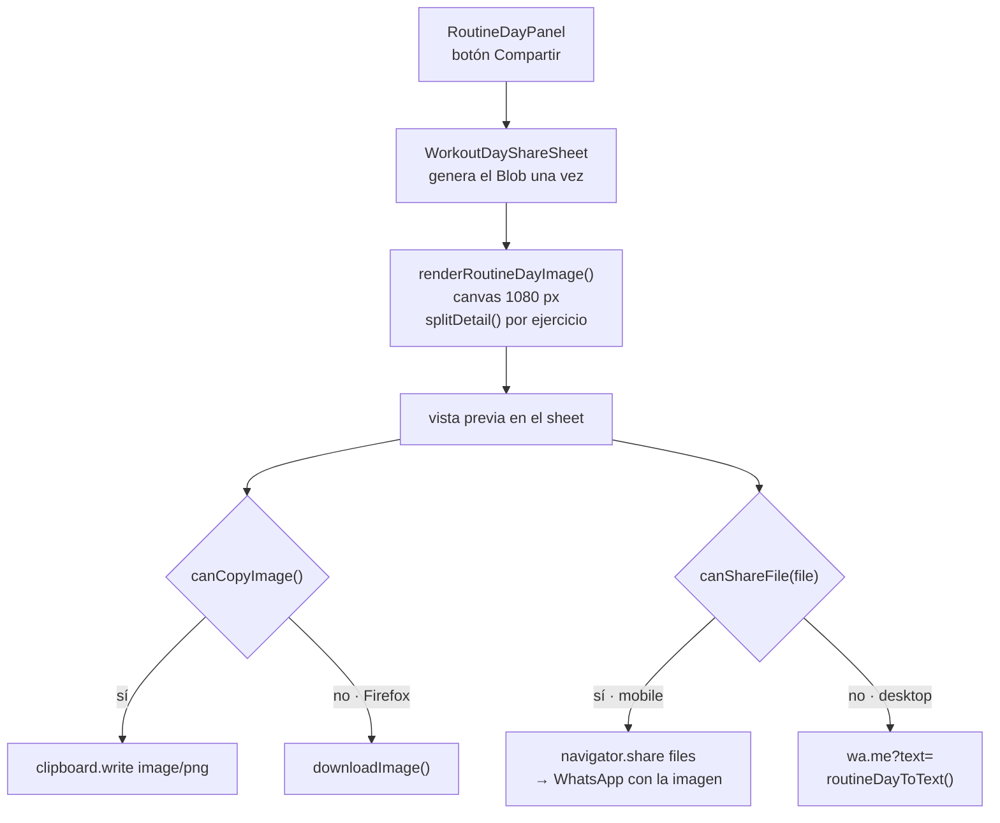

**Reglas de Firestore: no hace falta cambiar nada, y esta vez ni se acercan.**
Todo pasa en el cliente sobre datos que la pantalla ya tenía: no hay lectura ni
escritura nueva, así que no hay superficie que asegurar. El bloque de
`workoutRoutines` sigue igual:

```
    match /workoutRoutines/{routineId} {
      allow read: if request.auth != null && resource.data.ownerId == request.auth.uid;
      allow write: if false;
    }
```

> **Nota de privacidad.** La imagen se genera y se comparte **entera en el
> dispositivo**: no se sube a ningún lado, no pasa por el server y no queda
> guardada. El único momento en que sale del equipo es cuando el usuario elige
> una app en la hoja de compartir. Vale decirlo porque Entrenamiento es un módulo
> que se puede poner atrás del PinLock: compartir es una acción explícita del
> usuario, no una sincronización.


### 2026-08-18 — Entrenamiento: pantalla de detalle de una rutina, con una tab por día

**Qué cambió.** Nada del esquema: ni colecciones, ni campos, ni tipos. Es una
forma nueva de **leer** `workoutRoutines`, que hasta ahora sólo se veía
desplegando la card de la lista.

**Por qué.** El tope de `detail` subió a 200 caracteres más temprano hoy (ver la
entrada de arriba), y eso rompió el lugar donde el plan se leía. La card de la
lista mostraba los 4–7 días con todos sus ejercicios en el ancho de una fila:
con detalles de "4x10" pasaba, con un metcon de 150 caracteres por ejercicio es
un muro de texto — y con dos cards abiertas a la vez no se distingue dónde
termina una rutina y empieza la otra. Subir el tope sin mover la lectura dejó la
mini-app peor de lo que estaba.

- **Nueva ruta dinámica `/mini-apps/entrenamiento/rutinas/{routineId}`**
  (`src/app/(app)/mini-apps/entrenamiento/rutinas/[routineId]/page.tsx`).
  Ruta propia y no un query param con modal como el detalle de una billetera:
  acá **no hace falta la mini-app montada detrás**, es una pantalla de lectura
  completa — mismo caso que el detalle de un período cerrado, y por eso mismo
  criterio. Ya cubierta por sesión en dos capas: el prefijo
  `/mini-apps/entrenamiento` de `PROTECTED_ROUTES` matchea por `startsWith`
  (sin agregar nada al array) y `(app)/layout.tsx` llama `requireSession()` en
  todo lo que cuelga de él. `headerFor` (`nav-config.tsx`) suma un `if` de
  prefijo, como ya hacía con `/inicio/periodos/`.
- **El candado del módulo se aplica también acá.** La página monta el mismo
  `ModuleLockGate` que la principal. Sin eso, una ruta nueva del módulo es
  exactamente la forma de saltear el PinLock: el gate no es del componente, es
  del módulo.
- **Nueva `getWorkoutRoutineById(userId, routineId)`** (`lib/data/workouts.ts`):
  una rutina puntual, `null` tanto si no existe como si es de otra cuenta. La
  página trata los dos casos igual (`notFound()`) para no delatar qué ids
  existen. El chequeo de dueño va acá porque la lectura la hace el Admin SDK,
  que saltea las reglas — misma barrera que en `getExpenseCycleById`. La
  proyección del documento se extrajo a `toRoutine()` y ahora la comparten las
  dos lecturas: son los `??` de compatibilidad (una rutina vieja sin
  `exerciseId`) los que no conviene tener duplicados, o la misma rutina se vería
  distinta según por dónde se entró.
- **Las tabs de día las monta la pantalla, no el shell.** `SCREEN_HEADERS`
  declara las tabs de cada ruta, pero el shell resuelve el header con
  `usePathname` **antes** de que la pantalla lea sus datos, y las tabs de día
  salen de la rutina (una por `days[].weekday`, entre 1 y 7). Así que el header
  de esta ruta va sin `tabs` y `WorkoutRoutineScreen` monta su propio
  `TabsCarousel` de `lib-kit-components`: los paneles se deslizan en la
  dirección del cambio (martes → miércoles entra por la derecha), que es cómo se
  recorre un plan día por día.
- **El tablist de `TabsCarousel` se hace scrolleable a mano.** El componente no
  expone prop de scroll (su tablist es un `flex gap-6` de botones
  `whitespace-nowrap`), así que una rutina de 6 o 7 días se clipearía. Se le
  aplica `overflow-x-auto` al `[role=tablist]` con una variante arbitraria y no
  al componente entero, porque el panel del día es hermano del tablist adentro
  del mismo div y se iría de ancho junto con las tabs. El gancho es el rol ARIA,
  que es parte del contrato del componente, no una clase interna.
- **`scrollbar-none` pasó a existir.** La librería aplica esa clase a todo lo
  que scrollea en horizontal (el tablist de `Tabs scrollable` — la fila de tabs
  del header del shell — y los tracks de `ChipCarousel`) pero **no la define**:
  sólo existía como string en su bundle, así que era un no-op y esas filas
  mostraban la barra de scroll nativa. Ahora está en `globals.css` como
  `@utility` (no como regla suelta, para que Tailwind le pueda aplicar
  variantes). Efecto colateral buscado: también arregla las tabs del header.
- **Abre en el día de hoy** si la rutina entrena hoy, y si no en el primero de
  la semana; la tab de hoy además va marcada. Abrir siempre en lunes obliga a
  buscar la tab correcta todas las veces, y el día que se viene a leer es el que
  toca.
- **Las acciones de la rutina se mudaron de la lista al detalle**
  (activar, editar, exportar, eliminar). No es una preferencia: la card pasó a
  ser un `Link` entero, y un `<button>` adentro de un `<a>` no es HTML válido.
  El costo es un toque más para activar; a cambio la decisión se toma después de
  leer el plan. Eliminar navega con `router.replace` a la pantalla principal —
  `replace` y no `push` para que volver no traiga un detalle que ahora es 404.
  `WorkoutRoutineCard` quedó sin estado ni handlers y dejó de ser
  `"use client"`.
- **`splitDetail` (`lib/workout-model.ts`)**: parte un detalle largo en los
  movimientos que lo componen para mostrarlo como lista. Es una heurística de
  **presentación, no de datos** — `detail` es texto libre y no guarda ninguna
  estructura, así que lo único posible es reconocer los separadores con los que
  se escribe (` | `, ` + `, `, `, el primero que aparezca). Dos frenos para no
  picar de más: los detalles de hasta 40 caracteres no se tocan (lo que antes
  entraba en un renglón sigue en un renglón), y si el corte deja paréntesis o
  corchetes sin cerrar se descarta y vuelve el texto entero — el caso de
  `"3 rondas: (15 T2B / 30 K2E + 12 Burpees box jump overs + Front squats
  [9 / 15 / 21 reps])"`, donde el `+` está *dentro* del paréntesis. Nada de esto
  toca Firestore: el día que el modelo guarde los movimientos como array, la
  función se borra.
- **Revalidación: el detalle es otra entrada de caché.** Las acciones
  invalidaban sólo `/mini-apps/entrenamiento`, que no alcanza a una ruta
  distinta — editar una rutina desde su propio detalle habría dejado la pantalla
  con la versión vieja. Nuevo helper `revalidateRoutines()`
  (`workouts-actions.ts`) que invalida las dos, y se usa en las 6 acciones que
  mutan rutinas. Invalida el **patrón** `[routineId]` y no la ruta de esa rutina
  porque activar una apaga la que estaba activa, y el detalle de esa otra
  también quedaría con el badge "Activa" de más. `logWorkoutAction` y
  `deleteWorkoutAction` siguen invalidando sólo la principal a propósito: el
  detalle muestra el plan, no el historial.
- **`WEEKDAY_LABELS` / `WEEKDAY_SHORT` y `routineToJson` pasaron a
  `workout-options.ts`.** Los nombres de día estaban duplicados como constante
  local del composer, y `routineToJson` vivía dentro del panel: las dos las
  necesita ahora el detalle, y las dos son del formato/presentación del módulo,
  no de una pantalla.

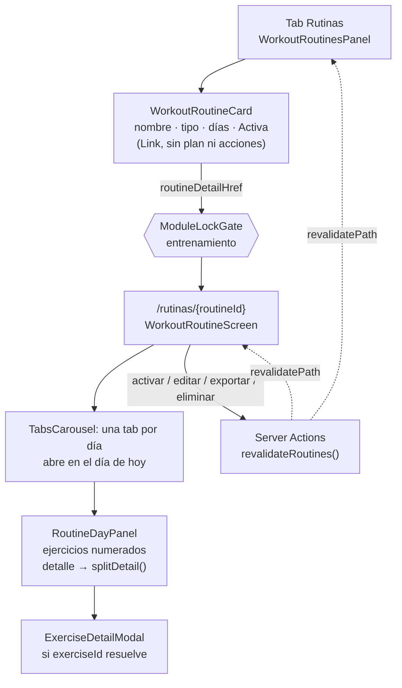

**Reglas de Firestore: no hace falta cambiar nada.** La lectura nueva la hace un
Server Component con el Admin SDK, que saltea `firestore.rules` — por eso el
chequeo de dueño está en `getWorkoutRoutineById` y no en una regla. El bloque
sigue igual, cerrado a la escritura del cliente:

```
    match /workoutRoutines/{routineId} {
      allow read: if request.auth != null && resource.data.ownerId == request.auth.uid;
      allow write: if false;
    }
```


### 2026-08-18 — Entrenamiento: el detalle de un ejercicio pasa de 40 a 200 caracteres

**Qué cambió.** `workoutRoutines.days[].exercises[].detail` acepta hasta **200
caracteres** (antes 40). No cambia ningún tipo ni se agrega ningún campo: es un
tope que se afloja, así que **todo documento existente sigue siendo válido y no
hay migración**.

**Por qué.** El tope de 40 estaba dimensionado para el caso de gimnasio, donde
el ejercicio es el nombre y el detalle son las series: `{ name: "Press banca",
detail: "4x10" }`. En CrossFit el reparto es otro — el nombre es el *bloque*
("Metcon / WOD (For Time)") y el contenido real vive en el detalle:

| Disciplina | `name` | `detail` |
|---|---|---|
| Gimnasio | el ejercicio | las series — "4x10", "20 min" |
| CrossFit | el bloque | los movimientos y las reps del bloque — 150 caracteres es normal |

Importar un plan semanal de CrossFit rebotaba entero (la importación es todo o
nada) porque 12 de sus 14 ejercicios tenían detalles de 41 a 150 caracteres.
Meterlos en el `name` no era opción: tiene su propio tope de 60 y además el
nombre es lo que `matchCatalogByName` cruza contra la biblioteca de ejercicios.

- **200 y no más.** El límite ya no es el ancho de la UI (ver abajo) sino la
  distinción entre los dos campos de texto libre de la mini-app: `detail` dice
  qué **toca**, y `workoutSessions.note` (600) dice cómo **fue**. Sin un tope
  bien por debajo del de la nota, `detail` se convierte en el diario de
  entrenamiento y el historial por día queda vacío.
- **El tope era, en parte, una decisión de layout — y esa parte se arregló.**
  Las tres vistas que muestran `detail` lo ponían a la derecha del nombre con
  `shrink-0`, o sea en una columna que no se podía comprimir: un detalle largo
  reventaba la fila. Ahora el contenedor es `flex-wrap` sin `shrink-0`, así que
  un `"4x10"` sigue quedando a la derecha —el caso de gimnasio no cambia de
  aspecto— y un WOD entero baja a su propio renglón y envuelve. El composer
  cambió el `Input` de `w-24` por un `Textarea` con `autoResize`.
- **Los errores de largo ahora nombran el ejercicio.** `normalizeExercises`
  tiraba "El detalle de un ejercicio no puede tener más de 40 caracteres" sin
  decir cuál, y por acá entran hasta 30 ejercicios por día más el JSON
  importado completo. Ahora dice el nombre y el largo real, como ya hacían los
  errores de `parseRoutine`.

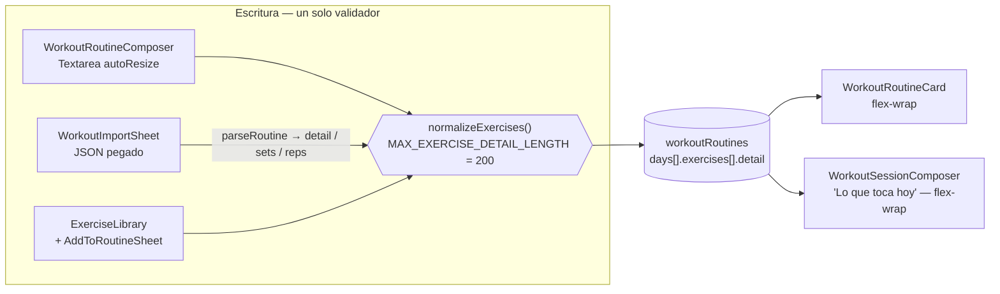

**Reglas de Firestore: no hace falta cambiar nada.** El bloque de
`workoutRoutines` sigue igual, y es justamente el que hace que el tope no
necesite expresarse en las reglas: todas las escrituras pasan por Server
Actions con el Admin SDK (que las saltea), así que la validación de forma vive
entera en `normalizeRoutine`/`normalizeExercises` y las reglas sólo tienen que
cerrarle la escritura al cliente.

```
    match /workoutRoutines/{routineId} {
      allow read: if request.auth != null && resource.data.ownerId == request.auth.uid;
      allow write: if false;
    }
```


### 2026-08-11 — Carteras: libro de operaciones, ventas y efectivo sin invertir

**Qué cambió.** Una billetera de inversión pasó a llevar un **libro de
operaciones** —depósitos, retiros, compras, ventas, dividendos y comisiones— en
vez de una lista de posiciones editables a mano. Vender un activo descuenta las
unidades y **el importe queda como efectivo sin invertir** dentro de la misma
billetera, listo para otra compra o para retirar.

**Reemplaza a `walletPositions`**, que se agregó más temprano hoy y se retira:
la colección nueva es `walletTrades`. Es un cambio de fondo, no un agregado —
ver el porqué abajo. Las cotizaciones se mudaron del documento de la posición a
un mapa `quotes` en el documento de la billetera.

> **Al desplegar**: `walletPositions` queda sin código que la lea ni la escriba.
> No hay migración automática (la mini-app se creó hoy mismo, sin datos en
> producción). Si alguna cuenta llegó a cargar posiciones, hay que borrar esa
> colección a mano — el borrado en cascada y el módulo `billetera` de Ajustes
> ya apuntan a `walletTrades`.

- **Por qué un libro y no posiciones editables.** El pedido fue "lo más
  profesional y trazable posible", y una tenencia que se puede editar a mano no
  es trazable: el número que muestra la pantalla no tiene por qué corresponderse
  con ninguna operación. Con el libro **nada se guarda derivado** — ni las
  unidades de cada activo, ni el costo promedio, ni el efectivo, ni el
  resultado. Todo sale de recorrer los asientos en orden (`portfolio()`,
  `wallet-model.ts`), así que cada número se puede seguir hasta la operación que
  lo produjo y es **imposible** que un total y su detalle se desincronicen.
  El detalle completo está en la sección de
  [`wallets`](#walletswalletid-y-walletmovementsmovementid).
- **La venta es el caso que le da sentido al modelo.** No hay que "acreditar"
  la plata en ningún lado: el efectivo *es* la suma de la columna `cashAmount`
  del libro, así que asentar la venta ya lo deja disponible. El composer de
  venta no deja tipear el activo —lo elige de las tenencias reales, con su
  cantidad disponible y un atajo "Vender todo"— y muestra antes de guardar qué
  resultado va a realizar y con cuánto efectivo va a quedar la cartera. El tope
  que valida el server (`heldQuantity`) sale del **mismo** `portfolio()` que
  dibuja la pantalla, así que nunca ofrece vender algo que después rebota.
- **Costo promedio ponderado** para el costo de lo que queda en cartera, y
  resultado **realizado vs. sin realizar** separados en la UI: son dos números
  distintos (uno ya es plata, el otro es lo que valdría si vendiera hoy) y
  mezclarlos escondería justamente lo que uno quiere ver después de vender.
- **Los asientos no se editan, sólo se borran** (`deleteTradeAction`). Borrar
  puede dejar una venta sin la compra que la respalde: el fold clampea en cero
  y marca la tenencia como inconsistente para que la pantalla lo avise, en vez
  de bloquear el borrado.
- **Una sola acción para las seis operaciones** (`recordTradeAction`): todas
  escriben el mismo documento y la diferencia está en qué campos exige cada
  una, que es exactamente lo que dice el registro `TRADE_KINDS`
  (`movesAsset`, `cashSign`). El signo del efectivo lo pone el server, nunca el
  cliente.
- **Las cotizaciones se mudaron a `wallets.quotes`** (mapa símbolo → precio +
  fecha), con escritura por ruta de campo (`quotes.AAPL`) — atómica por
  símbolo, misma mecánica que `HabitDoc.actionDoneDates`. Por eso el símbolo no
  puede tener puntos. `setQuoteAction` sigue siendo el enganche de la API de
  cotizaciones, ahora todavía más limpio: escribe una sola clave y no toca el
  libro.

**Verificación de la aritmética.** El invariante que tiene que cerrar es
`aportado + resultado total = valor de la cartera`. Con depósito de $1.000,
compra de 10 AAPL a $50, venta de 4 a $80 y cotización a $90:

| | |
|---|---|
| Efectivo sin invertir | $820 |
| Tenencia | 6 AAPL, costo $300 (promedio $50) |
| Valor de mercado | $540 |
| Resultado realizado | +$120 |
| Sin realizar | +$240 |
| **Valor de la cartera** | **$1.360** |
| Aportado | $1.000 · resultado total +$360 (+36,0%) |

`1.000 + 360 = 1.360` ✓ — y vender el resto a $90 deja el valor en $1.360
igual, que es lo correcto: vender a precio de mercado no cambia lo que tenés.

**`firestore.rules` — bloque a agregar** (ya aplicado), reemplazando al de
`walletPositions`. Las cotizaciones no necesitan match propio: viven en un mapa
dentro del documento de la billetera, ya cubierto por el bloque de `wallets`.

```
match /walletTrades/{tradeId} {
  allow read: if request.auth != null && resource.data.ownerId == request.auth.uid;
  allow write: if false;
}
```

`firestore.indexes.json` no necesita cambios: las consultas del libro son
equality-only sobre `ownerId` o `walletId`.

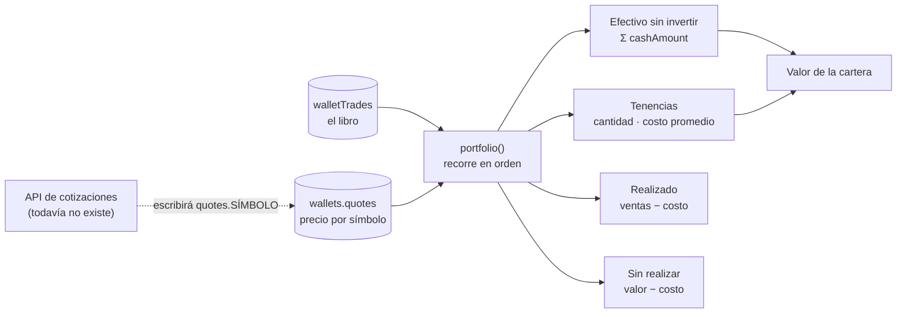

- **Fuera de alcance a propósito**: sin FIFO ni lotes (es promedio ponderado),
  sin historial de precios (`quotes` guarda el último, no una serie), sin
  transferencias entre billeteras, sin cálculo impositivo, y el efectivo de una
  cartera no se puede mover a una billetera de gastos — se retira y se carga
  del otro lado.

### 2026-08-11 — Billetera: tipo de perfil, moneda y carteras de inversión

**Qué cambió.** Una billetera ahora tiene **tipo** y **moneda**, y las de tipo
inversión llevan **posiciones** en vez de movimientos: qué activo, cuándo entró,
cuántas unidades y a qué precio — con el rendimiento ya calculado y el enganche
listo para una API de cotizaciones.

**Colección nueva**: `walletPositions`. **Campos nuevos** en `WalletDoc`:
`kind`, `currency`, `creditLimit`. Las billeteras que ya existían no traen
ninguno y se leen con defaults (`kind: "gastos"`, `currency: "ARS"`,
`creditLimit: null`), que es exactamente lo que eran — no hace falta migrar.

- **Cuatro tipos, un registro** (`WALLET_KINDS`, `src/lib/wallet-model.ts`):

  | `kind` | Qué lleva | Su número principal |
  |---|---|---|
  | `gastos` | movimientos | Saldo |
  | `ahorro` | movimientos + meta | Ahorrado |
  | `credito` | movimientos + límite | **Deuda** (saldo invertido) |
  | `inversion` | **posiciones** | Valor actual |

  El registro expone dos banderas, `usesPositions` e `isDebt`, y de ahí cuelga
  todo: qué se puede cargar, qué totales se calculan y qué muestra cada card.
  `walletHeadline`/`walletProgress` traducen eso a "qué número y con qué
  nombre", así que la grilla, el detalle y el carrusel de Inicio dicen lo mismo
  sin coordinarse. Ver la decisión completa en la sección de
  [`wallets`](#walletswalletid-y-walletmovementsmovementid).
- **`credito` invierte el signo al mostrar, no al guardar**: un consumo se
  guarda como movimiento negativo igual que un gasto, y la UI lo lee como
  "Deuda: $5.000". Sus botones dicen "Consumo"/"Pago" en vez de
  "Gasto"/"Ingreso" — misma escritura, otro nombre.
- **Moneda por billetera** (`ARS`/`USD`/`EUR`/`BRL`/`USDT`), con
  `formatAmount`/`formatSignedAmount` nuevos en `wallet-model.ts`. Armados a
  mano sobre `toLocaleString` como `formatMoney`, nunca con
  `Intl.NumberFormat(style: "currency")` — su símbolo varía entre Node y el
  browser y eso es un mismatch de hidratación. **Nunca se suman dos monedas**:
  se sacó el total de la grilla, porque sumar pesos con dólares exige una
  cotización que todavía no existe.
- **Tipo y moneda son inmutables después del alta.** No es sólo que la UI los
  esconda al editar: `updateWalletAction` no los incluye en el `update` y
  valida el resto de los campos contra el `kind` **guardado**. Los motivos
  están en la sección de la colección; en corto, cambiarlos resignifica datos
  ya cargados.
- **Posiciones de inversión** (`walletPositions`): colección propia y no
  movimientos con campos extra — una posición tiene cantidad × precio, se
  ordena por fecha de ingreso y su valor cambia sin que nadie escriba nada.
  Son la **única forma del repo con decimales** (media acción, 0.0031 BTC), así
  que su composer usa un `Input` numérico y no `AmountInput`, que redondea a
  entero.
- **El enganche de la API de cotizaciones ya está dibujado.**
  `currentPrice`/`currentPriceAt` hoy los escribe el usuario a mano con
  `setPositionPriceAction` — una acción chica y separada del alta a propósito,
  porque es exactamente la escritura que va a hacer la integración cuando
  exista (buscar por `assetSymbol`, escribir precio y fecha).
  `positionReturn`/`investmentTotals` ya derivan el rendimiento de esos campos
  sin importar quién los puso, así que enchufar la API no toca ningún cálculo
  ni ninguna pantalla. Sin precio no se inventa un valor: la posición vale lo
  que costó y la UI dice "sin cotización" en vez de un 0%.
- **Guardas del lado del server, no sólo en la UI**: `addWalletMovementAction`
  rechaza cargar movimientos en una billetera de inversión y
  `upsertWalletPositionAction` rechaza posiciones en una que no lo sea. La UI
  ni siquiera ofrece los botones, pero una Server Action es un endpoint
  público. Los campos que no aplican al tipo (`targetAmount` en crédito,
  `initialBalance` en inversión) se guardan en su valor neutro en vez de lo que
  mande el cliente.
- **El borrado en cascada de una billetera** ahora limpia las dos colecciones
  hijas, y el módulo `billetera` de Ajustes suma `walletPositions`.

**`firestore.rules` — bloque a agregar** (ya aplicado). Los campos nuevos de
`wallets` no necesitan nada: la colección ya tiene su bloque y el cliente sigue
sin poder escribir. La colección nueva sí:

```
match /walletPositions/{positionId} {
  allow read: if request.auth != null && resource.data.ownerId == request.auth.uid;
  allow write: if false;
}
```

Queda cerrada a escritura **también** pensando en la API de cotizaciones: ese
job va a correr en el server con el Admin SDK, que saltea las reglas igual que
las Server Actions, así que no hay ningún caso en que el browser necesite
escribir acá.

`firestore.indexes.json` no necesita cambios: las consultas nuevas son
equality-only sobre `ownerId` o `walletId`, que Firestore resuelve con los
índices de campo único que crea solo.

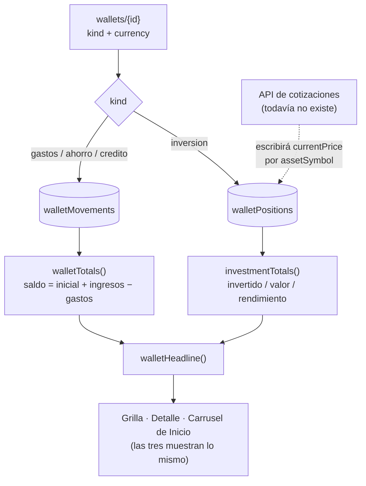

- **Fuera de alcance a propósito**: no hay conversión entre monedas ni un
  patrimonio total consolidado (haría falta la misma cotización que falta), no
  se registran ventas ni cierres parciales de una posición (sólo alta, edición
  y borrado), no hay historial de precios —`currentPrice` guarda el último, no
  una serie— y no hay fecha de cierre/vencimiento en las billeteras de crédito.

### 2026-08-11 — Inicio: carrusel de accesos directos a billeteras

**Qué cambió.** El Resumen de Inicio muestra un carrusel horizontal con las
billeteras que el usuario elija fijar; tocar una entra derecho a esa billetera
dentro de la mini-app, con su detalle ya abierto.

**Un campo nuevo, ninguna colección nueva**: `WalletDoc.pinnedToHome`
(`boolean`). Las billeteras creadas antes no lo tienen y se leen con `?? false`
(`getWallets`) — no hace falta migrar nada.

- **Se eligen una por una, no aparecen todas.** El carrusel abre un sheet
  (`HomeWalletsSheet`) con un `Switch` por billetera, que guarda al instante con
  `toggleWalletHomePinAction` y pintado optimista (mismo patrón que
  `PinLockSwitch`). El mismo switch está también en el detalle de la billetera
  dentro de la mini-app ("Mostrar en Inicio"), porque es donde el usuario ya
  está parado cuando se le ocurre fijarla. El Resumen es un índice: doce cards
  de billetera lo volverían la pantalla de otra cosa.
- **Por qué `pinnedToHome` y no un array tipo `favorites/{uid}`**: ver la
  decisión de diseño en la sección de
  [`wallets`](#walletswalletid-y-walletmovementsmovementid). En corto: se
  prende de a una, y un array obligaría a un read-modify-write que dos
  dispositivos se pisarían.
- **Inicio no se trae toda la mini-app.** `getWalletShortcuts` (nuevo, en
  `lib/data/wallets.ts`) devuelve *todas* las billeteras (≤ 12 documentos, para
  el selector) y los movimientos **sólo de las fijadas**, con un `in` sobre sus
  ids. Inicio muestra el saldo, no el detalle: traer los movimientos de las que
  no están en el carrusel sería pagar lecturas por documentos que nadie mira.
  Sin ninguna fijada no hace ni esa consulta. Entra al `Promise.all` de
  `getHomeData` junto al resto.
- **El deep link es un query param, no una ruta**:
  `/mini-apps/billetera?billetera={id}` (`walletDetailHref`, `app-config.ts`).
  El detalle de una billetera **no es una pantalla**: es un modal sobre la tab
  "Billeteras", que necesita el resto de la mini-app montada detrás — una ruta
  propia obligaría a duplicar la pantalla entera sólo para abrir un modal. Es
  la diferencia con `/inicio/periodos/{cycleId}`, que sí es una pantalla
  completa y por eso sí tiene ruta.

  La página lo lee de `searchParams` (que en esta versión de Next es una
  Promise: es una Request-time API) y lo baja como prop, igual que `today` —
  el cliente no vuelve a leer la URL por su cuenta. `WalletApp` lo valida
  contra las billeteras que ya tiene, mueve la tab del shell a "Billeteras" y
  **limpia el query param** con `router.replace`: el deep link es de un solo
  uso, y dejarlo puesto haría que volver a esa tab reabriera el detalle.
  `WalletsPanel` ya lo latcheó como estado inicial perezoso, así que limpiar la
  URL no cierra el modal.
- **Todas las acciones de billeteras revalidan también `/inicio`**
  (`revalidateWalletScreens`): el carrusel muestra nombre, color y saldo, así
  que cargar un movimiento, editar o borrar una billetera lo desactualiza tanto
  como a la mini-app.
- **Scroll horizontal con `snap`, no el `Carousel` de la librería**: ese
  componente es un visor de imágenes con flechas y dots. Se reusa la misma
  mecánica del carrusel de "Períodos anteriores"
  (`flex snap-x snap-mandatory gap-3 overflow-x-auto` + cards
  `shrink-0 snap-start`). La última card de la fila es un "+" que abre el
  selector, en vez de un botón aparte.

**`firestore.rules` no necesita ningún cambio.** `pinnedToHome` es un campo más
de un documento de una colección que ya tiene su bloque, y el cliente sigue sin
poder escribir nada — el toggle pasa por una Server Action con el Admin SDK. El
bloque vigente (sin cambios) es:

```
match /wallets/{walletId} {
  allow read: if request.auth != null && resource.data.ownerId == request.auth.uid;
  allow write: if false;
}
```

`firestore.indexes.json` tampoco: el `in` de `getWalletShortcuts` es sobre un
solo campo (`walletId`), que Firestore resuelve con el índice de campo único
que crea solo.

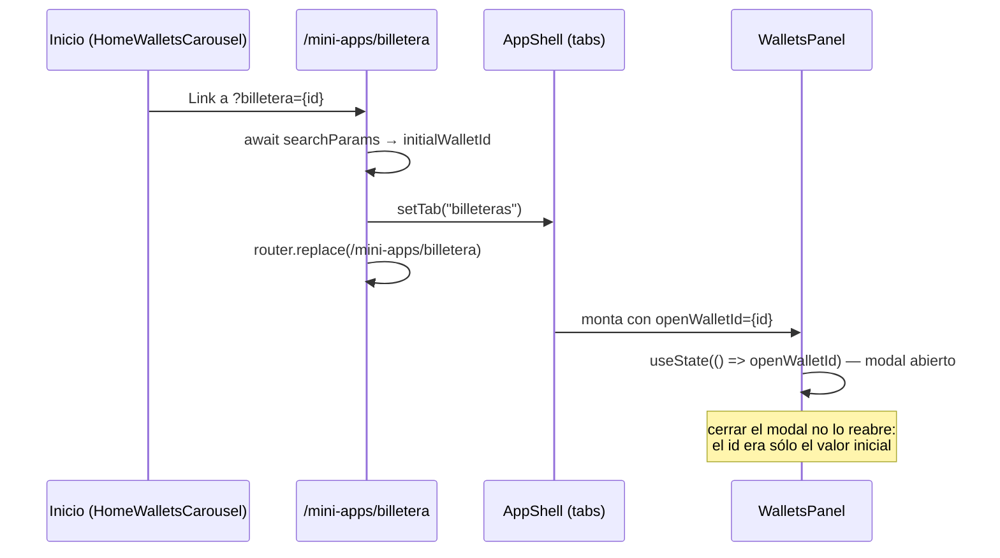

- **Fuera de alcance a propósito**: el orden del carrusel no es manual (sigue
  el `createdAt`, igual que la grilla), y no hay un tope propio de accesos
  directos más allá del de 12 billeteras.

### 2026-08-11 — Mini-app Billetera: el gestor de gastos + varias billeteras

**Qué cambió.** Nueva mini-app privada **Billetera**
(`/mini-apps/billetera`, `MiniApp.id` = `billetera`), pensada como *extensión*
del módulo de gastos: en una tab muestra el gestor de gastos por período de
siempre, y en la otra deja crear varias billeteras, cada una encargada de una
cosa distinta ("Ahorro auto", "Casa", "Viaje"), con su saldo y sus movimientos.

Dos colecciones nuevas — `wallets` y `walletMovements` — y **ningún cambio en
la forma** de `expenseCycles`/`expenseMovements`/`expenseCategories`.

- **La tab "Principal" no es una copia: es el mismo componente.** `WalletApp`
  (`src/components/organisms/mini-apps/WalletApp.tsx`) renderiza el
  `MovementsPanel` de `organisms/home` tal cual, con los mismos datos que le
  pasa Inicio (`getActiveExpenseCycle` + `getExpenseMovements` +
  `getExpenseCategories`). Es lo que la nota vieja de
  `expenseCycles`/`expenseMovements` anticipaba —*"las dos colecciones están
  pensadas para que una mini-app de gastos aparte, más adelante, las lea/escriba
  igual"*—: el gestor de gastos por período sigue siendo **uno solo**, y ahora
  se ve desde dos pantallas.
- **Las billeteras van en colecciones propias**, no como un `walletId` opcional
  en `expenseMovements`: ver la decisión de diseño completa en la sección
  [`wallets`/`walletMovements`](#walletswalletid-y-walletmovementsmovementid).
  El motivo corto es el borrado por módulo de Ajustes —que borra por `ownerId`—
  y no tener que volver `cycleId` nullable en toda la colección existente.
- **Lo que sí se comparte con el gestor de gastos**: el ABM de categorías
  (`expenseCategories/{uid}`, el mismo documento — una billetera no tiene
  categorías propias), el tipo `Movement` (`lib/data/home.ts`, al que se le
  sumó un `walletId?` opcional), el componente `MovementsList` y `formatMoney`/
  `byDayDesc` de `home-model.ts`.
- **`MovementsList` ganó un `onDelete` opcional**, que dibuja un botón de
  borrado por fila. Sin la prop la lista queda igual que antes (sólo lectura,
  que es como la usa el gestor de gastos: un movimiento de un ciclo no se
  borra); el detalle de una billetera sí la pasa.
- **Dos candados de PinLock distintos, a propósito.** La página monta un
  `ModuleLockGate` con `moduleId: "billetera"` que tapa la mini-app entera, y
  adentro la tab "Principal" sigue mostrando el switch del módulo
  `movimientos` (el suyo, el de Inicio) en su sheet de ajustes. Son dos
  módulos distintos en `UserPreferences.lockedModules`: bloquear la mini-app no
  bloquea la tab de Inicio ni al revés.
- **Ajustes → "Borrar datos"** suma la entrada `billetera` a
  `RESETTABLE_MODULES` con **sólo** `wallets` + `walletMovements`. Restablecer
  las billeteras no toca el período en curso del módulo `movimientos`, y
  viceversa — que es justamente lo que una colección compartida habría roto.
- **`nav-config`** suma `WALLET_TABS` (`principal` / `billeteras`, tipadas con
  `WalletTab` igual que `HOME_TABS`/`WORKOUT_TABS`) y la entrada de
  `SCREEN_HEADERS` con `back: true`. Sin `searchable`: hasta 12 billeteras
  entran en una grilla sin necesitar buscador.

**`firestore.rules` — bloques a agregar** (ya aplicados). Mismo criterio que
todo el resto del repo: el cliente lee lo suyo, y no escribe nada — todas las
escrituras pasan por Server Actions con el Admin SDK, que saltea las reglas.
`walletMovements` duplica el `ownerId` de su billetera justamente para que la
regla no necesite un `get()` del documento padre:

```
match /wallets/{walletId} {
  allow read: if request.auth != null && resource.data.ownerId == request.auth.uid;
  allow write: if false;
}

match /walletMovements/{movementId} {
  allow read: if request.auth != null && resource.data.ownerId == request.auth.uid;
  allow write: if false;
}
```

`firestore.indexes.json` **no necesita cambios**: las dos consultas nuevas son
equality-only sobre `ownerId` (y `walletId` en el borrado en cascada), que
Firestore resuelve con los índices de campo único que crea solo.

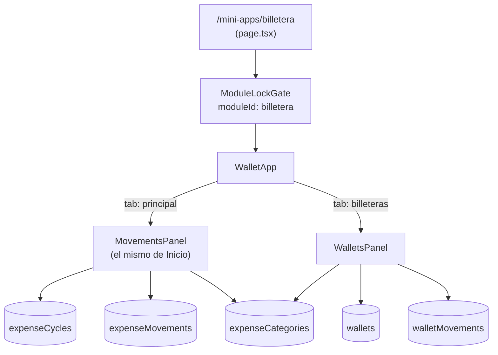

- **Fuera de alcance a propósito** (base para las próximas instrucciones): no
  hay transferencias entre billeteras ni entre una billetera y el período,
  ni orden manual de la grilla (se ordena por `createdAt`), ni archivado —
  una billetera se borra, no se guarda como historial—, ni edición de un
  movimiento ya cargado (sólo alta y borrado), ni notificaciones propias (el
  aviso de umbral del tope sigue siendo sólo del gestor de gastos).

### 2026-08-08 — Ajustes: borrar los datos de un módulo/mini-app puntual

**Qué cambió.** Nueva sección "Borrar datos" en Ajustes
(`ModuleResetCard`, `src/components/organisms/settings/ModuleResetCard.tsx`)
que deja borrar de una todos los datos de un módulo o mini-app elegido —no la
cuenta entera—, "restableciéndolo" a como estaba antes de usarlo. No agrega
colecciones ni cambia la forma de ningún documento: es puro borrado sobre lo
que ya existe.

- **Registro de módulos resettable**: `src/lib/data/module-reset.ts`
  (`RESETTABLE_MODULES`) mapea cada módulo a sus colecciones. Usa los mismos
  ids que ya existían para otro propósito —`MiniApp.id`
  (`lib/data/mini-apps.ts`) para mini-apps, `HomeTab`
  (`home/tabs.ts`) para las tabs de Inicio— en vez de inventar uno nuevo, el
  mismo criterio que ya usa `UserPreferences.lockedModules` de PinLock:

  | Módulo (`id`) | `kind` | Colecciones |
  |---|---|---|
  | `movimientos` (`HomeTab`, no `MiniApp`) | `home-tab` | `expenseCycles`, `expenseMovements`, `expenseCategories` |
  | `notas` | `home-tab` | `notes` |
  | `habitos` | `home-tab` | `habits` |
  | `links-guardados` | `mini-app` | `links` |
  | `entrenamiento` | `mini-app` | `workoutRoutines`, `workoutSessions`, `customExercises` |

  El gestor de gastos usa el id de la tab **Movimientos** de Inicio y no
  `split-gastos`: esa mini-app del catálogo es un placeholder sin
  persistencia (`SplitGastos.tsx`, *"Sin persistencia todavía"*) — hoy
  `expenseCycles`/`expenseMovements`/`expenseCategories` sólo los lee/escribe
  `MovementsPanel` vía `getHomeData`/`expenses-actions.ts`, así que ofrecer
  borrar "Split de gastos" habría borrado datos que esa pantalla ni siquiera
  muestra.
- **Dos tabs en la UI, no una sola lista.** `ModuleResetCard` separa
  "Módulos" (`kind: "home-tab"`: Movimientos, Notas, Hábitos) de "Mini-apps"
  (`kind: "mini-app"`: Links guardados, Entrenamiento) con el componente
  `Tabs` de `lib-kit-components` (`variant="segmented"`, con `panels` para el
  crossfade) — son dos catálogos distintos para quien usa la app (uno son las
  tabs de Inicio, el otro el grid de `/mini-apps`), aunque ambos se borran
  igual del lado del server. Si sólo uno de los dos grupos tiene datos, se
  muestra esa lista sola, sin la barra de tabs (no tiene sentido un
  selector con una sola opción).

  Sólo se listan los módulos con backend real y datos propios del usuario —el
  resto del catálogo de mini-apps (`cobrar-qr`, `calculadora-propinas`,
  `recordatorio-pagos`, `panel-accesos`, `generador-qr`,
  `ruleta-decisiones`, `sorteo-expres`) son utilidades sin persistencia o
  todavía sin pantalla, así que no tienen nada que ofrecer borrar.
- **"Sólo si tiene datos"**: `getModulesWithData(uid)` (mismo archivo, sólo
  Server Components) consulta cada colección del módulo con `limit(1)` —o,
  para `expenseCategories` (doc id = uid, sin campo `ownerId`), un `get()`
  directo del documento— y sólo devuelve los módulos con al menos un
  resultado. `AjustesPage` (`src/app/(app)/ajustes/page.tsx`) la llama junto
  con `getProfile` y le pasa la lista a `SettingsPanel`, que no renderiza
  la sección si viene vacía.
- **El borrado real es `resetModuleDataAction`**
  (`src/lib/data/module-reset-actions.ts`, Server Action): por cada colección
  del módulo, borra por `ownerId` en tandas de hasta 500 documentos por
  `WriteBatch` (repite hasta vaciar la colección para ese usuario — un módulo
  puede superar el tope de un solo batch, ej. años de `workoutSessions`), o
  borra directo el documento cuando el id ya es el `uid`
  (`expenseCategories`). Pide `requireFreshSession` en vez de `requireSession`
  —mismo criterio que "borrar la cuenta" en `dal.ts`— porque es irreversible
  y de alcance amplio, a diferencia del resto de los borrados del repo
  (`deleteNoteAction`, `clearNotificationsAction`, etc.) que sólo revalidan la
  sesión de la cookie.
- **La UI pide confirmación explícita**: `ModuleResetCard` es un componente
  cliente que muestra un `Modal` de `lib-kit-components` con "Cancelar"/
  "Borrar datos" antes de llamar a la Server Action —ningún borrado del
  repo hasta ahora tenía un paso de confirmación con `Modal`, el precedente
  más cercano (`NoteDetailModal`) usa un `mode: "confirm"` inline en vez de un
  modal aparte; acá se usa `Modal` porque es Ajustes, no el detalle de un
  ítem puntual.

- **`firestore.rules` no necesita ningún cambio.** Las cinco colecciones
  tocadas (`expenseCycles`, `expenseMovements`, `expenseCategories`, `links`,
  `workoutRoutines`, `workoutSessions`, `customExercises`, `notes`, `habits`)
  ya tienen `allow write: if false` — todo el borrado lo hace el Admin SDK
  desde `resetModuleDataAction`, que saltea las reglas igual que el resto de
  las Server Actions del repo. Los bloques vigentes (sin cambios) son:
  ```
  match /expenseCycles/{cycleId} {
    allow read: if request.auth != null && resource.data.ownerId == request.auth.uid;
    allow write: if false;
  }

  match /expenseMovements/{movementId} {
    allow read: if request.auth != null && resource.data.ownerId == request.auth.uid;
    allow write: if false;
  }

  match /expenseCategories/{uid} {
    allow read: if isOwner(uid);
    allow write: if false;
  }

  match /links/{linkId} {
    allow read: if request.auth != null && resource.data.ownerId == request.auth.uid;
    allow write: if false;
  }

  match /workoutRoutines/{routineId} {
    allow read: if request.auth != null && resource.data.ownerId == request.auth.uid;
    allow write: if false;
  }

  match /workoutSessions/{sessionId} {
    allow read: if request.auth != null && resource.data.ownerId == request.auth.uid;
    allow write: if false;
  }

  match /customExercises/{exerciseId} {
    allow read: if request.auth != null && resource.data.ownerId == request.auth.uid;
    allow write: if false;
  }

  match /notes/{noteId} {
    allow read: if request.auth != null && resource.data.ownerId == request.auth.uid;
    allow write: if false;
  }

  match /habits/{habitId} {
    allow read: if request.auth != null && resource.data.ownerId == request.auth.uid;
    allow write: if false;
  }
  ```

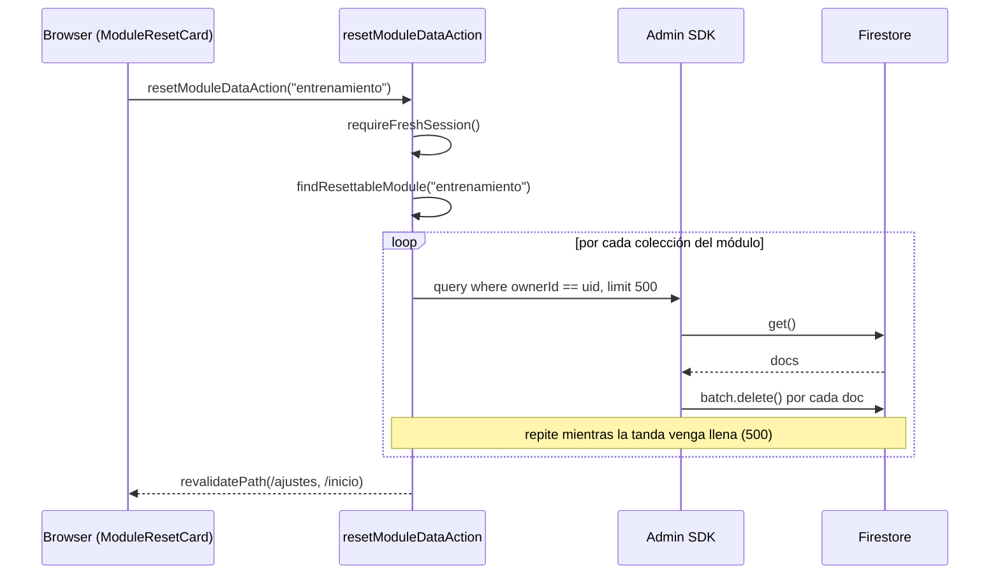

- **Fuera de alcance a propósito**: no hay una opción de "borrar todo" que
  junte todos los módulos en un solo click —el pedido fue módulo por
  módulo—, ni borrado de `favorites`/`notificationPreferences`/
  `pushSubscriptions` (no son "datos de un módulo", son configuración
  transversal ya cubierta por otras pantallas de Ajustes). Tampoco borra la
  cuenta de Firebase Auth ni el documento `users/{uid}`: eso sería "borrar la
  cuenta", una acción distinta que no se pidió acá.

### 2026-08-08 — Entrenamiento: biblioteca de ejercicios y ABM propio

**Qué cambió.** La mini-app de entrenamiento pasó a tener dos tabs
(`WORKOUT_TABS` en `nav-config`, leídas con `useShellTabs()` igual que las de
Inicio): **Rutinas** (lo que ya había) y **Ejercicios**, una biblioteca
consultable con la ficha de cada movimiento — qué es, para qué sirve y los
consejos de ejecución.

- **Catálogo base estático**: `src/lib/exercise-catalog.ts`, ~90 ejercicios
  con `group`, `equipment`, `description` y `tips`, repartidos en 10 grupos
  musculares. **No es una colección de Firestore** (ver la decisión de diseño
  en la sección de `customExercises`).
- **Colección nueva `customExercises/{exerciseId}`** — `CustomExerciseDoc`:
  los ejercicios que el usuario agrega con el ABM. Misma forma que una
  entrada del catálogo, para poder mezclarlos en una sola lista
  (`mergeExercises`).
- **`WorkoutExerciseDoc` sumó `exerciseId: string | null`**: de qué ejercicio
  de la biblioteca salió esa fila de la rutina. Es lo que permite abrir la
  ficha desde el plan. `null` en las filas escritas a mano y en todas las
  cargadas antes de este cambio (`getWorkoutRoutines` lo resuelve con `??`,
  sin migración).
- **Server Action nueva `addExercisesToRoutineDayAction(routineId, weekday,
  exercises)`** en `workouts-actions.ts`: el camino "de la lista a la
  rutina". Desde la biblioteca se seleccionan varios ejercicios, se elige a
  qué rutina y a qué día van, y se agregan al final de ese día. El mismo
  selector (`ExercisePickerSheet`) se reusa dentro del composer de rutinas,
  donde no toca Firestore: ahí sólo agrega filas al borrador.

**Por qué el catálogo no va en Firestore.** Es idéntico para todas las
cuentas y sólo cambia con un deploy. Guardarlo en la base sería ~90
documentos por usuario (o una colección global con su propia regla) y una
lectura extra en cada carga, siempre para devolver lo mismo. Como además no
es editable —a diferencia de `DEFAULT_EXPENSE_CATEGORIES`, que es un punto de
partida que el ABM copia—, lo propio del usuario puede vivir aparte sin que
las dos listas se pisen nunca, y mejorar una descripción llega a todos sin
migrar datos.

**Por qué la rutina copia el nombre pero guarda el id.** Mismo criterio que
`category` en `expenseMovements`, con un matiz: el `name` copiado hace que
renombrar o borrar un ejercicio propio no reescriba ni rompa las rutinas ya
armadas, mientras que la descripción y los consejos se resuelven por
`exerciseId` en cada render, así que sí se ven siempre actualizados. Un id
que dejó de resolver degrada la fila a "sin ficha", que es el mismo estado en
el que están, legítimamente, las filas escritas a mano.

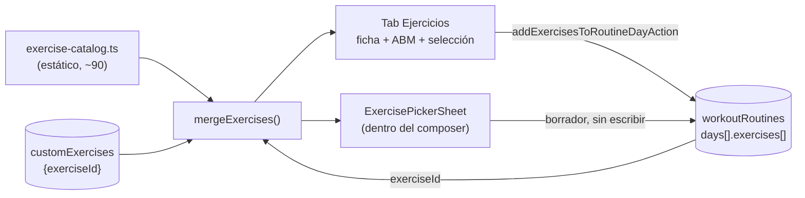

**Reglas de Firestore.** Un bloque nuevo, mismo criterio por campo que el
resto. El catálogo estático no necesita ninguno: no vive en Firestore.

```
    match /customExercises/{exerciseId} {
      allow read: if request.auth != null && resource.data.ownerId == request.auth.uid;
      allow write: if false;
    }
```

**Sin índices nuevos.** `getCustomExercises` filtra sólo por `ownerId` (`==`)
y ordena en memoria, igual que el resto.

**Fuera de alcance de esta entrada.** El catálogo no tiene imágenes ni videos
(sólo texto), no hay registro de cargas por ejercicio (el peso sigue siendo
texto libre en `detail`), y los ejercicios propios no se pueden compartir
entre cuentas — el export de una rutina lleva los nombres, no las fichas.

### 2026-08-06 — Mini-app Entrenamiento: rutinas y días entrenados

**Qué cambió.** Dos colecciones nuevas para la mini-app privada
**Entrenamiento** (`/mini-apps/entrenamiento`, `requiresAuth: true`):

- `workoutRoutines/{routineId}` (id autogenerado) — `WorkoutRoutineDoc`: la
  rutina con su `type` (gimnasio/crossfit/aire-libre/casa/funcional/otro),
  sus `days` (un `weekday` único por día, con `title` y `exercises`) y el flag
  `active`, del que sólo puede haber uno prendido por cuenta.
- `workoutSessions/{uid}_{yyyy-mm-dd}` — `WorkoutSessionDoc`: un día
  efectivamente entrenado, con qué se hizo y la nota del día. **El id no es
  autogenerado**: se deriva del día, lo que hace que marcarlo sea idempotente
  y que editar la nota sea la misma escritura que crearlo.

Módulos nuevos: `src/lib/data/workouts.ts` (lectura),
`src/lib/data/workouts-actions.ts` (Server Actions, incluida la importación
desde JSON) y `src/lib/workout-model.ts` (racha, récord y progreso semanal —
funciones puras compartidas entre server y cliente, como `home-model.ts`).
`ROUTES.miniAppEntrenamiento` se sumó a `PROTECTED_ROUTES`, y el módulo
soporta PinLock con el id `"entrenamiento"` (el mismo `MiniApp.id`).

**Por qué dos colecciones y no un array en la rutina.** `habits` guarda su
historial como un `string[]` adentro del propio documento, y para un hábito
alcanza: un día cumplido es un booleano. Acá un día entrenado tiene contenido
propio (qué se hizo, la nota) y tiene que sobrevivir a la rutina con la que se
registró — el usuario cambia de plan cada varios meses y no puede perder el
historial al hacerlo. Por eso `workoutSessions` es su propia colección, con
`routineName`/`type` copiados al registrar en vez de una referencia viva
(mismo criterio que `category` en `expenseMovements`): borrar la rutina no
rompe ni reescribe lo ya registrado.

**Por qué la racha no cuenta días corridos.** `workoutStreak` saltea los días
de descanso de la rutina activa en vez de cortarse con ellos: un plan de
lunes/miércoles/viernes cumplido tres semanas seguidas es una racha de 9, no
una racha rota cada sábado. Un día entrenado fuera del plan no suma — mide
cumplimiento del plan, no actividad, mismo criterio que
`scheduledWeekCountOf` en los hábitos. Se deriva de las sesiones en cada
render, no se guarda.

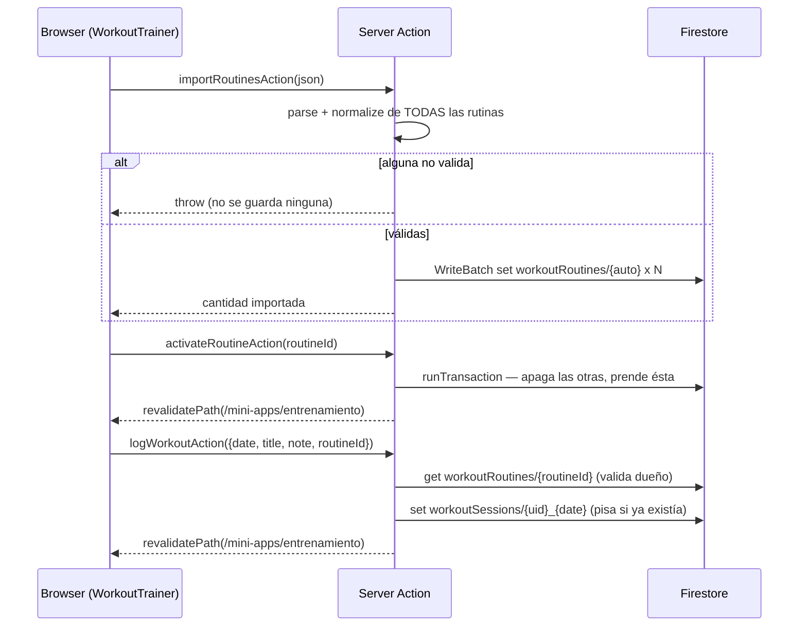

**Reglas de Firestore.** Hay que agregar dos bloques a `firestore.rules` (ya
escritos en el repo, mismo criterio de dueño por campo que
`notes`/`links`/`habits`: el cliente lee lo suyo, todas las escrituras pasan
por Server Actions con el Admin SDK). En `workoutSessions` el dueño se valida
por `ownerId` y **no** parseando el prefijo del id: la regla no depende de
cómo se arme la clave.

```
    match /workoutRoutines/{routineId} {
      allow read: if request.auth != null && resource.data.ownerId == request.auth.uid;
      allow write: if false;
    }

    match /workoutSessions/{sessionId} {
      allow read: if request.auth != null && resource.data.ownerId == request.auth.uid;
      allow write: if false;
    }
```

**Sin índices nuevos.** Las dos consultas filtran sólo por `ownerId` (`==`) y
ordenan en memoria, así que no hace falta tocar `firestore.indexes.json`.

**Fuera de alcance de esta entrada.** No hay recordatorios ni notificaciones
de entrenamiento (los `topics` no se tocaron), no hay progresión de cargas por
ejercicio (el peso va como texto libre en `detail`), y la racha no genera
avisos de hito como la de los hábitos.

### 2026-08-04 — Links guardados: descripción y categoría propias del usuario

**Qué cambió.** `LinkDoc` sumó dos campos: `note` (`string | null`,
descripción libre que escribe el usuario) y `category` (`string | null`,
categoría libre, ej. "Trabajo"/"Recetas"). Nueva Server Action
`updateLinkAction(linkId, { note, category })` en
`src/lib/data/links-actions.ts` para editarlos después del alta —
re-verifica dueño, mismo criterio que `deleteLinkAction`. `addLinkAction`
ahora recibe un segundo parámetro opcional `{ note?, category? }` para
completarlos ya en el alta. Ambos se normalizan a `null` si vienen vacíos
o sólo espacios (`orNull`), nunca `""`.

**Por qué.** `description` ya existía, pero es la del sitio (`og:description`,
resuelta automáticamente por `fetchLinkMetadata`) — no había forma de que el
usuario agregue su propia nota ("para qué guardé esto") ni de agruparlos por
tema. `note`/`category` son del usuario, editables en cualquier momento
desde el modal de detalle (`LinkDetailModal`), y quedan aparte de
`description` en vez de pisarla para no perder el dato original del sitio.
El buscador de la mini-app (conectado al buscador del `AppHeader`, ver
`useShellSearch`) ahora también matchea contra estos dos campos, no sólo
contra la URL.

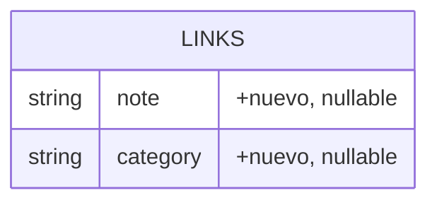

**Reglas.** Sin cambios — `links/{linkId}` ya era de sólo lectura por
`ownerId` para el cliente (`allow read: if ... resource.data.ownerId ==
request.auth.uid; allow write: if false`), y los campos nuevos no cambian
eso: siguen escribiéndose sólo por Server Actions con Admin SDK. Bloque de
`firestore.rules` reproducido tal cual, sin tocar:

```
match /links/{linkId} {
  allow read: if request.auth != null && resource.data.ownerId == request.auth.uid;
  allow write: if false;
}
```

### 2026-08-04 — PinLock opcional por módulo/mini-app

**Qué cambió.** `UserPreferences` (adentro de `users/{uid}`) sumó dos
campos: `pinHash` (`string | null`, sha256 hex de un PIN de 4 dígitos) y
`lockedModules` (`string[]`, ids de los módulos/mini-apps con el candado
activo). Tres Server Actions nuevas en `src/lib/data/profile-actions.ts`:

- `setPinAction(pin: string | null)`: define/cambia/quita el PIN
  compartido. `null` también vacía `lockedModules` — no puede quedar un
  módulo "bloqueado" sin PIN contra el cual verificar.
- `setModuleLockAction(moduleId: string, locked: boolean)`: prende/apaga el
  candado de un módulo puntual (falla si todavía no hay PIN). Usa
  `FieldValue.arrayUnion`/`arrayRemove` sobre `preferences.lockedModules`
  por dot-path, mismo criterio atómico que `toggleHabitDayAction` con
  `doneDates`.
- `verifyPinAction(code: string): Promise<boolean>`: compara contra el hash
  guardado. Se llama desde el cliente (`onUnlock` de `PinLock`, de
  `lib-kit-components`) — el hash nunca sale del server.

**Por qué.** Se pidió poder poner un PIN opcional a los tabs de Inicio
(Movimientos, Notas, Hábitos) y a cualquier mini-app privada (hoy: Split de
gastos, Links guardados) — un solo PIN por cuenta, configurado desde
Ajustes, con un interruptor propio en cada módulo/mini-app para activarlo o
desactivarlo. Es un "re-lock" de una sesión ya autenticada (mismo caso de
uso que documenta `PinLock`), no un mecanismo de login: por eso vive en
`preferences` del mismo `users/{uid}` de siempre, y no en una colección
nueva. Las mini-apps públicas (`requiresAuth: false`, ej. Calculadora de
propinas) quedan fuera a propósito — bloquear con el PIN de una cuenta algo
que no pide login no tiene sentido. El desbloqueo en el cliente se recuerda
en `sessionStorage` (`src/lib/security/session-unlock.ts`), no en
`localStorage`/IndexedDB: se pidió que el candado se vuelva a pedir al
cerrar y reabrir la app, no en cada cambio de tab dentro de la misma
sesión.

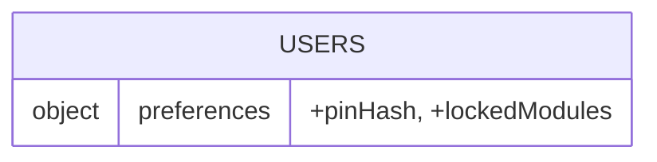

**Reglas.** Sin cambios — `users/{uid}` ya era de sólo lectura por dueño y
sin escritura de cliente (`allow write: if false`, todo pasa por Admin SDK
en las Server Actions de arriba), mismo precedente que `alias`/`avatarUrl`/
`preferences` (ver más arriba en este documento). Bloque de
`firestore.rules` reproducido tal cual, sin tocar:

```
match /users/{uid} {
  allow read: if isOwner(uid);
  allow write: if false;
}
```

### 2026-08-03 — Hábitos de grupo: pasos con timeline dentro de un hábito

**Qué cambió.** `HabitDoc` sumó dos campos: `actions` (`HabitActionDoc[]`,
sólo `{ id, name }`) y `actionDoneDates` (`Record<string, string[]>`, el
historial de días cumplidos de cada acción). Nueva Server Action
`toggleHabitActionAction` (`src/lib/data/habits-actions.ts`) para marcar/
desmarcar un paso puntual. `addHabitAction`/`updateHabitAction` ahora
también reciben `actions`, y `updateHabitAction` reconcilia
`actionDoneDates` contra los ids vigentes al editar. `getHabits` resuelve
cada acción con su `doneDates` ya armado desde el mapa.

**Por qué.** Un hábito puede ser ahora una rutina con varios pasos (ej.
"Rutina matutina" → Tomar agua / Estirar / Ducha fría / Desayunar), cada uno
marcable por separado y mostrado como timeline. No es una colección nueva:
sigue siendo el mismo `Habit` de siempre, con el mismo horario, alerta,
racha, puntaje y orden manual — `actions: []` (el default) es el hábito
simple de toda la vida, sin ningún cambio de comportamiento. El día del
hábito cuenta como cumplido (`doneDates`, racha, puntaje) recién cuando
**todas** las acciones de ese día están tildadas.

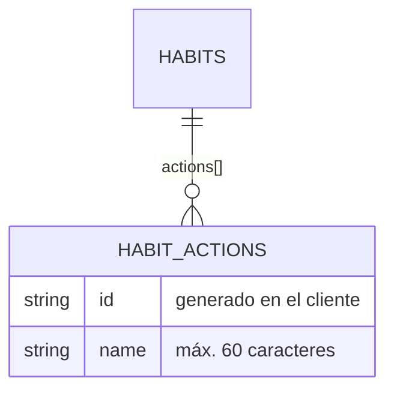

**Decisión de diseño principal — un `map`, no un array anidado, para el
historial de cada acción.** `doneDates` de una acción no puede vivir dentro
de `actions: HabitActionDoc[]`: Firestore no permite `arrayUnion`/
`arrayRemove` apuntado a un campo *dentro* de un elemento de array — no hay
forma de direccionar "el elemento con id X" en una escritura, sólo
reescribir el array entero. Los mapas sí soportan rutas de campo por clave,
así que `actionDoneDates.${actionId}` se actualiza atómicamente igual que
`doneDates` del hábito, mientras que `actions` (sin historial, sólo
definición) se reescribe entero en las ediciones — poco frecuentes, no
necesitan esa atomicidad. Ver el resto de las decisiones (por qué
`doneDates`/`score` del hábito quedan *derivados* de las acciones) en la
sección [`habits/{habitId}`](#habitshabitid).

**Reglas.** Sin cambios. `habits` ya era de sólo lectura por `ownerId` para
el cliente — los campos nuevos no lo cambian, todas las escrituras
(incluida `toggleHabitActionAction`) siguen pasando por Server Actions con
Admin SDK. Bloque de `firestore.rules` reproducido tal cual, sin tocar:

```
    match /habits/{habitId} {
      allow read: if request.auth != null && resource.data.ownerId == request.auth.uid;
      allow write: if false;
    }
```

**Índices.** Ninguno nuevo — `actions`/`actionDoneDates` no se consultan por
sí solos, sólo se leen junto con el resto del documento.

### 2026-08-03 — Hábitos: subtítulo, horario semanal, alerta a hora fija, puntaje y orden manual

**Qué cambió.** `HabitDoc` sumó seis campos: `subtitle`, `scheduledWeekdays`,
`alertEnabled`/`alertTime`, `score`, `order` y `lastPenalizedDay`; y perdió
`goalPerWeek`. Con eso:

- Cada hábito puede tener un subtítulo libre y corto.
- El viejo "objetivo semanal" (1 a 7, sin días concretos) se reemplaza por
  `scheduledWeekdays`: qué días de la semana aplica de verdad (ej. "sólo
  martes y jueves"). La meta semanal ahora es `scheduledWeekdays.length`.
- Alerta opcional a una hora fija (`alertEnabled`/`alertTime`), disparada por
  un job nuevo (`dispatchHabitReminders`).
- Puntaje (`score`): `+1` al marcar un día programado, `-1` al desmarcarlo,
  `-2` cuando otro job nuevo (`dispatchHabitPenalties`) detecta que se pasó
  un día programado sin marcar.
- Orden manual de la lista (`order`, drag & drop), con `reorderHabitsAction`
  reescribiéndolo en batch.

**Por qué.** Pedido directo: sumar contexto a cada hábito (subtítulo),
poder limitarlo a días concretos en vez de una meta abstracta, avisar a una
hora fija, que perder un día programado tenga una consecuencia visible
(puntaje) y poder ordenar la lista a mano en vez de que quede fija por
antigüedad.

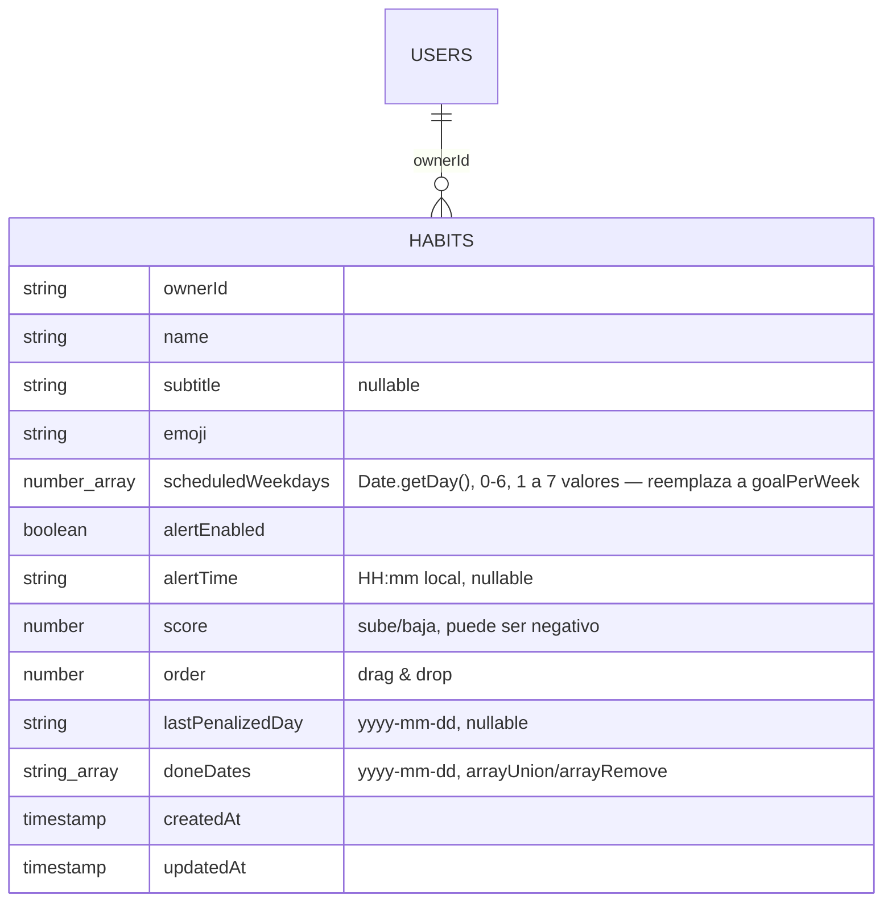

**Decisiones de diseño principales** (el resto, con más detalle, en la
sección [`habits/{habitId}`](#habitshabitid)):

- El puntaje se guarda (no se deriva como la racha): tiene que sobrevivir a
  un evento que nadie dispara — el día que se *deja pasar* sin marcar — así
  que no hay array del que recalcularlo.
- La alerta no tiene un `alertAt` tipo `NoteDoc`: se repite cada día
  programado, no es un instante único, así que el job la evalúa contra la
  hora local del dueño en cada corrida en vez de consultar un rango sobre un
  `Timestamp`.
- `lastPenalizedDay` es estado nuevo que no tiene equivalente en
  `dispatch-note-alerts.ts`: sin él, "se perdió el día programado de ayer"
  seguiría siendo cierto durante todo el día de hoy, y el job restaría
  puntos en cada corrida del cron (cada 5-15 min) en vez de una sola vez.
- Sin migración: los hábitos existentes no tienen los campos nuevos.
  `getHabits` cae a `createdAt` cuando falta `order`, y a `0`/`[]`/`false`
  para el resto — mismo criterio que ya usaba `doneDates ?? []`.

**Reglas.** Sin cambios. `habits` ya era de sólo lectura por `ownerId` para
el cliente — ningún campo nuevo lo cambia, todas las escrituras (incluida
`reorderHabitsAction`) siguen pasando por Server Actions con Admin SDK.
Bloque de `firestore.rules` reproducido tal cual, sin tocar:

```
    match /habits/{habitId} {
      allow read: if request.auth != null && resource.data.ownerId == request.auth.uid;
      allow write: if false;
    }
```

**Índices.** Ninguno nuevo. `dispatchHabitReminders` filtra `habits` por
`alertEnabled == true` (equality, índice automático);
`dispatchHabitPenalties` no filtra — escanea todos los `habits` porque
`scheduledWeekdays` siempre tiene al menos un día y Firestore no puede
consultar "array no vacío" (ver la nota de escala en
`dispatch-habit-penalties.ts`).

### 2026-08-03 — Sistema de notificaciones: bandeja real, Web Push y una API para que cualquier módulo avise

**Qué cambió.** Tres colecciones nuevas — `notifications`, `pushSubscriptions`
y `notificationPreferences` — y con ellas el sistema de notificaciones
completo: la campana del shell deja de ser decorativa, aparece el push real, y
queda una sola función (`notify()`) por la que cualquier mini-app puede avisar.

Antes, `getNotifications` devolvía `[]` fijo y el `NotificationDrawer` guardaba
leer/descartar en un `useState` que se perdía al recargar. El `push` handler ya
existía en `sw.js`, pero no había nada del lado del server que mandara un push:
la variable `NEXT_PUBLIC_FIREBASE_VAPID_KEY` del `.env.example` y el export
`vapidKey` de `firebase/config.ts` nunca se usaron, y se eliminaron (ver la
última decisión de abajo).

**Por qué.** Los módulos que se fueron sumando (gastos, notas, hábitos) tienen
eventos que valen un aviso —te pasaste del tope, venció el recordatorio, llegaste
a 30 días de racha— y ninguno tenía dónde publicarlos. Resolverlo por módulo
habría significado que cada uno se escribiera su propia bandeja, su propio
opt-in de push y su propia pantalla de preferencias, o —más probable— que
ninguno lo hiciera.

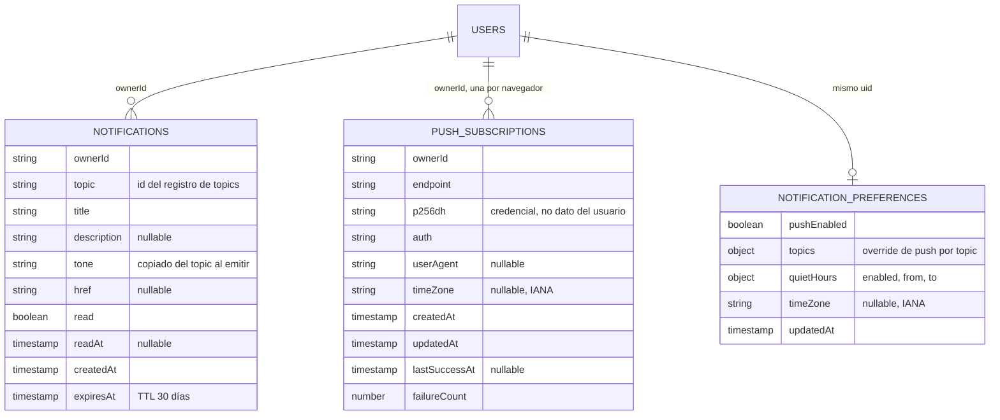

**Decisión de diseño principal**: el punto de extensión es un **registro de
topics** (`src/lib/notifications/topics.ts`) y una sola función de emisión
(`notify()`). Agregar un aviso nuevo es agregar una entrada en ese registro y
llamar a `notify({ topic: "<id>", ... })` — el tipo no compila si el id no
existe. De ahí sale solo: la fila del panel, el push, el tono, y el interruptor
propio en `/ajustes/notificaciones`, porque esa pantalla recorre el registro en
vez de una lista escrita a mano. Ver la sección
[`notifications` …](#notificationsnotificationid-pushsubscriptionshash-y-notificationpreferencesuid)
para el resto de las decisiones (idempotencia por id de documento, limpieza de
suscripciones muertas, horario de silencio, por qué el panel no se puede
silenciar).

**Lo demás que se tocó.**

- **Emisión** — `notify()` / `notifyQuietly()` (`lib/notifications/notify.ts`),
  el registro de topics, `preferences.ts` (resuelve overrides contra defaults,
  mismo patrón que `DEFAULT_PREFERENCES`), `quiet-hours.ts` (puro: lo evalúan
  el server y la UI) y `web-push.ts` (VAPID + `web-push`, nueva dependencia).
  `notifyQuietly` traga los errores: que falle un aviso no puede hacer fallar
  el alta de gasto que el usuario pidió.
- **Emisores reales**, para que el sistema no quede teórico:
  `addExpenseMovementAction` avisa al cruzar el 80% y el 100% del tope del
  ciclo; `toggleHabitDayAction` avisa al llegar a 7/30/100/365 días de racha
  (por eso `getOwnedHabitRef` pasó a `getOwnedHabit`, que devuelve también el
  documento — `doneDates` ya estaba leído); y las alertas de notas, que
  dependen del reloj y no de un click, salen de `dispatchNoteAlerts` vía
  `POST /api/notifications/dispatch`, un route handler pensado para un cron
  cada 5-15 minutos y autenticado con `NOTIFICATIONS_CRON_SECRET` (comparación
  en tiempo constante; sin la variable, 401 siempre). Para eso `notes` sumó
  `alertAt` — ver abajo.
- **`notes` gana `alertAt: Timestamp | null`.** Sin él, el recordatorio sonaba
  a la hora equivocada: `alertDate`/`alertTime` son la hora local de quien
  cargó la nota y el cron los interpretaba con el reloj del server, o sea tres
  horas antes para Argentina en un deploy en UTC. Ahora el cliente resuelve el
  instante absoluto (`alertInstant`, `src/lib/home-model.ts`) y lo manda junto
  con los strings, que siguen siendo lo que la UI muestra. De paso, la consulta
  del cron pasó de escanear **todas** las notas con alerta de la base en cada
  corrida a un rango sobre un solo campo (`alertAt` entre hace 24h y ahora):
  una corrida sin vencimientos ahora no lee ningún documento, y le alcanza el
  índice automático de Firestore. La corrida procesa hasta 100 alertas de a 8
  en paralelo (`Promise.allSettled`: una que falla no se lleva puestas a las
  otras, y como no se escribió su documento la vuelve a tomar la corrida
  siguiente), con `maxDuration = 60` en el route handler — secuencial, cien
  alertas tardarían minutos y Vercel corta la función antes de terminar.
- **Panel** — `AppShell` reemplaza el `useState` por `useOptimistic` + Server
  Actions: leer/descartar se ve al instante pero la lista real la sigue
  mandando el server, así que una notificación emitida en otra pestaña o por un
  cron aparece igual. Nuevo `NotificationSync`
  (`components/shell/notification-sync.tsx`): escucha el `postMessage` que
  `sw.js` manda al recibir un push y hace `router.refresh()`, y repite el
  refresco al volver a primer plano tras 30s o más. Sin polling. El cajón
  ganó `onItemClick` (navega al `href` y se cierra) y un pie que lleva a las
  preferencias.
- **`sw.js` v3** — el handler de `push` ahora además mantiene el badge del
  ícono (`setAppBadge`) y avisa a las pestañas abiertas. Se bumpeó
  `CACHE_VERSION` para que `UpdatePrompt` empuje la versión nueva: un service
  worker viejo seguiría mostrando el aviso pero dejaría la campana
  desactualizada.
- **Pantalla `/ajustes/notificaciones`** — opt-in de push por dispositivo
  (`usePushSubscription` del kit, con las Server Actions como `onSubscribe`/
  `onUnsubscribe`), interruptor maestro, horario de silencio, un switch por
  topic agrupado por módulo, lista de dispositivos con push activo, y un botón
  de notificación de prueba que va con `force` (saltea preferencias y silencio
  a propósito: la prueba tiene que probar el camino, no las preferencias).
  El switch suelto de "Notificaciones" que había en Ajustes se sacó: pedía el
  permiso del navegador sin crear ninguna suscripción del lado del server, o
  sea que quedaba concedido y sin recibir nada. Ahora Ajustes linkea acá.
- **Sin FCM** — `NEXT_PUBLIC_FIREBASE_VAPID_KEY` y el export `vapidKey` se
  eliminaron. La consola de Firebase entrega sólo la clave pública del par, y
  firmar el JWT de VAPID desde nuestro server necesita la privada; el par se
  genera con `yarn vapid` (`scripts/generate-vapid-keys.mjs`) y va en
  `NEXT_PUBLIC_VAPID_PUBLIC_KEY` / `VAPID_PRIVATE_KEY`.

**Reglas.** Las tres colecciones necesitan su propio `match`: sin él caían en
el `match /{document=**}` final y quedaban cerradas. Bloques agregados a
`firestore.rules` (pegados también arriba, en "Reglas objetivo"):

```
    // Bandeja de notificaciones. Id autogenerado (o derivado de la dedupeKey),
    // mismo criterio por campo que notes/habits.
    match /notifications/{notificationId} {
      allow read: if request.auth != null && resource.data.ownerId == request.auth.uid;
      allow write: if false;
    }

    /* Suscripciones Web Push. Cerradas también para lectura, a diferencia del
       resto: el documento guarda el endpoint y las claves de cifrado de la
       suscripción, que es exactamente lo que hace falta para mandarle un push
       a ese navegador. El cliente no las necesita — la suscripción de *este*
       dispositivo se la pide al `pushManager`, no a Firestore — y la lista de
       dispositivos de Ajustes la arma el server (`getPushDevices`), que
       saltea estas reglas. */
    match /pushSubscriptions/{subscriptionId} {
      allow read, write: if false;
    }

    // Preferencias de notificación. El id del documento es el uid, igual que
    // expenseCategories/favorites.
    match /notificationPreferences/{uid} {
      allow read: if isOwner(uid);
      allow write: if false;
    }
```

`pushSubscriptions` es la primera colección de datos de usuario que se cierra
también para **lectura**: `p256dh`/`auth` no son datos del usuario, son las
credenciales con las que se le manda un push a ese navegador.

**Índices.** El primero del repo. `getNotifications` filtra por `ownerId` y
ordena por `createdAt desc` con `limit(50)`, así que necesita un índice
compuesto — es la única consulta de la app donde el orden decide *qué se trae*
y no sólo cómo se muestra, por eso acá sí vale (el resto sigue ordenando en
memoria). Se creó `firestore.indexes.json` y se lo enganchó en `firebase.json`:

```json
{
  "collectionGroup": "notifications",
  "queryScope": "COLLECTION",
  "fields": [
    { "fieldPath": "ownerId", "order": "ASCENDING" },
    { "fieldPath": "createdAt", "order": "DESCENDING" }
  ]
}
```

Publicar con `firebase deploy --only firestore:indexes --project maguita-7832c`.

⚠️ **Acciones pendientes de infraestructura** (nada de esto está hecho en el
proyecto real):

1. `yarn vapid` y cargar las claves en `.env.local` y en el deploy.
2. Publicar reglas e índices.
3. Configurar la **TTL policy** de Firestore sobre `notifications.expiresAt`
   (Console → Firestore → Time-to-live). Sin ella el campo se escribe pero
   nadie borra nada: la bandeja crece sin techo y `getNotifications` sólo la
   recorta en la lectura.
4. Programar el cron contra `POST /api/notifications/dispatch` con el header
   `Authorization: Bearer $NOTIFICATIONS_CRON_SECRET`. Sin esto, las alertas de
   notas nunca se disparan (el resto de los avisos sí, porque salen de acciones
   del usuario). La frecuencia del cron **es** la precisión del recordatorio:
   cada 5 minutos, una alerta de las 09:00 suena entre 09:00 y 09:05.

   Con la app en **Vercel** y el scheduler en **Google Cloud** (el mismo
   proyecto que ya usa Firestore — Cloud Scheduler es un producto de GCP, y un
   proyecto de Firebase *es* un proyecto de GCP):

   ```bash
   gcloud scheduler jobs create http maguita-note-alerts \
     --project=maguita-7832c \
     --location=southamerica-east1 \
     --schedule="*/5 * * * *" \
     --time-zone="America/Argentina/Buenos_Aires" \
     --uri="https://<host-de-vercel>/api/notifications/dispatch" \
     --http-method=POST \
     --headers="Authorization=Bearer <NOTIFICATIONS_CRON_SECRET>" \
     --attempt-deadline=60s
   ```

   No hace falta una Cloud Function en el medio: el trabajo lo hace el route
   handler, que es donde vive el código. Una función programada que sólo le
   pegara a esa URL sería un salto de más — y una que hiciera el trabajo
   duplicaría `notify()` y el registro de topics en otro deploy.

   El `--time-zone` acá sólo afecta a cuándo corre el job (irrelevante con
   `*/5`, que es cada cinco minutos siempre); la hora de cada recordatorio sale
   de `alertAt`, que ya es absoluto.

   **Cloud Scheduler pide facturación activada** (plan Blaze) en el proyecto,
   aunque los primeros 3 jobs son gratis. Sin Blaze, cualquier cron externo que
   sepa mandar un header sirve igual — el endpoint no depende de quién lo llame.
5. **Migración de las notas con alerta ya existentes**: se crearon sin
   `alertAt`, así que el cron no las encuentra (la consulta es un rango de
   `Timestamp` y un campo ausente no entra en el índice). Se arreglan solas al
   volver a guardar la nota desde su detalle; si hubiera muchas, hace falta un
   backfill que las recorra asumiendo un huso — dato que esas notas no
   registran.

**Fuera de alcance a propósito**: no hay agrupación ni resumen ("3 gastos
nuevos"); no hay notificaciones entre usuarios (todas son del sistema al
dueño); no hay `action` en las entradas del panel (el kit lo soporta, pero
todavía ningún aviso necesita un botón propio más allá de navegar al `href`); y
el horario de silencio no pospone el push, lo descarta — cuando pasa la franja
no se manda nada acumulado, el evento queda sólo en la campana.

### 2026-08-03 — Fix: bucle infinito de redirects en `/login`

**Qué cambió.** La decisión "ya hay sesión, andá a inicio" se movió del `proxy`
(`src/proxy.ts`) al layout del route group `(auth)`
(`src/app/(auth)/layout.tsx`), que la toma con `getCurrentSession()` — la
verificación real de la firma de la session cookie. El `proxy` quedó con un
único chequeo, el de rutas protegidas sin cookie. `AUTH_ROUTES` se eliminó de
`src/lib/app-config.ts`: el route group ya define esas rutas y mantener la
lista aparte era justo lo que se desincronizaba.

**Por qué.** Las dos direcciones del redirect usaban fuentes de verdad
distintas. El `proxy` sólo puede hacer un chequeo optimista (corre en cada
request, incluidos los prefetch, así que no puede pagar el viaje de red de
`verifySessionCookie`) y decidía con la **presencia** de la cookie; el
`requireSession()` de los layouts protegidos decide con su **validez**. Con
una cookie presente pero inválida — vencida, revocada, o emitida por otro
proyecto de Firebase — las dos discrepaban y se rebotaban la request para
siempre. La cookie mala no se limpia sola: `getSession()` devuelve `null` pero
no puede borrarla, porque en el render de un Server Component no se pueden
setear cookies.

El caso que lo disparó acá es el tercero: `.env.local` apunta a
`maguita-7832c`, y había emuladores corriendo con `--project maguita-test`. Una
cookie que quedó en el browser firmada por un emisor distinto entra directo al
bucle.

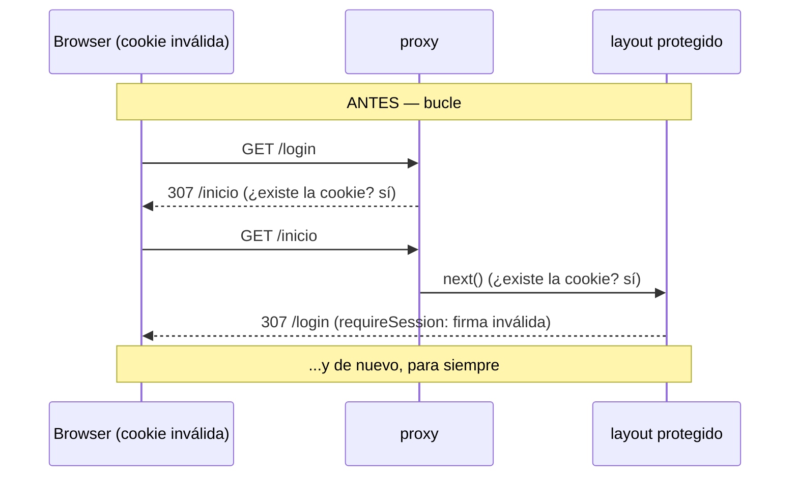

```mermaid
sequenceDiagram
    participant B as Browser (cookie inválida)
    participant P as proxy
    participant L as layout
    Note over B,L: AHORA — 1 hop y se detiene
    B->>P: GET /inicio
    P->>L: next() (¿existe la cookie? sí)
    L-->>B: 307 /login?next=/inicio (requireSession: firma inválida)
    B->>P: GET /login
    P->>L: next() (el proxy ya no mira las pantallas de auth)
    L-->>B: 200 (getCurrentSession() → null: renderiza el login)
```

**Decisión de diseño principal**: el `proxy` nunca decide que una sesión es
*válida*, sólo que *falta*. Es la única asimetría que evita el desacuerdo: el
peor caso de un falso positivo del proxy es una pantalla de login de más, y el
falso negativo lo cubre `requireSession()`. La alternativa —verificar la firma
en el `proxy`— es justo lo que la doc de Next 16 desaconseja
(`node_modules/next/dist/docs/01-app/02-guides/authentication.md`, "Optimistic
checks with Proxy"), porque correría en cada prefetch.

**Reglas.** No hace falta cambiar nada en `firestore.rules`. El cambio es de
routing y no toca colecciones, ni la forma de ningún documento, ni quién puede
leer qué: la verificación de sesión que respalda las reglas
(`requireSession()`, y el `request.auth` que ve Firestore) es exactamente la
misma de antes. Sigue vigente el bloque final que cierra todo lo no declarado:

```
    /* Firestore ya deniega lo que ninguna regla permita — las reglas se
       combinan con OR, así que este bloque no restringe nada. Queda explícito
       para dejar claro que una colección nueva arranca cerrada hasta que se le
       escriba su propio `match`. */
    match /{document=**} {
      allow read, write: if false;
    }
```

**Índices.** Ninguno: el cambio no agrega queries.

### 2026-08-03 — Nueva colección `habits`: la tab Hábitos deja de ser local

**Qué cambió.** Se agregó la colección `habits` (`HabitDoc`) y con ella el
backend real del módulo de hábitos: alta, edición, borrado y marcado del día
(`src/lib/data/habits.ts` + `habits-actions.ts`). `getHomeData` ya no
devuelve `habits: []` — ahora los trae de Firestore junto con notas y
movimientos. El tipo `Habit` sumó `emoji`.

**Por qué.** La tab Hábitos existía pero no tenía dónde guardar: `getHomeData`
devolvía la colección vacía y `HomeBoard` guardaba los días marcados en
`localStorage` (`maguita:habitos`) con `usePersistentState`. Como la lista de
hábitos siempre venía vacía, no había forma de crear uno y ese log local no
llegaba a mostrarse nunca: la tab quedaba permanentemente en su estado vacío.
Además, atado al `localStorage` la racha se perdía al cambiar de dispositivo o
al limpiar el navegador, que es justo lo que un sistema de rachas no puede
darse el lujo de perder. Ese estado local se eliminó por completo.

```mermaid
erDiagram
    USERS ||--o{ HABITS : "ownerId"
    HABITS {
        string ownerId
        string name
        string emoji
        number goalPerWeek "1 a 7, informativa"
        string_array doneDates "yyyy-mm-dd, arrayUnion/arrayRemove"
        timestamp createdAt
        timestamp updatedAt
    }
```

**Decisión de diseño principal**: el historial de días cumplidos va como
`string[]` adentro del propio hábito y no en una colección `habitLogs`
aparte. La grilla de constancia necesita todos los días juntos de una, así
que una colección aparte costaría una query por hábito (o un índice
compuesto) en cada carga de Inicio; con el array, leer el hábito ya trae su
historial. Ver la sección [`habits/{habitId}`](#habitshabitid) para el resto
de las decisiones (idempotencia del toggle, validación del día, tope de 50).

**Reglas.** `habits` necesita su propio `match`: sin él caía en el
`match /{document=**}` final y quedaba cerrada. Mismo criterio por campo que
`notes`/`links` — el cliente lee lo suyo y no escribe nada, todas las
escrituras pasan por Server Actions. Bloque agregado a `firestore.rules`:

```
    // Hábitos de la tab Hábitos. Id autogenerado, mismo criterio por campo
    // que notes/links: el historial de días cumplidos (`doneDates`) vive
    // adentro del mismo documento, así que no necesita un match aparte.
    match /habits/{habitId} {
      allow read: if request.auth != null && resource.data.ownerId == request.auth.uid;
      allow write: if false;
    }
```

**Índices.** Ninguno nuevo: `getHabits` filtra sólo por `ownerId` (equality) y
ordena en memoria, mismo criterio que `getNotes`/`getLinks`.

### 2026-08-02 — Nueva mini-app privada "Links guardados"

- Nueva colección **`links/{linkId}`** (ver sección de arriba para la forma
  completa y las decisiones de diseño, en particular las protecciones contra
  SSRF del fetch de metadata). Guarda enlaces por URL con preview (título,
  descripción, imagen) sacado de sus metatags Open Graph al momento del alta.
  Nuevo `getLinks` (`src/lib/data/links.ts`, sólo Server Components) y
  `addLinkAction` / `deleteLinkAction` (`src/lib/data/links-actions.ts`,
  Server Actions), mismo patrón lectura/escritura que `notes.ts`/
  `notes-actions.ts`. Sin `orderBy`: filtra sólo por `ownerId` y ordena en
  memoria por `createdAt`, mismo criterio que el resto del archivo.
- Nuevo `fetchLinkMetadata` (`src/lib/data/link-metadata.ts`): recorta
  `<head>` del HTML descargado y extrae `og:title`/`og:description`/
  `og:image`/`og:site_name` (con fallback a `<title>`/meta description/
  `twitter:image`) con regex, sin sumar una dependencia de parsing HTML.
  Sigue redirects a mano (hasta 3 saltos) validando cada uno, en vez de
  dejarle el seguimiento a `fetch` — necesario para que el chequeo de IPs
  privadas no se salte con un redirect. Si el fetch falla por lo que sea
  (timeout, host privado, no-HTML, red), `addLinkAction` igual guarda el link
  con la URL y el dominio como único dato, sin bloquear el alta.
- Nueva pantalla `/mini-apps/links`
  (`src/app/(app)/mini-apps/links/page.tsx` + `SavedLinks`,
  `src/components/organisms/mini-apps/SavedLinks.tsx`): un `Input` para
  pegar la URL arriba, y abajo una grilla de `MediaCard` (de
  `lib-kit-components`) con la imagen de preview, título y descripción de
  cada link — tocar la card la abre en una pestaña nueva
  (`window.open(url, "_blank", "noopener,noreferrer")`), un botón de borrar
  con `TrashIcon` corta la propagación del click para no abrir el link de
  paso. Nueva entrada en el catálogo de mini-apps
  (`src/lib/data/mini-apps.ts`, id `links-guardados`, categoría
  Productividad, `requiresAuth: true`) y nuevos `LinkIcon`/`ExternalLinkIcon`
  en `src/components/atoms/icons.tsx` (`LinkIcon` se suma también al mapeo de
  `MiniAppIcon`, que ganó la clave `"link"` en el tipo `MiniApp["icon"]`).
  `ROUTES.miniAppLinks` nueva en `src/lib/app-config.ts`, sumada a
  `PROTECTED_ROUTES`; header propio (`back: true`) en
  `src/components/shell/nav-config.tsx`.
- **Nuevo bloque de reglas en `firestore.rules`** (pegado también en la
  sección de arriba, "Reglas objetivo"):
  ```
  match /links/{linkId} {
    allow read: if request.auth != null && resource.data.ownerId == request.auth.uid;
    allow write: if false;
  }
  ```
  Mismo criterio que `notes`/`expenseCycles`: id autogenerado, así que el
  dueño se valida por campo (`ownerId`) en vez de por id de documento.
  Pendiente de publicar contra el proyecto real, igual que el resto de
  `firestore.rules` (ver ⚠️ arriba).
- **Fuera de alcance a propósito**: no hay edición de un link ya guardado (si
  el preview salió mal, hay que borrar y volver a cargarlo); el preview no se
  refresca solo si el sitio cambia sus metatags después del alta; no hay
  carpetas, tags ni orden manual — la grilla siempre es más reciente
  primero; no hay import/export masivo de enlaces.

### 2026-08-01 — Tab Notas con backend real: prioridad, alerta, edición/borrado y grilla animada

- Nueva colección **`notes/{noteId}`** (ver sección de arriba para la forma
  completa y las decisiones de diseño). Antes las notas del FAB
  (`useNoteDrafts`, `lib/data/local-drafts.ts`) sólo quedaban en
  `localStorage`, marcadas `local: true` y mezcladas en el cliente con
  `data.notes` (que `getHomeData` siempre devolvía vacío) — un holdover de
  antes de que existiera backend, mismo estado en el que hoy sigue
  `useExpenseDrafts` para gastos hasta que se migró (ver "El FAB de Inicio
  guarda 'Nuevo gasto' en el gestor de gastos", más abajo). Ahora las notas
  se guardan en Firestore igual que el resto de la app.
- `Note` (`src/lib/data/home.ts`) gana `priority: "low" | "medium" |
  "high"`, `hasAlert: boolean`, `alertDate: string | null` y `alertTime:
  string | null`; pierde `local?: boolean` (ya no hay nada que marcar como
  "todavía no llegó al servidor"). Sin título: se evaluó agregarlo pero se
  sacó del alcance antes de terminar la entrada — una nota es sólo texto +
  metadata, sin campo libre adicional. Nuevo `getNotes`
  (`src/lib/data/notes.ts`, sólo Server Components) y `addNoteAction`
  (`src/lib/data/notes-actions.ts`, Server Action) siguiendo el mismo patrón
  lectura/escritura que `expenses.ts`/`expenses-actions.ts`. `getHomeData`
  pasa a pedir `getNotes(userId)` en el mismo `Promise.all` que el gestor de
  gastos, en vez de devolver `notes: []` fijo.
- **El composer se mudó del FAB al header de la tab Notas.** Antes "Nueva
  nota" abría un sheet chico (sólo texto) desde el FAB global de Inicio;
  ahora `NoteComposer`
  (`src/components/organisms/home/NoteComposer.tsx`) vive siempre visible
  arriba de `NotesPanel`: un `Textarea` grande arriba y, debajo, los dos
  controles que quedan en vez de todos los campos apilados de una. La
  **prioridad** es un chip que abre un `Popover` con las tres opciones y se
  cierra al elegir. La **alerta** es un `Switch` al lado, que al prenderse
  despliega `DatePicker` + `TimePicker` debajo. Pasó por dos iteraciones
  antes de llegar ahí: primero era un chip que abría un popover con un
  `Switch` adentro (dos toques para un booleano), después el chip mismo hacía
  de toggle (un toque, pero un chip no se lee como interruptor), y terminó
  siendo el `Switch` a secas. Prenderlo
  preselecciona hoy como fecha: si quedara vacía, el formulario queda
  inválido sin que se vea por qué (el botón de guardar se apaga y la fecha
  recién aparece más abajo). Sin chip de fecha de la nota a pedido: se guarda
  con el `today` del server, sin selector — ver la decisión de diseño de
  `date` en la sección de arriba. Se sacó del FAB porque cargar
  una nota completa (con alerta) no entra en un sheet chico sin quedar
  apretado, y porque es la acción principal de esa tab — no tiene sentido
  esconderla atrás de un botón flotante que además hay que abrir desde otra
  tab. `quick-actions.tsx` perdió `NewNoteSheet` (sólo le queda
  `ShareAppSheet`) y `local-drafts.ts` se borró entero: sin notas, no le
  quedaba nada adentro. Nuevos `CalendarIcon` / `FlagIcon` en
  `src/components/atoms/icons.tsx`; label/tono de cada prioridad se comparten
  entre el chip del composer y el badge de la grilla desde
  `src/components/organisms/home/note-priority.ts`.
- **"Nueva nota" volvió al FAB, pero sin sheet propio.** La acción
  (`HomeBoard.tsx`) cambia a la tab Notas y enfoca el composer que ya vive
  arriba, en vez de abrir otro formulario: duplicarlo en un sheet
  significaría mantener dos composers con el mismo estado. El puente es un
  **contador** (`focusSignal`, de `HomeBoard` a `NotesPanel` a
  `NoteComposer`) y no un booleano — estando ya parado en la tab Notas, un
  flag que ya vale `true` no volvería a disparar el foco. El composer lo mira
  en un efecto y hace `focus()` + `scrollIntoView()`; arranca en 0, así que
  no se roba el foco al montarse la pantalla.
- `NotesPanel` (`src/components/organisms/home/NotesPanel.tsx`) reemplaza la
  lista vertical por una grilla de post-it (ver más abajo) con una
  **`ProductFilterBar`** arriba: campo de orden (Fecha / Prioridad) con
  toggle asc/desc, panel de filtros por prioridad y por con/sin alerta, y el
  contador de resultados. Es controlada y **no filtra ni ordena por vos** —
  eso lo hace `NotesPanel` con un `filter` + `sortNotes`
  (`src/lib/home-model.ts`, reemplaza a la vieja `byPriorityDesc`: ahora hay
  que poder ordenar en las dos direcciones, no sólo descendente). Los `count`
  de cada faceta se cuentan sobre la lista completa y no sobre la ya
  filtrada: si se descontaran solos al tildarlos, el panel dejaría de servir
  para saber qué más hay.
- **Nuevo bloque de reglas en `firestore.rules`** (pegado también en la
  sección de arriba, "Reglas objetivo"):
  ```
  match /notes/{noteId} {
    allow read: if request.auth != null && resource.data.ownerId == request.auth.uid;
    allow write: if false;
  }
  ```
  Mismo criterio que `expenseCycles`/`expenseMovements`: id autogenerado, así
  que el dueño se valida por campo (`ownerId`) en vez de por id de documento.
  Pendiente de publicar contra el proyecto real, igual que el resto de
  `firestore.rules` (ver ⚠️ arriba).
- **El detalle es el mismo post-it, en grande.** Cada card de la grilla abre
  `NoteDetailModal` (`src/components/organisms/home/NoteDetailModal.tsx`):
  papel del color de su prioridad, esquina doblada y todo, centrado sobre un
  backdrop. **No usa el `Modal` de la librería** — ese trae su propia
  superficie (`surface`, header y footer con bordes) y no hay forma de que se
  lea como papel. El overlay se arma a mano con el mismo patrón que
  `shell/notification-drawer.tsx` (backdrop `z-[140]` + panel `z-[150]`,
  bloqueo del scroll del body, foco al abrir, cierre con Escape o tocando
  afuera), que es lo que ya hace la app cuando la librería no tiene el
  contenedor que hace falta.
- **Editar y borrar salieron de la botonera a un menú de tres puntitos**
  (`MoreIcon`, nuevo en `icons.tsx`, sobre el `Dropdown` de la librería con
  "Eliminar" en `destructive`): el papel queda limpio y las dos acciones
  aparecen sólo cuando se las busca. El menú se renderiza en la cabecera,
  fuera del área scrolleable del panel — adentro, el `overflow-y-auto` le
  recortaría el desplegable. Borrar sigue confirmando en el mismo panel, sin
  apilar otro encima: las tres caras (ver / editar / confirmar) son un único
  estado `mode` y se cruzan con `AnimatePresence mode="wait"`.
- **Animaciones del detalle**: el papel entra como si se apoyara (baja, se
  agranda y se endereza desde −2°, con spring) y sale girando apenas para el
  otro lado; el backdrop hace fade con blur; el contenido cruza con un fade +
  desplazamiento corto al cambiar de cara. Se evaluó una transición de
  elemento compartido (`layoutId`) para que el post-it de la grilla se
  expandiera en el del detalle, pero la card ya combina `layout` con `rotate`
  en capas separadas justamente porque no conviven, y sumarle un tercer nodo
  compartido rotado era la receta para que se deformara en el medio: no valía
  el riesgo contra una entrada con spring que se ve bien y no puede romperse.
- Volver el panel a "ver" al cerrarse se hace en la función `close()` que
  usan todos los caminos de cierre, no en un efecto sobre `note`: un
  `setState` dentro de un efecto dispara renders en cascada y el eslint del
  repo lo rechaza. Con el backdrop puesto no se puede abrir otra nota sin
  cerrar la actual, así que no hace falta más que eso.
- `note` se recibe como prop derivada de la lista (`notes.find(...)` en
  `NotesPanel`), no copiada aparte: al guardar una edición o al borrar, el
  `revalidatePath` de la Server Action refresca `data.notes` y el modal
  muestra el texto nuevo (o se cierra solo, si ya no está) sin lógica extra
  de sincronización. Nuevos `updateNoteAction` / `deleteNoteAction`
  (`src/lib/data/notes-actions.ts`), con un `getOwnedNoteRef` que centraliza
  "traer + validar dueño" — mismo criterio que `getOwnedActiveCycle` en
  `expenses-actions.ts` — y `assertValidNoteFields` factoreado de
  `addNoteAction` para no duplicar las validaciones entre alta y edición.
  Nuevo `NoteEditor` (`src/components/organisms/home/NoteEditor.tsx`): los
  mismos campos que `NoteComposer` pero en un form apilado — mismo criterio
  de "cada uno con su propio estado, sin compartir un hook" que ya usan
  `ExpenseCycleForm`/`ExpenseCycleEditor`. Se edita sobre el papel de color:
  los inputs traen su propio fondo `surface`, así que se leen como campos
  apoyados sobre la nota y no hace falta cambiarle el color al panel para
  entrar en modo edición.
- **Grilla animada de post-it, en una o dos columnas.** Las notas dejaron de
  ser `Card` de la librería: son papel: fondo de color según prioridad,
  `rounded-sm`, `shadow-lg`, esquina doblada (un triángulo `foreground/10`
  recortado con `clip-path`) y una inclinación de ±0.8°. La inclinación sale
  del id de la nota (`tiltOf`), no del índice — atada a la posición, cambiar
  el orden o borrar una nota le movería el ángulo a todas las demás. Sobre el
  papel de color no van los chips de `NOTE_PRIORITY_TONE` (están pensados
  para `surface`): la meta se escribe en `foreground/65`, que se invierte
  solo con el tema igual que el papel.
- **Tres tokens nuevos en `globals.css`** (`--color-note-high` / `-medium` /
  `-low`), con su variante en `.dark`: en claro son pasteles y en oscuro los
  mismos hues apagados — un pastel claro sobre el fondo casi negro encandila
  y encima invertiría el texto, que sigue siendo `foreground`. El mapa
  prioridad → clase vive en `note-priority.ts` (`NOTE_PRIORITY_PAPER`) con
  las clases escritas enteras: Tailwind escanea el fuente como texto, así que
  un `bg-note-${x}` armado en runtime no generaría ninguna de las tres.
  `NoteDetailModal` usa el mismo papel para el cuerpo de la nota, así abrirla
  no le hace perder la identidad con la que se la venía viendo en la grilla.
- **El color no es el único portador de la prioridad**: la card sigue
  escribiendo "Alta"/"Media"/"Baja" al pie. Es lo que la mantiene legible con
  daltonismo — y de paso hace que el papel se pueda leer de un vistazo sin
  tener que recordar qué significaba cada color.
- La animación (`framer-motion`, ya dependencia directa — mismo patrón que
  `shell/notification-drawer.tsx`) va en **dos capas anidadas a propósito**:
  la de afuera lleva `layout` + entrada/salida (fade y slide-up escalonado
  por índice, fade al borrar), la de adentro el `rotate` y el hover (se
  endereza y se levanta). `layout` y `rotate` en el mismo nodo no conviven:
  framer deforma el contenido al interpolar la posición de algo rotado.
- **Selección múltiple para borrar de a varias.** Un botón de tilde al lado
  del selector de columnas entra en modo selección: los post-it dejan de
  abrir el detalle y pasan a marcarse (anillo `primary` + tilde en la
  esquina, los no marcados atenuados), y aparece una barra con el conteo,
  "Todas"/"Ninguna", "Cancelar" y "Eliminar". Borrar confirma en la misma
  barra antes de ejecutar — es la acción más destructiva de la pantalla y es
  fácil llegar a ella con muchas notas marcadas. Nueva Server Action
  `deleteNotesAction` (ver arriba).
- Lo que se borra es la **intersección de lo seleccionado con lo visible**
  (`selectedVisible`), no el set crudo: sin eso, marcar tres notas, cambiar
  el filtro y tocar "Eliminar" se llevaría notas que no están en pantalla. Y
  como se calcula en cada render, no hace falta ningún efecto que limpie la
  selección cuando cambian los filtros.
- Nuevo selector de **1 o 2 columnas** (`ColumnOneIcon` / `ColumnTwoIcon` en
  `icons.tsx`), al lado de la `ProductFilterBar`, con la elección persistida
  en `localStorage` (`usePersistentState`, clave `maguita:notas-columnas`,
  SSR-safe) — es una preferencia de lectura, no algo para volver a elegir en
  cada visita. La grilla pasó de `grid-cols-1 sm:grid-cols-2` fijo a
  `gridTemplateColumns` inline, y como las cards tienen `layout`, cambiar de
  columnas las reacomoda animadas en vez de saltar. Va afuera de la barra
  porque `ProductFilterBar` no expone ningún slot para sumarle un control
  propio, y porque la densidad de la grilla no es un filtro: no cambia qué
  notas se ven, sólo cómo. Se evaluó `CardGrid` de la librería (hace
  exactamente esto, con persistencia incluida) pero su chrome de controles —
  label "Columnas" + caja −/+ **y** pills numeradas — es demasiado para una
  elección binaria que acá entra en dos íconos.
- **El panel del `TimePicker` se abre hacia arriba** en el composer y en el
  editor. El componente no expone hacia qué lado abrirlo: lo posiciona
  `absolute` sin `top` ni `bottom`, así que siempre cae debajo del input — y
  en las dos pantallas es el último campo del formulario, con lo cual el
  panel se abre contra el borde de abajo. `TIME_PICKER_UPWARD`
  (`note-priority.ts`) lo da vuelta desde el `className` del propio
  componente, con variantes arbitrarias que apuntan a su único hijo directo
  `absolute` (el panel; label, input y hint no lo son). Es un parche sobre
  markup ajeno, así que queda en una constante compartida y comentada: si la
  librería suma un prop de posición, se borra de un lugar solo.
- **`lib-kit-components` actualizado** (`37b64c3` → `23eae87`): `TimePicker` y
  `ProductFilterBar` ya existían upstream pero el checkout de `node_modules`
  estaba viejo, así que la primera versión de esta pantalla los había suplido
  con un `Input type="time"` y un `Select`. De paso el paquete cambió de
  forma: ya no publica `components/` con el fuente, sólo `dist/` — el
  `@source "…/lib-kit-components/dist"` de `globals.css` sigue apuntando bien
  (verificado: las clases que sólo usa la librería, como el `z-[95]` del
  `Popover`, siguen apareciendo en el CSS compilado).
- **Fuera de alcance a propósito**: la alerta se guarda pero no dispara
  ninguna notificación todavía (no hay integración con push/notificaciones
  del navegador) — es sólo el dato, para cuando exista ese mecanismo; y las
  referencias a `NewNoteSheet`/`useNoteDrafts` en entradas de este changelog
  anteriores a esta quedan tal cual estaban al escribirse, como registro
  histórico.

### 2026-08-01 — Fix: "Nuevo gasto" del FAB no cerraba el sheet ni avisaba al guardar

- Sin cambios de datos. Dos fixes en el flujo de alta de un gasto:
  1. `NewExpenseMovementSheet`/`NewExpenseIncomeSheet`
     (`src/components/organisms/home/`) no tenían try/catch alrededor de la
     Server Action: si `addExpenseMovementAction`/`addExpenseIncomeAction`
     rechazaba (categoría borrada entre que se abrió el sheet y se guardó,
     período recién finalizado, etc.), el rechazo se perdía en silencio —
     ni el snack de éxito ni `onSaved()`/`closeSheet()` corrían, y tampoco
     había un snack de error. Ahora atrapan el error y muestran un snack
     `variant="error"` con el mensaje de la excepción; el sheet queda
     abierto para reintentar.
  2. El FAB de Inicio (`HomeBoard.tsx`) dejó de usar `FabActionSheets` de
     `lib-kit-components` — monta sus tres `BottomSheet` propios sin
     exponer ninguna forma de cerrarlos desde adentro de su `content`, así
     que "Nuevo gasto" desde el FAB **nunca** podía cerrarse solo (a
     diferencia de abrirlo desde Movimientos, que sí usa el sheet propio de
     la app). Ahora las tres acciones del FAB (`quickActions`) usan
     `FloatingButton` directo + `useAppSheet()` — el mismo sheet global que
     ya usan Movimientos y Notas —, así que "Nuevo gasto" le pasa
     `onSaved={closeSheet}` a `NewExpenseMovementSheet` igual que desde
     Movimientos, y se cierra solo al guardar sin importar desde dónde se
     abrió.
- **Fuera de alcance a propósito**: "Nueva nota" y "Compartir" del FAB
  siguen sin cerrarse solos (no se les pasó `onSaved`/`closeSheet`) — no
  era el bug reportado, y una nota no tiene la misma necesidad de
  confirmación visual inmediata que cargar un gasto.

### 2026-08-01 — Ítems de movimientos con elevación

- Sin cambios de datos. Nuevo `MovementsList`
  (`src/components/organisms/home/MovementsList.tsx`), que reemplaza a
  `TransactionList` de `lib-kit-components` en las tres pantallas donde se
  listan movimientos (`MovementsPanel`, `SummaryPanel`, `PeriodDetailScreen`):
  agrupa por día igual que antes, pero cada movimiento es su propia `Card
  variant="elevated"` (borde + `shadow-lg`) en vez de una fila plana dentro
  de una lista con `divide-y`. `TransactionList` no tiene forma de darle
  elevación a sus filas (son `<li>` fijos del componente), así que no había
  manera de pedir esto sin dejar de usarlo.
- De paso se resolvió una fuente de mismatch de hidratación que ya tenía
  `TransactionList`: agrupaba "Hoy"/"Ayer" con `new Date()` real adentro del
  componente, en vez del `today` que ya resuelve una sola vez el server.
  `MovementsList` agrupa con `formatDay` (con `today`) o, si no se lo pasan
  (`PeriodDetailScreen`, un período ya cerrado donde "Hoy"/"Ayer" no
  aplica), con `formatShortDate` — fecha absoluta.
- **Fuera de alcance a propósito**: `TransactionList` traía chips de filtro
  por categoría; `MovementsList` no los tiene. No se pidieron y agregarlos
  hubiera significado reconstruir esa lógica a mano.

### 2026-08-01 — Pantalla de detalle de un período anterior

- Sin colecciones ni campos nuevos: nueva forma de leer `expenseCycles` /
  `expenseMovements` que ya existían.
- Nueva `getExpenseCycleById(userId, cycleId)`
  (`src/lib/data/expenses.ts`): trae un ciclo puntual por id (cualquier
  `status`, no sólo `active`) y devuelve `null` tanto si no existe como si
  es de otra cuenta — la Server Action del Admin SDK saltea las reglas, así
  que esta verificación de dueño es la barrera real. La página nueva trata
  los dos casos igual (`notFound()`), para no delatar cuál de los dos pasó.
- Nueva ruta dinámica `/inicio/periodos/{cycleId}`
  (`src/app/(app)/inicio/periodos/[cycleId]/page.tsx`), a la que se llega
  tocando una card del carrusel de "Períodos anteriores"
  (`PastExpenseCyclesSection`, ahora envuelve cada card en un `Link`). Ya
  cubierta por sesión en dos capas: el prefijo `/inicio` de
  `PROTECTED_ROUTES` matchea por `startsWith` (sin agregar nada al array) y
  `(app)/layout.tsx` llama `requireSession()` en todo lo que cuelga de él.
  `headerFor` (`src/components/shell/nav-config.tsx`) le agrega un `if`
  de prefijo — es la única ruta dinámica hoy, así que no encaja en el mapa
  fijo de `SCREEN_HEADERS`.
- `PeriodDetailScreen`
  (`src/components/organisms/home/PeriodDetailScreen.tsx`): resumen del
  ciclo (saldo inicial/ingresos/saldo final + barra de tope), categorías
  con más gasto y días con más consumo (las dos como barras de un solo
  color — ver nota de diseño abajo), y el listado completo de operaciones
  con `TransactionList`. Nuevas funciones puras en `home-model.ts`:
  `categoryBreakdown` y `dailyBreakdown` (agrupan y suman gastos por
  categoría/día), y `shortDate` pasa a exportarse como `formatShortDate`
  (la necesitan también estas dos gráficas).
- **Nota de diseño (paleta de las gráficas)**: categorías y días son listas
  de "magnitud, ¿cuál es más alto?", no series a diferenciar por identidad
  — así que llevan un solo hue (`primary`) en vez de una paleta categórica.
  Evita además un problema real: las categorías son libres/ilimitadas (el
  ABM del usuario), así que una paleta categórica se quedaría sin colores
  distinguibles por CVD tarde o temprano; la etiqueta + emoji de cada fila
  ya cargan la identidad, el color sólo carga la magnitud. Días con más
  consumo usa el patrón "emphasis": todas las barras en `primary/35`
  (contexto) y el día pico en `accent` (el punto de la historia) — one hue
  + gray, no un color por barra.
- **Sin cambios de reglas**: la lectura va por el Admin SDK (Server
  Component/Action), que ya saltea `firestore.rules`.

### 2026-08-01 — Fix: "Balance del mes" del tab Resumen no coincidía con Movimientos

- Sin cambios de datos. Bug en `SummaryPanel`
  (`src/components/organisms/home/SummaryPanel.tsx`): calculaba el balance
  con la vieja `monthBalance` (`income - expense` de los movimientos cuya
  `date` cae en el mes calendario de `today`), que quedó pisada por el
  gestor de gastos sin actualizarse. Dos problemas: (1) `movements` ya son
  sólo los del ciclo activo (`getHomeData`), y un período no tiene por qué
  coincidir con un mes calendario (ej. "Gastos vacaciones Ushuaia" del
  15/08 al 15/09) — filtrar por mes de nuevo descartaba movimientos del
  ciclo o mezclaba con el mes siguiente; (2) ni sumaba el saldo inicial, así
  que el número no coincidía con "Saldo disponible" de `MovementsPanel`
  para lo que es el mismo período.
- Ahora usa `expenseCycleProgress` (`src/lib/home-model.ts`), la misma
  función que ya usa `MovementsPanel` — mismo cálculo, mismo número. La
  card pasa a llamarse "Saldo disponible" (antes "Balance del mes", que ya
  no describía lo que mostraba) y `SummaryPanel` gana el prop
  `expenseCycle: ExpenseCycle | null`; sin ciclo activo muestra "Sin
  período activo" en vez de calcular sobre una lista vacía.
- `monthBalance`/`MonthBalance` se borraron de `home-model.ts`: sin este
  último uso, quedaban muertos.

### 2026-08-01 — Carrusel de "Períodos anteriores" en Movimientos

- Sin colecciones ni campos nuevos: lee `expenseCycles`/`expenseMovements`
  tal como ya existían, sólo con un filtro (`status: "closed"`) que antes
  nadie usaba — los ciclos cerrados existían desde "Finalizar", pero no
  había ninguna pantalla que los mostrara.
- Nueva `getClosedExpenseCycles` (`src/lib/data/expenses.ts`): trae hasta
  10 ciclos `closed` del usuario (`ownerId` + `status`, sin `orderBy` —
  ordena en memoria, mismo criterio que `getExpenseMovements`) y, en una
  sola consulta aparte con `where("cycleId", "in", [...])` sobre
  `expenseMovements`, el gastado/ingresado de esos mismos ciclos — evita
  N+1 consultas (una por ciclo) a costa de un único `in` con como máximo 10
  valores, bien por debajo del límite de 30 que acepta Firestore.
- Nueva Server Action de sólo lectura `getPastExpenseCyclesAction`
  (`src/lib/data/expenses-actions.ts`): existe porque
  `getClosedExpenseCycles` vive en un módulo `server-only`, y el nuevo
  `PastExpenseCyclesSection` (dropdown + carrusel) la llama bajo demanda
  desde el cliente, no en el fetch inicial de `getHomeData()` — la mayoría
  de las visitas a Movimientos no llegan a abrir el historial, así que no
  tiene sentido pagar esa consulta siempre.
- `PastExpenseCyclesSection`
  (`src/components/organisms/home/PastExpenseCyclesSection.tsx`): un
  dropdown ("Períodos anteriores") que al desplegarse por primera vez pide
  los períodos cerrados y los cachea en estado local (cerrar/reabrir no
  repite la consulta) mientras muestra un skeleton; con datos, una fila de
  cards con scroll horizontal (título o lapso de fechas, barra de progreso
  del tope y gastado/tope/saldo final). Se monta en `MovementsPanel`, con o
  sin ciclo activo — el historial no depende de que haya uno en curso.
- **Sin cambios de reglas**: la lectura va por el Admin SDK (Server
  Action), que ya saltea `firestore.rules`; no se agregó ningún campo a
  documentos existentes.

### 2026-08-01 — Selector de emoji en vez de input de texto libre en categorías

- Sin cambios de datos: `ExpenseCategoryItem.emoji` sigue siendo un
  `string`, sólo cambia cómo se lo carga en la UI.
- Nuevo `EmojiPicker` (`src/components/molecules/EmojiPicker.tsx`): botón
  con el emoji elegido (o un `+` si no hay ninguno) que abre una grilla de
  un set curado de ~32 emojis relevantes para categorías de gasto. Mismo
  patrón de popover + cierre por click afuera que ya usa `DatePicker` de
  `lib-kit-components`.
- `ExpenseCategoriesEditor` (`src/components/organisms/home/ExpenseCategoriesEditor.tsx`)
  reemplaza el `Input` de texto libre del emoji, tanto en el alta como en la
  edición de una categoría, por `EmojiPicker`. El nombre sigue siendo un
  `Input` normal — es el único campo de texto que le queda al editor.

### 2026-08-01 — Título de período y "Finalizar" en vez de "Reiniciar"

- `ExpenseCycleDoc` (`src/lib/firebase/collections.ts`) gana `title: string
  | null`; `ExpenseCycle` (`src/lib/data/expenses.ts`) idem. `null` = el
  usuario no le puso título, y la UI cae al lapso de fechas.
- `startExpenseCycleAction` / `updateExpenseCycleAction`
  (`src/lib/data/expenses-actions.ts`) ganan `title?: string`, opcional;
  vacío o ausente se guarda como `null` (`input.title?.trim() || null`).
- Nuevas funciones puras en `src/lib/home-model.ts`: `formatDateRangeShort`
  (`"01/08 al 31/08"`, recorta el string de la day key directo — no pasa
  por `Date`, así que no hay huso que corra el día) y `expenseCycleTitle`,
  que devuelve `cycle.title` si está o cae a `formatDateRangeShort`. La
  usan `MovementsPanel` (título de la card) y sirve de referencia para lo
  que va a mostrar la futura mini-app.
- `ExpenseCycleForm` (alta) y `ExpenseCycleEditor` (sección "Período" del
  panel de ajustes) ganan un `Input` "Título (opcional)".
- **Renombre de "Reiniciar" a "Finalizar"**: el botón de la card y el modo
  `"reset"` de `ExpenseCycleForm` (ahora `"finish"`) no reiniciaban nada —
  cierran el ciclo actual (que queda como historial) y arrancan uno nuevo
  desde cero, con sus propios título/fechas/saldo/tope. "Reiniciar" sugería
  volver a poner en cero el mismo período; "Finalizar" describe lo que
  realmente pasa. Sin cambio de comportamiento, sólo de texto (label del
  botón, título/descripción del sheet, texto del botón de submit y el
  snack de éxito).
- **Sin cambios de reglas**: `title` es un campo más de un documento que
  `firestore.rules` ya cubre entero (`expenseCycles/{cycleId}`, lectura por
  `ownerId`, escritura sólo por Admin SDK) — Firestore no tiene reglas a
  nivel de campo para lectura, mismo caso que `alias`/`avatarUrl` en
  `users/{uid}` (ver esa entrada más abajo).

### 2026-08-01 — Inputs de monto con separador de miles en vivo

- Sin cambios de datos: es sólo el input de "Saldo inicial" y "Tope de
  gastos" (`ExpenseCycleForm`, `ExpenseCycleEditor`). Antes eran un `Input`
  de texto plano de `lib-kit-components`, con el número crudo tal cual lo
  tipeaba el usuario.
- Nuevo `AmountInput` (`src/components/molecules/AmountInput.tsx`): `type="text"`
  + `inputMode="numeric"` (no `type="number"`, que no acepta un valor con
  puntos de miles) que formatea con `toLocaleString("es-AR")` en cada
  tecleo — escribir "150000" muestra "150.000" a medida que se escribe.
  Guarda/expone el valor como `number`, no como string; los dos forms
  dejaron de parsear con `Number(x.replace(",", "."))`.
  Más grande que el `Input` de la librería (`py-3.5 text-lg` vs. su
  `h-12 text-sm` fijo, que no es overrideable por `className` porque esas
  clases están en el `<input>` interno, no en el wrapper) — a propósito,
  para que el monto se lea más parecido a como se lo ve en
  `NewExpenseMovementSheet`/`NewExpenseIncomeSheet` (que ya mostraban el
  monto grande y formateado, pero con `Keypad` en vez de un input real).

### 2026-08-01 — El FAB de Inicio guarda "Nuevo gasto" en el gestor de gastos

- Sin cambios de datos ni de reglas: `expenseMovements` ya tenía todo lo que
  hace falta. El cambio es de dónde y cómo se dispara el alta.
- El "Nuevo gasto" del FAB de Inicio (`FabActionSheets`, montado en
  `HomeBoard`) dejaba lo cargado en `localStorage` (`useExpenseDrafts`,
  `lib/data/local-drafts.ts`) sin tocar Firestore — un holdover de antes de
  que existiera el gestor de gastos. Ahora abre el mismo
  `NewExpenseMovementSheet` que usa `MovementsPanel`, que guarda contra el
  ciclo activo con `addExpenseMovementAction`. `useExpenseDrafts`,
  `movementFromDraft`, `ExpenseDraft` y la clave `DRAFT_KEYS.expenses` se
  borraron de `local-drafts.ts` (`useNoteDrafts`/notas siguen igual, sin
  backend todavía). `HomeBoard` ya no mezcla ningún borrador de gastos con
  `data.movements` — los movimientos que muestra son sólo los del ciclo
  activo, tal como los devuelve el server.
- `NewExpenseMovementSheet` ahora se monta en dos mecanismos de sheet
  distintos: el propio de `MovementsPanel` (`useAppSheet()`, con
  `closeSheet()` real) y `FabActionSheets`, que **no** expone ninguna forma
  de cerrarse desde adentro de su `content` (son sheets fijos, sólo
  `openIdx`/`onClose` internos de la librería). Por eso el componente dejó
  de llamar a `useAppSheet().closeSheet()` directo y ahora recibe un
  `onSaved?: () => void` opcional: `MovementsPanel` le pasa `closeSheet`,
  `HomeBoard` no le pasa nada (mismo criterio que ya tenían
  `NewNoteSheet`/el viejo `NewExpenseSheet` del FAB: guardan, muestran un
  snack y dejan el sheet abierto para que el usuario lo cierre a mano).
- Sin ciclo activo, "Nuevo gasto" del FAB muestra un aviso
  (`NoActiveExpenseCycleNotice`, en `HomeBoard.tsx`) con un botón a la tab
  Movimientos en vez del formulario — cargar un gasto no tiene sentido sin
  un período contra el cual cargarlo. Por esto mismo `QUICK_ACTIONS` pasó de
  ser una constante de módulo a un `useMemo` adentro de `HomeBoard`: ese
  ítem del FAB depende de `data.expenseCycle`/`data.expenseCategories`, que
  antes ninguna de las tres acciones necesitaba.

### 2026-08-01 — Panel de ajustes único para período y categorías

- Sin cambios de datos ni de reglas: es una reorganización de UI sobre lo de
  las dos entradas de abajo. Antes "Categorías" y "Editar" (tope/fechas)
  eran dos sheets sueltos, cada uno con su propio botón; ahora comparten un
  único sheet "Ajustes" (`ExpenseSettingsSheet`,
  `src/components/organisms/home/ExpenseSettingsSheet.tsx`), con la sección
  de período arriba (sólo si hay ciclo activo) y la de categorías abajo,
  separadas por un borde. `MovementsPanel` pasó de tres botones ghost
  ("Categorías", "Editar", "Reiniciar") a dos: un ícono de ajustes
  (`SettingsIcon`) y "Reiniciar" (que sigue aparte a propósito: cierra el
  ciclo y arranca uno nuevo, no es un simple ajuste).
- Los dos sheets viejos se renombraron a secciones reutilizables:
  `EditExpenseCycleSheet` → `ExpenseCycleEditor`
  (`src/components/organisms/home/ExpenseCycleEditor.tsx`) y
  `ExpenseCategoriesSheet` → `ExpenseCategoriesEditor`
  (`src/components/organisms/home/ExpenseCategoriesEditor.tsx`) — las
  referencias a los nombres/archivos viejos en las entradas de abajo quedan
  como estaban al escribirse, este es el puntero vigente.
- `ExpenseCycleEditor` dejó de cerrar el sheet al guardar (antes lo hacía
  como sheet independiente): ahora vive arriba de la sección de categorías
  dentro del mismo panel, así que cerrarlo de golpe cortaría si el usuario
  todavía quería tocar algo más ahí abajo. Mismo criterio que ya tenía
  `ExpenseCategoriesEditor`, que nunca cerró el sheet solo.

### 2026-08-01 — Ingresos y edición en curso del ciclo de gastos

- **No hay colección nueva**: los ingresos son `expenseMovements` con
  `amount` positivo y la categoría fija `"Ingreso"` / `💰` (no pasan por el
  ABM de categorías de gasto). `expenseCycles` no gana campos — se le puede
  actualizar `startDate`/`endDate`/`expenseLimit` en el lugar.
- Nueva Server Action `addExpenseIncomeAction`
  (`src/lib/data/expenses-actions.ts`): igual chequeo de dueño/`status:
  "active"` que `addExpenseMovementAction`, pero sin categoría y guardando el
  monto en positivo. Nuevo sheet `NewExpenseIncomeSheet`
  (`src/components/organisms/home/NewExpenseIncomeSheet.tsx`, mismo `Keypad`
  embebido que el de gasto), abierto por un botón **"Ingreso"** nuevo en
  `MovementsPanel`, al lado de "Gasto".
- Nueva Server Action `updateExpenseCycleAction`: cambia tope de gastos y/o
  lapso de fechas de un ciclo `active` sin cerrarlo ni tocar sus
  movimientos — a diferencia de `startExpenseCycleAction` ("Reiniciar"), que
  cierra el actual y arranca uno nuevo. El saldo inicial queda afuera a
  propósito: cambiarlo a mitad de período resignificaría los gastos ya
  cargados contra un punto de partida distinto al que tenían al cargarse.
  Nuevo sheet `EditExpenseCycleSheet`
  (`src/components/organisms/home/EditExpenseCycleSheet.tsx`), prefilled con
  los valores del ciclo actual, abierto por un botón **"Editar"** nuevo en
  `MovementsPanel`.
- Ambas acciones nuevas y `addExpenseMovementAction` comparten el chequeo de
  dueño/estado a través de un helper `getOwnedActiveCycle`
  (`src/lib/data/expenses-actions.ts`), antes duplicado en cada función.
- `expenseCycleProgress` (`src/lib/home-model.ts`) suma un campo `income` y
  `remaining` pasa de `initialBalance - spent` a
  `initialBalance + income - spent`: antes los ingresos no existían, así que
  el saldo disponible sólo restaba gastos.
- **Sin cambios de reglas**: `updateExpenseCycleAction` sólo hace `update()`
  sobre un documento que ya cubre la regla existente de `expenseCycles/{cycleId}`
  (lectura por `ownerId`, escritura sólo por Admin SDK); los ingresos son
  documentos de `expenseMovements` con la misma forma y las mismas reglas que
  los gastos.

### 2026-08-01 — ABM de categorías del gestor de gastos

- Nueva colección **`expenseCategories/{uid}`**: un documento por cuenta con
  el array `{ id, name, emoji }[]` (ver sección de arriba para la forma
  completa, los defaults y las decisiones de diseño). Antes las categorías
  eran una lista fija en código (`EXPENSE_CATEGORIES` en `home-model.ts`,
  sin emoji); ese export se eliminó.
- `ExpenseMovementDoc` (`src/lib/firebase/collections.ts`) gana
  `categoryEmoji: string`; `category` deja de ser un valor de una lista fija
  para ser el nombre de una categoría real del ABM, copiado al momento del
  alta (no una referencia). `Movement` (`src/lib/data/home.ts`) gana
  `categoryEmoji?: string` — lo usa `MovementsPanel` para pasarle un `icon`
  (el emoji) a cada fila de `TransactionList`.
- `AddExpenseMovementInput.category` pasa a ser `categoryId`:
  `addExpenseMovementAction` (`src/lib/data/expenses-actions.ts`) resuelve
  nombre/emoji del lado del server contra `expenseCategories/{uid}` (nunca
  confía en un nombre/emoji que mande el cliente) y rechaza el alta si el id
  no existe en la lista del usuario.
- Nuevas Server Actions `upsertExpenseCategoryAction` /
  `deleteExpenseCategoryAction`
  (`src/lib/data/expense-categories-actions.ts`), mismo patrón
  read-modify-write en transacción que `toggleFavorite`: devuelven el array
  completo ya actualizado, no sólo el item tocado.
- Nuevo sheet `ExpenseCategoriesSheet`
  (`src/components/organisms/home/ExpenseCategoriesSheet.tsx`): lista con
  editar/borrar por fila y alta al pie (emoji + nombre). Se abre con un
  botón "Categorías" nuevo en `MovementsPanel`, visible tanto con ciclo
  activo como en el alta inicial.
- `NewExpenseMovementSheet` recibe `categories` como prop (resuelta por
  `getHomeData` → `HomeData.expenseCategories`) y arma los chips del
  `ChipCarousel` con emoji + nombre; si el usuario borró todas sus
  categorías, muestra un aviso en vez del carrusel vacío.
- **El `Keypad` reemplaza a `AmountPad`** en `NewExpenseMovementSheet`: el
  monto se carga con un teclado numérico embebido directo en el sheet
  (`Keypad` de `lib-kit-components`, acumulando dígitos a mano) en vez de
  abrir `AmountPad`, que es un overlay a pantalla completa aparte — los
  pesos acá son siempre enteros, así que no hace falta su tecla de coma ni
  su UI de pantalla completa.
- **Fix**: `AppSheetProvider` (`src/components/shell/app-sheet.tsx`) guardaba
  sólo `open: boolean`; si se abría un sheet (ej. "Nuevo gasto") y se
  navegaba a otra pantalla sin cerrarlo a mano (ej. tocando otro tab del
  BottomNav), quedaba flotando sobre una pantalla que no tenía nada que ver,
  con datos (`cycleId`) de un contexto que ya no aplicaba. Ahora guarda
  `{ path, open }` y deriva `open` comparando contra la ruta actual — mismo
  patrón que ya usaba `AppShell` para la tab activa y el buscador — así se
  cierra solo en cada cambio de ruta, sin un efecto aparte. De paso corrige
  el mismo riesgo latente en el sheet de `MiniAppsGrid`, que comparte la
  misma infraestructura.
- **Nuevo bloque de reglas en `firestore.rules`** (pegado también en la
  sección de arriba, "Reglas objetivo"):
  ```
  match /expenseCategories/{uid} {
    allow read: if isOwner(uid);
    allow write: if false;
  }
  ```
  Mismo criterio que `users`/`favorites`: el id del documento es el `uid`,
  así que alcanza con `isOwner(uid)` en vez del patrón por campo `ownerId`
  que usan `expenseCycles`/`expenseMovements` (que tienen id autogenerado).
  Pendiente de publicar contra el proyecto real, igual que el resto de
  `firestore.rules` (ver ⚠️ arriba).
- **Fuera de alcance a propósito**: no hay reordenamiento manual de
  categorías (quedan en orden de alta); no hay picker de emoji nativo, se
  escribe con el teclado de emoji del dispositivo/SO; borrar una categoría
  no ofrece "reasignar" los movimientos que ya la usaban (igual no hace
  falta: quedan con el nombre/emoji copiado al momento del alta).

### 2026-08-01 — Gestor de gastos en la tab Movimientos

- Nuevas colecciones **`expenseCycles`** y **`expenseMovements`** (ver
  sección de arriba para la forma completa de cada documento y las
  decisiones de diseño). Simplificación de lo que va a ser una mini-app de
  gastos compartidos más adelante: misma colección, hoy sólo consumida desde
  la tab Movimientos de Inicio.
- `HomeData` (`src/lib/data/home.ts`) gana `expenseCycle: ExpenseCycle |
  null`; sus `movements` pasan de estar siempre vacíos a ser los del ciclo
  `active` del usuario (`[]` si todavía no armó ninguno).
- `MovementsPanel` (`src/components/organisms/home/MovementsPanel.tsx`) deja
  de ser un placeholder: sin ciclo activo muestra el alta
  (`ExpenseCycleForm`, `DatePicker` en modo rango + saldo inicial + tope);
  con uno, una card con el saldo disponible y una `ProgressBar` del % del
  tope gastado, más la lista de movimientos del período
  (`TransactionList`). El botón "Nuevo gasto" de esta tab abre
  `NewExpenseMovementSheet`, que carga el movimiento contra el ciclo activo
  vía `addExpenseMovementAction` — a diferencia del "Nuevo gasto" del FAB
  global (`quick-actions.tsx`), que se deja sin tocar y sigue guardando en
  `localStorage` (borrador rápido desde cualquier pantalla, sin período
  asociado); unificar los dos quedó fuera de alcance a propósito, ver nota
  más abajo.
- **Nuevo bloque de reglas en `firestore.rules`** (pegado también en la
  sección de arriba, "Reglas objetivo"):
  ```
  match /expenseCycles/{cycleId} {
    allow read: if request.auth != null && resource.data.ownerId == request.auth.uid;
    allow write: if false;
  }

  match /expenseMovements/{movementId} {
    allow read: if request.auth != null && resource.data.ownerId == request.auth.uid;
    allow write: if false;
  }
  ```
  Mismo criterio que el resto del archivo: todas las escrituras van por
  Server Actions con el Admin SDK, que saltea las reglas — la lectura del
  cliente se limita a lo propio, validado por `ownerId` en vez de por id de
  documento porque acá el id es autogenerado (no el `uid`, como en
  `users`/`favorites`). Pendiente de publicar contra el proyecto real, igual
  que el resto de `firestore.rules` (ver ⚠️ arriba).
- **Fuera de alcance a propósito**: no hay UI para ver el historial de
  ciclos cerrados (quedan en Firestore con `status: "closed"`, sin pantalla
  que los liste); el FAB global "Nuevo gasto" sigue siendo un borrador local
  sin conectar al gestor de gastos, porque `FabActionSheets` monta sus tres
  sheets de una y no pueden depender de datos que hoy sólo resuelve el
  Server Component de Inicio (ver comentario en
  `src/components/organisms/quick-actions.tsx`); y `category` de
  `expenseMovements` queda fija en `"Gastos"` — no hay selector de categoría
  en el alta.

### 2026-08-01 — Pantalla de editar perfil: subida real de avatar a Firebase Storage

- Cierra el pendiente `IMAGE_STORAGE_PROVIDER` (ver entrada de abajo): `avatarUrl`
  pasa de ser "sólo texto" a una URL de descarga real de **Firebase Storage**,
  subida por `uploadAvatar` (`src/lib/firebase/storage.ts`, Admin SDK) a una
  ruta fija por usuario (`avatars/{uid}/avatar.jpg` — cada subida nueva
  sobreescribe la anterior, sin archivos huérfanos).
- `updateProfileAction` (`src/lib/data/profile-actions.ts`) cambia de firma:
  de argumentos tipados (`{name?, alias?}`) a `(prevState, formData)`, patrón
  `useActionState`, para poder recibir el archivo de la foto junto con
  `name`/`alias` en un solo submit. Nueva pantalla `/ajustes/perfil`
  (`src/app/(app)/ajustes/perfil/page.tsx` + `EditProfileForm`), con un
  `AvatarPicker` propio (`src/components/molecules/AvatarPicker.tsx`) que
  comprime la imagen en el cliente (canvas, recorte cuadrado, máx. 512px)
  antes de mandarla.
- `UserAvatar` (`src/components/molecules/UserAvatar.tsx`) gana un prop `src`
  opcional para mostrar la foto real en vez de sólo iniciales; se conecta en
  el account card de `SettingsPanel`/`ajustes`.
- **Nuevo archivo `storage.rules`** (el proyecto no tenía reglas de Storage
  hasta ahora) + `firebase.json` referenciándolo:
  ```
  rules_version = '2';
  service firebase.storage {
    match /b/{bucket}/o {
      match /avatars/{uid}/{fileName} {
        allow read: if true;
        allow write: if false;
      }
      match /{allPaths=**} {
        allow read, write: if false;
      }
    }
  }
  ```
  Mismo criterio que Firestore: todas las subidas van por el Admin SDK
  (`uploadAvatar`), que saltea las rules; el cliente nunca escribe. La
  lectura de `avatars/{uid}/*` es pública a propósito, así se puede mostrar
  con un `` normal sin manejar tokens de descarga ni signed URLs.
  Pendiente de publicar contra el proyecto real, igual que `firestore.rules`
  (ver sección de arriba): `firebase deploy --only storage:rules`.
- **`firestore.rules` no necesita ningún cambio**: `avatarUrl` sigue siendo
  un `string | null` como cualquier otro campo de `users/{uid}`, que ya
  tenía `allow write: if false` (todo por Admin SDK) y `allow read: if
  isOwner(uid)` cubriendo el documento entero. El bloque vigente (idéntico
  al de la sección de reglas de arriba) queda igual:
  ```
  match /users/{uid} {
    allow read: if isOwner(uid);
    allow write: if false;
  }
  ```
- `next.config.ts`: `experimental.serverActions.bodySizeLimit` sube a
  `"4mb"` (el default es 1MB) porque el form de editar perfil manda la foto
  como `multipart/form-data`.
- **Fuera de alcance a propósito**: el saludo del header (`AppShell`) sigue
  mostrando sólo iniciales — depende de la session cookie (`CurrentUser`),
  no de una lectura de Firestore, y conectarlo ahí es un cambio más grande
  que no se pidió. Cambiar el email tampoco está implementado (requiere
  reautenticación en Firebase Auth).

### 2026-08-01 — Perfil extendido: alias, avatar, preferencias

- `UserDoc` (`src/lib/firebase/collections.ts`) gana `alias`, `avatarUrl` y
  `preferences` (nuevo tipo `UserPreferences` + `DEFAULT_PREFERENCES`).
- `createAccount` y `findOrCreateGoogleAccount` (`src/lib/auth/users.ts`)
  escriben el documento completo con estos campos desde el alta;
  `findOrCreateGoogleAccount` además toma `avatarUrl` del claim `picture`
  de Google, que antes se descartaba sin usar.
- Nuevos accesores `src/lib/data/profile.ts` (`getProfile`) y
  `src/lib/data/profile-actions.ts` (`updateProfileAction`,
  `updatePreferencesAction`), siguiendo el mismo patrón que
  `favorites.ts` / `favorites-actions.ts`.
- Sin cambios de reglas (ver sección de arriba).
- **Fuera de alcance a propósito**: no se conectó `SettingsPanel` ni
  `ThemeProvider` — siguen en `localStorage`. Falta subir avatar
  (depende de `IMAGE_STORAGE_PROVIDER`, todavía sin implementar).

### 2026-08-01 — Ingreso y alta automática con Google

- Nueva Server Action `loginWithGoogle` (`src/lib/auth/actions.ts`) y
  `findOrCreateGoogleAccount` (`src/lib/auth/users.ts`): reutiliza el mismo
  canje de ID token por session cookie que el login por contraseña
  (`createSession`, `src/lib/auth/session.ts`).
- La cuenta de **Firebase Auth** la crea Firebase solo en el primer login
  federado (eso es lo "automático" del alta); lo único que faltaba era el
  documento de perfil en Firestore, que ahora crea
  `findOrCreateGoogleAccount` sólo si no existía (nunca pisa un perfil ya
  creado).
- Nuevo componente cliente `GoogleSignInButton`
  (`src/components/organisms/auth/GoogleSignInButton.tsx`), con
  `signInWithPopup` del SDK de Firebase (ya lazy-cargado vía
  `src/lib/firebase/client.ts`), agregado a `LoginForm` y `SignupForm`.

```mermaid
sequenceDiagram
    participant B as Browser (GoogleSignInButton)
    participant G as Firebase Auth (popup Google)
    participant SA as Server Action loginWithGoogle
    participant AD as Admin SDK
    participant FS as Firestore users/{uid}

    B->>G: signInWithPopup(GoogleAuthProvider)
    G-->>B: idToken
    B->>SA: loginWithGoogle(idToken, next)
    SA->>AD: verifyIdToken(idToken)
    AD-->>SA: decoded {uid, email, name, picture}
    SA->>FS: get users/{uid}
    alt no existía
        SA->>FS: set({email, name, alias:null, avatarUrl, preferences, createdAt, updatedAt})
    end
    SA->>AD: createSessionCookie(idToken)
    AD-->>SA: session cookie
    SA-->>B: Set-Cookie(httpOnly) + redirect(next)
```

- Sin cambios de reglas: la escritura del perfil sigue yendo por el Admin
  SDK, igual que el alta por contraseña.
- **Pendiente en Firebase Console** (fuera del repo, no es código): habilitar
  el proveedor **Google** en Authentication → Sign-in method — hoy sólo está
  habilitado Email/contraseña.
