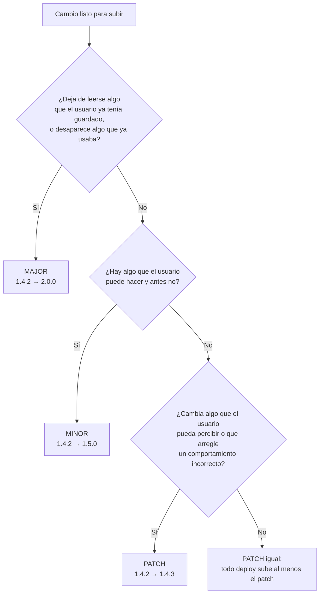

# Versionado

`APP_VERSION` en [`src/lib/app-config.ts`](../src/lib/app-config.ts) es el
único número de versión de la app. No sale de una variable de entorno: es
parte del código que se sube, así que la versión que muestra Ajustes es
siempre la que está corriendo.

Bumpearla no es cosmético. De ahí sale `SW_URL` (`/sw.js?v=<APP_VERSION>`), y
cambiar esa URL es lo que hace que el navegador instale un service worker
nuevo, invalide las caches viejas y le muestre al usuario el aviso de "hay una
versión nueva". O sea: **el número de versión es el mecanismo de despliegue**,
no una etiqueta al costado.

## El formato

`MAJOR.MINOR.PATCH`, sin sufijos (`1.2.0`, no `1.2.0-beta.1`). Es semver, pero
Maguita no publica una API que otro programa consuma, así que "romper
compatibilidad" hay que traducirlo a lo que sí tiene: **lo que el usuario ya
tiene guardado y lo que ya sabe usar**.

Esa es la pregunta que ordena todo lo demás:

### MAJOR — `1.4.2` → `2.0.0`

Se rompe la continuidad: lo que el usuario tenía deja de funcionar como estaba,
y no alcanza con actualizar y seguir.

- Un documento de Firestore o una clave de `localStorage` cambia de forma y la
  versión nueva **ya no sabe leer la vieja** (o hace falta una migración que no
  es reversible).
- Se elimina una mini-app, una pantalla o una funcionalidad que la gente venía
  usando.
- Rediseño de navegación que obliga a reaprender dónde está todo.
- Cambia el modelo de sesión/permisos de manera que las sesiones abiertas se
  caen o alguien pierde acceso a algo que veía.

El caso que hay que mirar con más cuidado es el de los datos, porque los
dispositivos no actualizan todos juntos: mientras uno ya está en la versión
nueva, otro puede seguir en la vieja escribiendo con la forma anterior. Si esa
convivencia no funciona, es MAJOR.

### MINOR — `1.4.2` → `1.5.0`

Hay superficie nueva y todo lo anterior sigue andando igual.

- Una mini-app nueva, o una pantalla nueva dentro de una que ya existe (por
  ejemplo, el detalle de una rutina de entrenamiento).
- Una ruta nueva en `ROUTES`.
- Una colección nueva de Firestore, o un campo **opcional** nuevo en un
  documento existente — lo viejo se sigue leyendo sin tocar nada.
- Un tipo de notificación o de alerta que antes no existía.
- Una capacidad visible que se agrega a algo que ya estaba (filtros, export,
  un modo nuevo de un cálculo).

Regla práctica: **si el cambio exige una entrada en el changelog de
[`firestore-schema.md`](./firestore-schema.md), es MINOR como mínimo.** Tocar
la arquitectura de datos nunca es un patch.

### PATCH — `1.4.2` → `1.4.3`

No hay nada nuevo que el usuario pueda hacer; hay algo que anda mejor.

- Corrección de un bug.
- Textos, copy, íconos, espaciados, colores, animaciones.
- Performance, accesibilidad, corrección de contraste.
- Refactors internos, tipos, orden de archivos.
- Bump de dependencias (incluida `lib-kit-components`) sin cambios visibles.
- Cambios que sólo tocan el server o la config de build.

## Las tres reglas que evitan las discusiones

**1. Todo deploy sube al menos el patch.** Aunque el cambio sea sólo del lado
del server y "no se vea", el número es lo que invalida las caches del service
worker y lo que le avisa al usuario. Subir sin bumpear deja a los instalados
con assets viejos y sin ningún aviso.

**2. Ante la duda, el más chico que cumpla.** Si un cambio se puede defender
como patch y como minor, mirá si el usuario puede hacer algo que antes no
podía. Si no puede, es patch — por más código que haya movido.

**3. Un solo bump por deploy, y gana el más alto.** Si en la misma subida van
tres bugfixes y una mini-app nueva, es un MINOR. Los patches no se acumulan
aparte: `1.4.2` + tres fixes + una feature es `1.5.0`, no `1.4.5` y después
`1.5.0`.

## Al bumpear

1. Cambiar `APP_VERSION` en [`src/lib/app-config.ts`](../src/lib/app-config.ts).
   Es lo único: `public/sw.js` lee la versión del `?v=` de su propia URL y no
   se toca.
2. Si el cambio toca datos o auth, la entrada en el changelog de
   [`firestore-schema.md`](./firestore-schema.md) (con el bloque de
   `firestore.rules` que corresponda), como pide `AGENTS.md`.
3. Agregar la fila en el historial de acá abajo.
4. `npx tsc --noEmit`, `npx eslint .`, `npm run build`.

Después del deploy, el aviso le aparece al usuario en la primera carga que
traiga el bundle nuevo. Una pestaña abierta desde antes no se entera hasta que
navegue: el chequeo periódico del hook re-pide la URL del worker anterior, que
no cambió.

## Historial

| Versión | Qué entró |
|---|---|
| `1.2.0` | Compartir el plan de un día de entrenamiento como imagen: al portapapeles o por la hoja nativa del sistema (WhatsApp con la imagen adjunta), con fallback a texto por `wa.me` en desktop. La imagen se dibuja en un canvas —no es un screenshot— y se genera entera en el dispositivo. Además, las tabs de día pasaron a `TabsCarousel` y `scrollbar-none` dejó de ser una clase muerta: la librería la aplicaba sin definirla, así que las tabs del header y los `ChipCarousel` mostraban la barra de scroll nativa. |
| `1.1.0` | Pantalla de detalle de una rutina de entrenamiento (ruta propia `/mini-apps/entrenamiento/rutinas/[routineId]`) y el composer de rutinas. Además, la versión pasó a ser la fuente única del despliegue: `SW_URL` la lleva en el query string y `public/sw.js` dejó de tener su propio `CACHE_VERSION`. |
| `1.0.0` | Primera versión publicada. |
